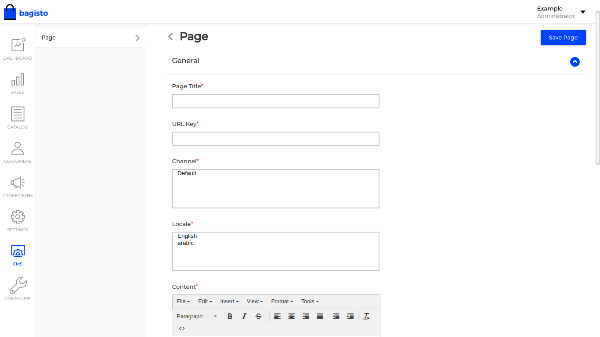
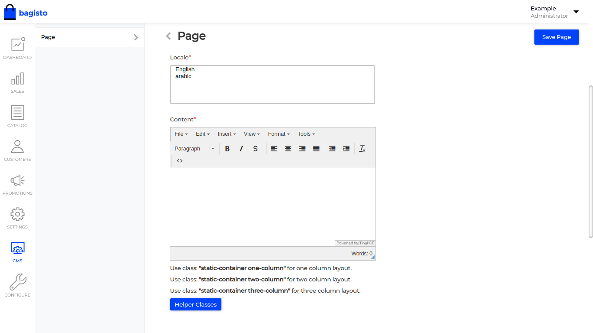
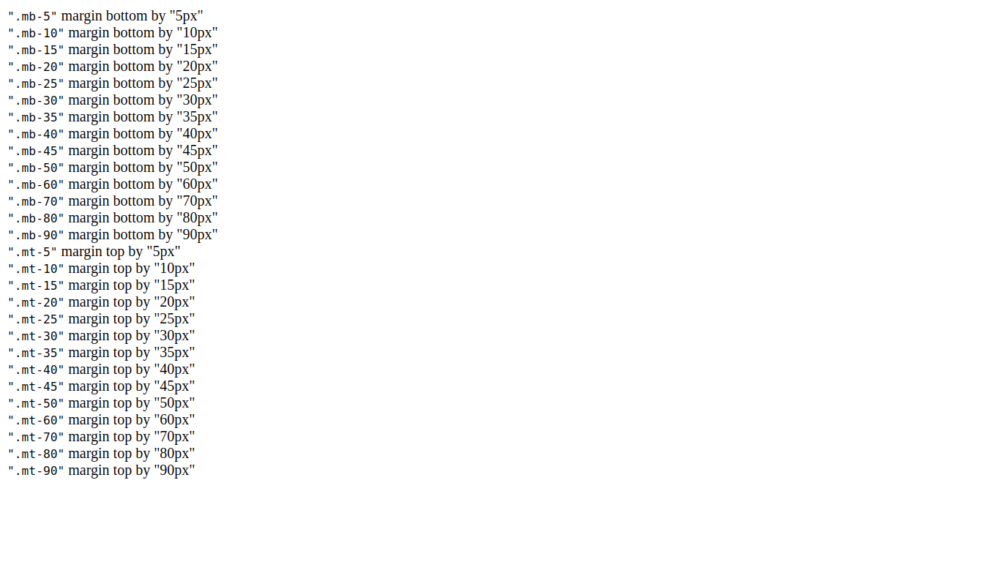

## CMS ( Content Management System )

In efforts to make bagisto interactive and user-friendly, we have added a new feature of CMS (Content Management System) through which admin has the power to create static pages content. The Pages created through CMS are in a combination of channel and locale i.e., the content of the page will be displayed only for channel and locale selected while creating pages.

### Steps to create pages in CMS

- All necessary fields are provided to create a page, so admin can customize the page by own. As we can see in the screenshot below.

{: .screenshot-dimension .center}

- Now, about the content writing, the admin has the flexibility to use CSS classes i.e., Helper Classes and column layout classes.

{: .screenshot-dimension .center}

#### Helper Classes

To provide admin power build static content using some CSS classes. Here, in the screenshot below, you may find some CSS classes which you may use while writing content and apply style on it.

{: .screenshot-dimension .center}

##### How to Use Helper Classes
