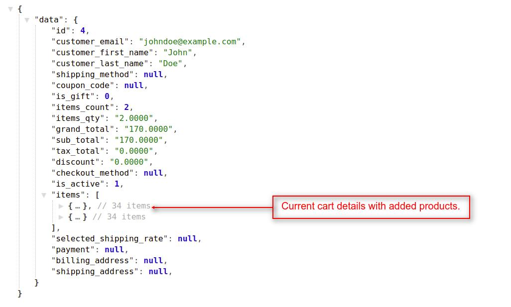
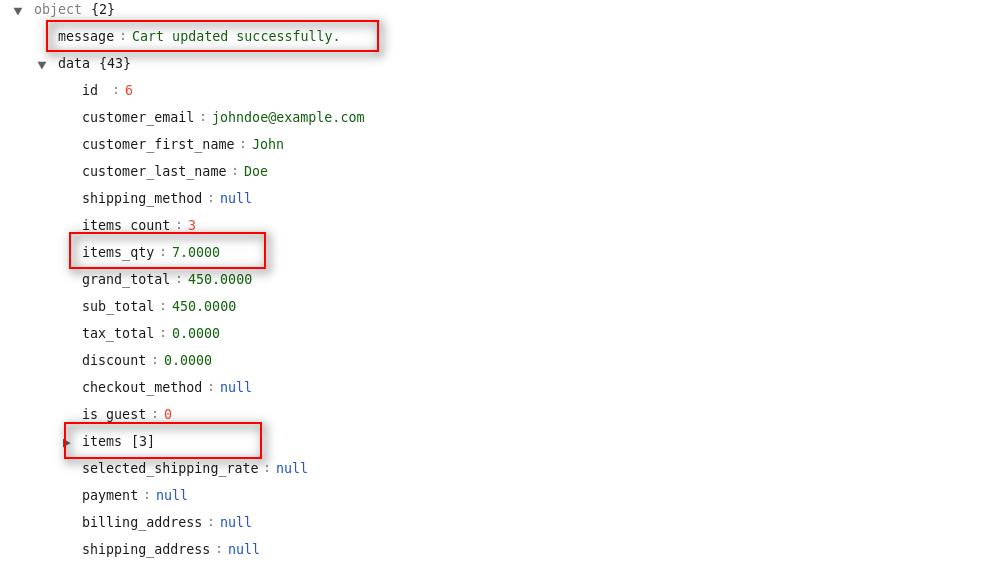
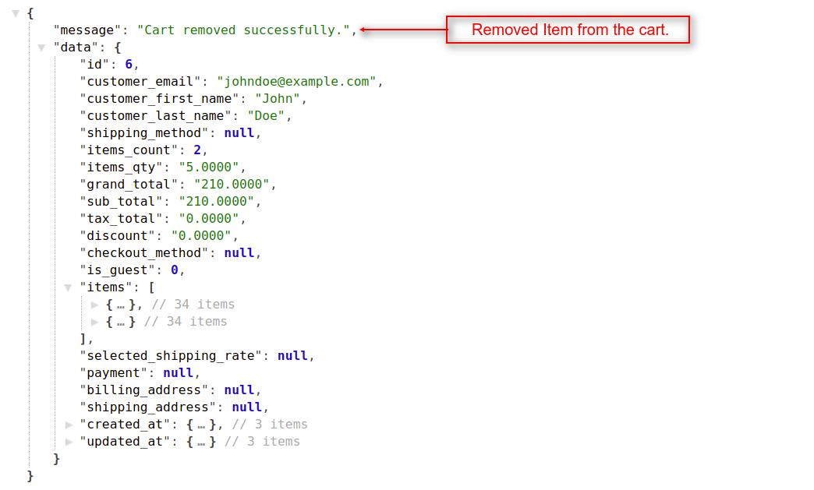
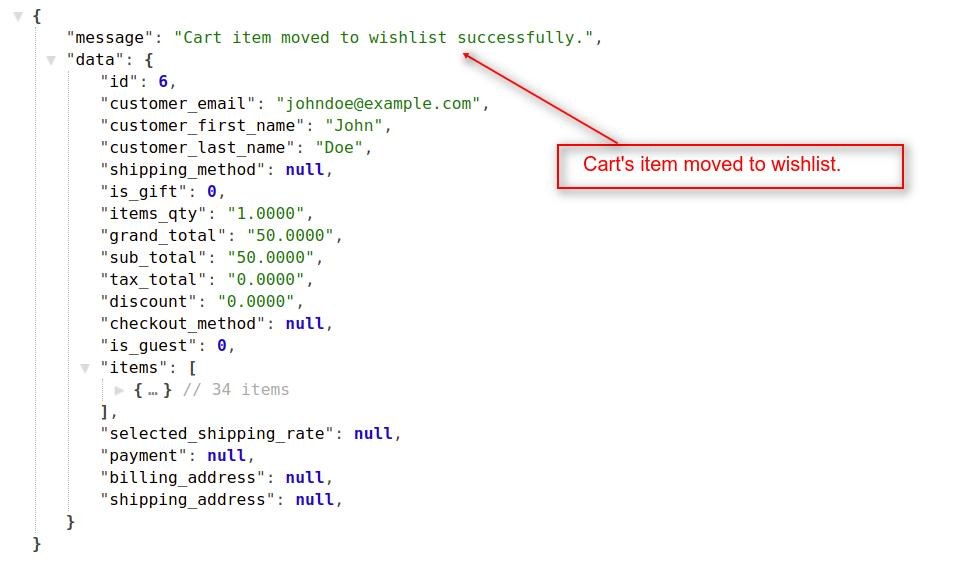
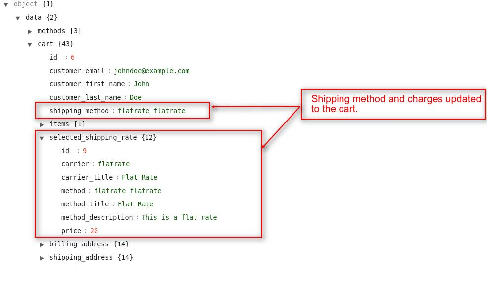
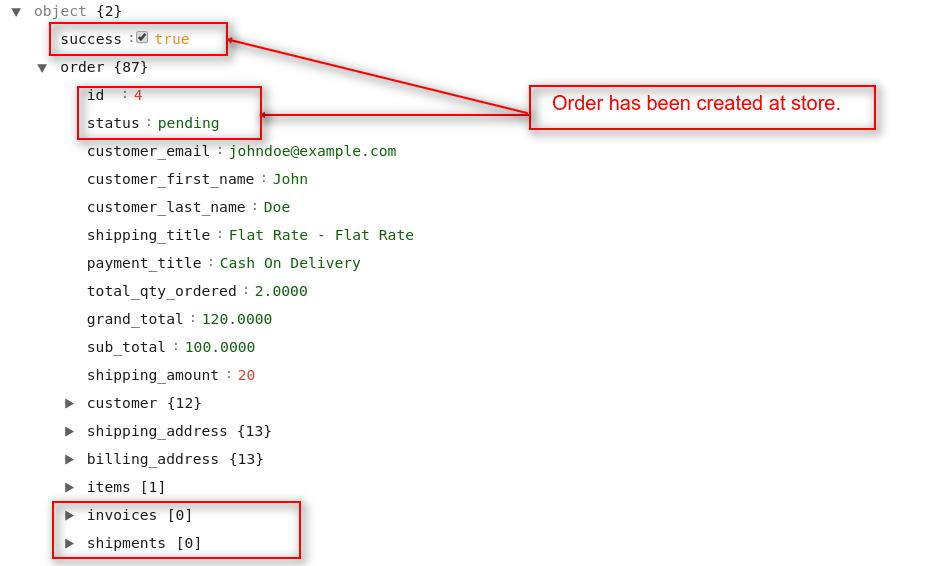

# How To Create Requests For Cart

{:.pencil-icon}
[edit on github](https://github.com/bagisto/bagisto-docs/blob/master/api_cart.md){:class="edit-github" target="\_blank"}

## 1. Get Complete Cart Details: 

To get the current cart details, you have to use the **`checkout/cart`** resource in API url. You will see in all the **`cart`** related api, we used **`checkout prefix`**. This API call will work both with customer's authentication or without customer's authentication. If customer is not login into the store, then this API resource will return the `Guest's` cart detail.

**Note**: _In the `checkout/cart` resource API call, we used `GET HTTP verb` to get complete cart details of the customer/guest._

##### Request:

> _http(s)://example.com/public/api/checkout/cart_

##### Response:

#### 1.1 In case of Guest Customer: 

    {
        "data": {
            "id": 7,
            "customer_email": null,
            "customer_first_name": null,
            "customer_last_name": null,
            "shipping_method": null,
            "items_qty": "1.0000",
            "grand_total": "50.0000",
            "sub_total": "50.0000",
            "tax_total": "0.0000",
            "discount": "0.0000",
            "checkout_method": null,
            "is_guest": 1,
            "items": [
                {...}, // Cart Item 1
                {...} // Cart Item 2
            ],
            "selected_shipping_rate": null,
            "payment": null,
            "billing_address": null,
            "shipping_address": null,
        }
    }

{:class="screenshot-dimension center"}

#### 1.2 In case of Login Customer: 

    {
        "data": {
            "id": 6,
            "customer_email": "johndoe@example.com",
            "customer_first_name": "John",
            "customer_last_name": "Doe",
            "shipping_method": null,
            "items_count": 2,
            "items_qty": "2.0000",
            "grand_total": "170.0000",
            "sub_total": "170.0000",
            "tax_total": "0.0000",
            "discount": "0.0000",
            "checkout_method": null,
            "is_guest": 0,
            "items": [
                {...}, // Cart Item 1
                {...} // Cart Item 2
            ],
            "selected_shipping_rate": null,
            "payment": null,
            "billing_address": null,
            "shipping_address": null,
        }
    }

{:class="screenshot-dimension center"}

## 2. Add Product To Cart:

By using this API call you can add new products into the cart and also you can add quantity to the existing product in cart. To do this task, you have use the **`checkout/cart/add/{id}`** resource with **`{id} i.e product_id`** as a request payload in API url. This API call will work both with customer's authentication or without customer's authentication.

> _http(s)://example.com/public/api/checkout/cart/add/{id}_

**Note**: _In the `checkout/cart/add/{id}` resource API call, we used `POST HTTP verb` to add/update the product to the cart for the customer/guest._

##### Request:

> _http(s)://example.com/public/api/checkout/cart/add/6_

##### Response:

    {
        "message": "Product added to cart successfully.",
        "data": {
            "id": 4,
            "customer_email": johndoe@example.com,
            "customer_first_name": John,
            "customer_last_name": Doe,
            "shipping_method": null,
            "items_qty": "1.0000",
            "grand_total": "50.0000",
            "sub_total": "50.0000",
            "tax_total": "0.0000",
            "discount": "0.0000",
            "checkout_method": null,
            "is_guest": 0,
            "items": [
                {...}, // Cart Item 1
                {...} // Cart Item 2
            ],
            "selected_shipping_rate": null,
            "payment": null,
            "billing_address": null,
            "shipping_address": null,
        }
    }

{:class="screenshot-dimension center"}

## 3. To Empty Cart: 

By using this API call you can remove all the products from the cart. To do this task, you have to use the **`checkout/cart/empty`** resource in API url. This API call will work both with customer's authentication or without customer's authentication.

**Note**: _In the `checkout/cart/empty` resource API call, we used `GET HTTP verb` to remove all the product(s) from the cart for the customer/guest._

##### Request:

> _http(s)://example.com/public/api/checkout/cart/empty_

##### Response:

    {
        "message": "Cart removed successfully.",
        "data": null
    }

{:class="screenshot-dimension center"}

## 4. To Update Cart: 

By using this API call you can update the cart's product(s) quantity. To do this task, you have to use the **`checkout/cart/update`** resource in API url. This API call will work both with customer's authentication or without customer's authentication.

**Note**: _In the `checkout/cart/update` resource API call, we used `PUT HTTP verb` to update the cart's product(s) quantity for the customer/guest._

##### Request:

> _http(s)://example.com/public/api/checkout/cart/update_

##### Response:

    {
        "message": "Cart updated successfully.",
        "data": {
            "id": 7,
            "customer_email": johndoe@example.com,
            "customer_first_name": John,
            "customer_last_name": Doe,
            "shipping_method": null,
            "items_qty": "7.0000",
            "grand_total": "450.0000",
            "sub_total": "450.0000",
            "tax_total": "0.0000",
            "discount": "0.0000",
            "checkout_method": null,
            "is_guest": 0,
            "items": [
                {...}, // Cart Item 1
                {...}, // Cart Item 2
                {...} // Cart Item 3
            ],
            "selected_shipping_rate": null,
            "payment": null,
            "billing_address": null,
            "shipping_address": null,
        }
    }

{:class="screenshot-dimension center"}

## 5. Remove Specific Product From Cart: 

You can remove any particular product from the cart. To do this task, you have to use the **`checkout/cart/remove-item/{id}`** resource with the **`{id}`** i.e. **`cart_item_id`** as request payload in API url. This API call will work both with customer's authentication or without customer's authentication.

> _http(s)://example.com/public/api/checkout/cart/remove-item/{id}_

**Note**: _In the `checkout/cart/remove-item` resource API call, we used `GET HTTP verb` to remove the cart's product for the customer/guest._

##### Request:

> _http(s)://example.com/public/api/checkout/cart/remove-item/15_

##### Response:

    {
        "message": "Cart removed successfully.",
        "data": {
            "id": 6,
            "customer_email": "johndoe@example.com",
            "customer_first_name": "John",
            "customer_last_name": "Doe",
            "shipping_method": null,
            "items_count": 2,
            "items_qty": "5.0000",
            "grand_total": "210.0000",
            "sub_total": "210.0000",
            "tax_total": "0.0000",
            "discount": "0.0000",
            "checkout_method": null,
            "is_guest": 0,
            "items": [
                {...},
                {...}
            ],
            "selected_shipping_rate": null,
            "payment": null,
            "billing_address": null,
            "shipping_address": null,
        }
    }

{:class="screenshot-dimension center"}

## 6. Move Product From Cart To Wishlist: 

You can move a product from cart to wishlist. To do this task, you have to use the **`checkout/cart/move-to-wishlist/{id}`** resource with the **`{id}`** i.e. **`cart_item_id`** as request payload in API url.

> _http(s)://example.com/public/api/checkout/cart/move-to-wishlist/{id}_

**Note**: _In the `checkout/cart/move-to-wishlist` resource API call, we used `GET HTTP verb` to move the cart's product to the wishlist for the login customer._

##### Request:

> _http(s)://example.com/public/api/checkout/cart/move-to-wishlist/16_

##### Response:

    {
        "message": "Cart item moved to wishlist successfully.",
        "data": {
            "id": 1,
            "customer_email": "johndoe@example.com",
            "customer_first_name": "John",
            "customer_last_name": "Doe",
            "shipping_method": null,
            "items_qty": "1.0000",
            "grand_total": "50.0000",
            "sub_total": "50.0000",
            "tax_total": "0.0000",
            "discount": "0.0000",
            "checkout_method": null,
            "is_guest": 0,
            "items": [
                {...} // Remaining Cart Item
            ],
            "selected_shipping_rate": null,
            "payment": null,
            "billing_address": null,
            "shipping_address": null,
        }
    }

{:class="screenshot-dimension center"}

## 7. Save Addresses To Cart: 

At the checkout step, customer can create new addresses or select from the existing addresses for billing & shipping the cart's item. You can achieve this task by using the **`checkout/save-address`** resource in API url. This API will work for the both login customers and with guest users also.

**Note**: _In the `checkout/save-address` resource API call, we used `POST HTTP verb` for choosing the customer's addresses for checkout process._

##### Request:

> _http(s)://example.com/public/api/checkout/save-address_

##### Response:

    {
        "data": {
            "rates": [{...}, {...}],
            "cart": {
                "id": 6,
                "customer_email": "johndoe@example.com",
                "items": [{...}, {...}],
                "billing_address": {
                    "id": 7,
                    "first_name": "John",
                    "last_name": "Doe",
                    "name": "John Doe",
                    "email": "johndoe@example.com",
                    "address1": [
                        "Block H-ARP Park, Sector 63 "
                    ],
                    "country": "IN",
                    "country_name": "India",
                    "state": "UP",
                    "city": "Noida",
                    "postcode": 201301,
                    "phone": "0132456789"
                },
                "shipping_address": {
                    "id": 8,
                    "first_name": "John",
                    "last_name": "Doe",
                    "name": "John Doe",
                    "email": "johndoe@example.com",
                    "address1": [
                        "Block H-ARP Park, Sector 63 "
                    ],
                    "country": "IN",
                    "country_name": "India",
                    "state": "UP",
                    "city": "Noida",
                    "postcode": 201301,
                    "phone": "0132456789"
                }
            }
        }
    }

{:class="screenshot-dimension center"}

## 8. Save Shipping Method To Cart: 

After saving customer's addresses to the cart, you have to select a shipping method to proceed for completing the order. You can achieve this task by using the **`checkout/save-shipping`** resource in API url. Shipping method and changes will apply to the cart through this API call. This API will work for the both login customers and with guest users also.

**Note**: _In the `checkout/save-shipping` resource API call, we used `POST HTTP verb` to apply the shipping method and changes to the cart._

##### Request:

> _http(s)://example.com/public/api/checkout/save-shipping_

##### Response:

    {
        "data": {
            "methods": [{...},{...}],
            "cart": {
            "id": 6,
            "customer_email": "johndoe@example.com",
            "customer_first_name": "John",
            "customer_last_name": "Doe",
            "shipping_method": "flatrate_flatrate",
            "items": [{...}],
            "selected_shipping_rate": {
                "id": 9,
                "carrier": "flatrate",
                "carrier_title": "Flat Rate",
                "method": "flatrate_flatrate",
                "method_title": "Flat Rate",
                "method_description": "This is a flat rate",
                "price": 20,
            },
            "payment": null,
            "billing_address": {...},
            "shipping_address": {...}
            }
        }
    }

{:class="screenshot-dimension center"}

## 9. Save Payment Method To Cart: 

After applying shipping method to the cart, you have to select a payment method to proceed for completing the order. You can achieve this task by using the **`checkout/save-payment`** resource in API url. By using this API `Payment method` will apply to the cart and will work for the both login customers and with guest users also.

**Note**: _In the `checkout/save-payment` resource API call, we used `POST HTTP verb` to apply the payment method to the cart._

##### Request:

> _http(s)://example.com/public/api/checkout/save-payment_

##### Response:

    {
        "data": {
            "cart": {
            "id": 6,
            "customer_email": "johndoe@example.com",
            "customer_first_name": "John",
            "customer_last_name": "Doe",
            "shipping_method": "flatrate_flatrate",
            "items": [{...}],
            "selected_shipping_rate": {...},
            "payment": {
                "id": 4,
                "method": "cashondelivery",
                "method_title": "Cash On Delivery"
            },
            "billing_address": {...},
            "shipping_address": {...}
            }
        }
    }

{:class="screenshot-dimension center"}

## 10. Save Order: 

After applying shipping addresses, shipping method, and payment method to the cart, now finally you have to create/save order. You can achieve this task by using the **`checkout/save-order`** resource in API url. By using this API order will be placed and save to the current store and this API will work for the both login customers and with guest users also.

**Note**: _In the `checkout/save-order` resource API call, we used `POST HTTP verb` to create and save order in the current store._

##### Request:

> _http(s)://example.com/public/api/checkout/save-order_

##### Response:

    {
        "success": true,
        "order": {
            "id": 4,
            "status": "pending",
            "customer_email": "johndoe@example.com",
            "customer_first_name": "John",
            "customer_last_name": "Doe",
            "shipping_title": "Flat Rate - Flat Rate",
            "payment_title": "Cash On Delivery",
            "total_qty_ordered": "2.0000",
            "grand_total": "120.0000",
            "shipping_amount": 20,
            "customer": {...},
            "shipping_address": {...},
            "billing_address": {...},
            "items": [{...}],
            "invoices": [],
            "shipments": []
        }
    }

{:class="screenshot-dimension center"}
