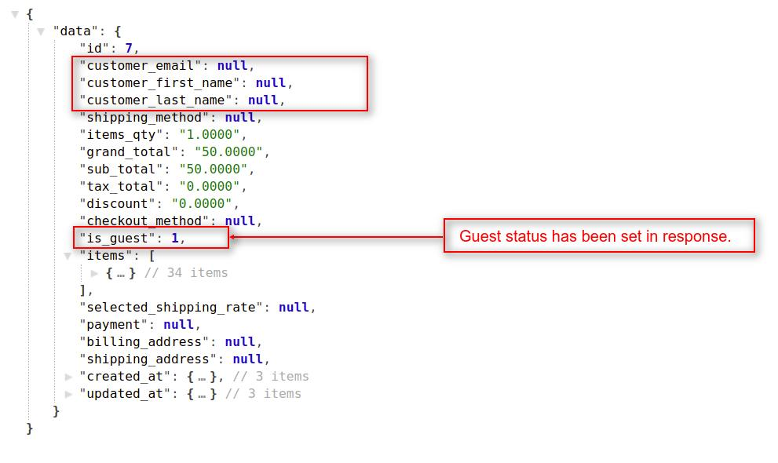

# How To Create Requests For Cart  <a href="https://github.com/bagisto/bagisto-docs/blob/master/create_module.md">Edit On github</a>

## 1. Get Complete Cart Details:
To get the current cart details, you have use the **`checkout/cart`** resource in API url. You will see in all the **`cart`** related api, we used **`checkout prefix`**. This API call will work both with customer's authentication or without customer's authentication. If customer is not logged into the store, the this API resource will return the `Guest's` cart detail.

**Note: In the `checkout/cart` resource API call, we used `GET HTTP verb` to get complete cart details of the customer/guest.**

### Request:

> *http(s)://example.com/public/api/checkout/cart*

### Response:

#### 1.1 In case of Guest Customer:
    {
        "data": {
            "id": 7,
            "customer_email": null,
            "customer_first_name": null,
            "customer_last_name": null,
            "shipping_method": null,
            "items_qty": "1.0000",
            "grand_total": "50.0000",
            "sub_total": "50.0000",
            "tax_total": "0.0000",
            "discount": "0.0000",
            "checkout_method": null,
            "is_guest": 1,
            "items": [
                {...}, // Cart Item 1
                {...} // Cart Item 2
            ],
            "selected_shipping_rate": null,
            "payment": null,
            "billing_address": null,
            "shipping_address": null,
        }
    }

<a href="assets/images/Bagisto_Api/bagisto_cart_guest.jpg" target="_blank">
{: height="50%" width="50%" .center}
</a>

#### 1.2 In case of Logged In Customer:
    {
        "data": {
            "id": 6,
            "customer_email": "johndoe@example.com",
            "customer_first_name": "John",
            "customer_last_name": "Doe",
            "shipping_method": null,
            "items_count": 2,
            "items_qty": "2.0000",
            "grand_total": "170.0000",
            "sub_total": "170.0000",
            "tax_total": "0.0000",
            "discount": "0.0000",
            "checkout_method": null,
            "is_guest": 0,
            "items": [
                {...}, // Cart Item 1
                {...} // Cart Item 2
            ],
            "selected_shipping_rate": null,
            "payment": null,
            "billing_address": null,
            "shipping_address": null,
        }
    }

<a href="assets/images/Bagisto_Api/bagisto_cart.jpg" target="_blank">
{: height="50%" width="50%" .center}
</a>

## 2. Add Product To Cart:
By using this API call you can add new product into the cart and also you can add quantity to the existing product in cart. To do this task, you have use the **`checkout/cart/add/{id}`** resource with **`{id} i.e product_id`** as a request payload in API url. This API call will work both with customer's authentication or without customer's authentication.

> *http(s)://example.com/public/api/checkout/cart/add/{id}*

**Note: In the `checkout/cart/add/{id}` resource API call, we used `POST HTTP verb` to add/update the product to the cart for the customer/guest.**

### Request:

> *http(s)://example.com/public/api/checkout/cart/add/6*

### Response:

    {
        "message": "Product added to cart successfully.",
        "data": {
            "id": 4,
            "customer_email": johndoe@example.com,
            "customer_first_name": John,
            "customer_last_name": Doe,
            "shipping_method": null,
            "items_qty": "1.0000",
            "grand_total": "50.0000",
            "sub_total": "50.0000",
            "tax_total": "0.0000",
            "discount": "0.0000",
            "checkout_method": null,
            "is_guest": 0,
            "items": [
                {...}, // Cart Item 1
                {...} // Cart Item 2
            ],
            "selected_shipping_rate": null,
            "payment": null,
            "billing_address": null,
            "shipping_address": null,
        }
    }

<a href="assets/images/Bagisto_Api/bagisto_cart_add.jpg" target="_blank">
{: height="50%" width="50%" .center}
</a>

## 3. To Empty Cart:
By using this API call you can remove all the products from the cart. To do this task, you have use the **`checkout/cart/empty`** resource in API url. This API call will work both with customer's authentication or without customer's authentication.

**Note: In the `checkout/cart/empty` resource API call, we used `GET HTTP verb` to remove all the product(s) from the cart for the customer/guest.**

### Request:

> *http(s)://example.com/public/api/checkout/cart/empty*

### Response:

    {
        "message": "Cart removed successfully.",
        "data": null
    }

<a href="assets/images/Bagisto_Api/bagisto_cart_empty.jpg" target="_blank">
{: height="50%" width="50%" .center}
</a>

## 4. To Update Cart:
By using this API call you can update the cart's product(s) quantity. To do this task, you have use the **`checkout/cart/update`** resource in API url. This API call will work both with customer's authentication or without customer's authentication.

**Note: In the `checkout/cart/update` resource API call, we used `PUT HTTP verb` to update the cart's product(s) quantity for the customer/guest.**

### Request:

> *http(s)://example.com/public/api/checkout/cart/update*

### Response:

    {
        "message": "Cart updated successfully.",
        "data": {
            "id": 7,
            "customer_email": johndoe@example.com,
            "customer_first_name": John,
            "customer_last_name": Doe,
            "shipping_method": null,
            "items_qty": "7.0000",
            "grand_total": "450.0000",
            "sub_total": "450.0000",
            "tax_total": "0.0000",
            "discount": "0.0000",
            "checkout_method": null,
            "is_guest": 0,
            "items": [
                {...}, // Cart Item 1
                {...}, // Cart Item 2
                {...} // Cart Item 3
            ],
            "selected_shipping_rate": null,
            "payment": null,
            "billing_address": null,
            "shipping_address": null,
        }
    }

<a href="assets/images/Bagisto_Api/bagisto_cart_update.jpg" target="_blank">
{: height="50%" width="50%" .center}
</a>
