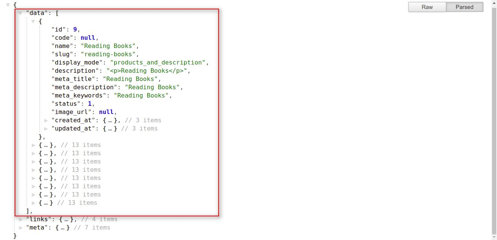
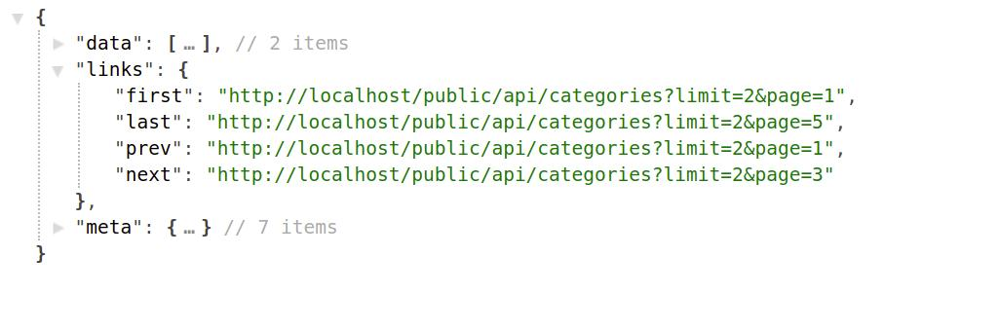
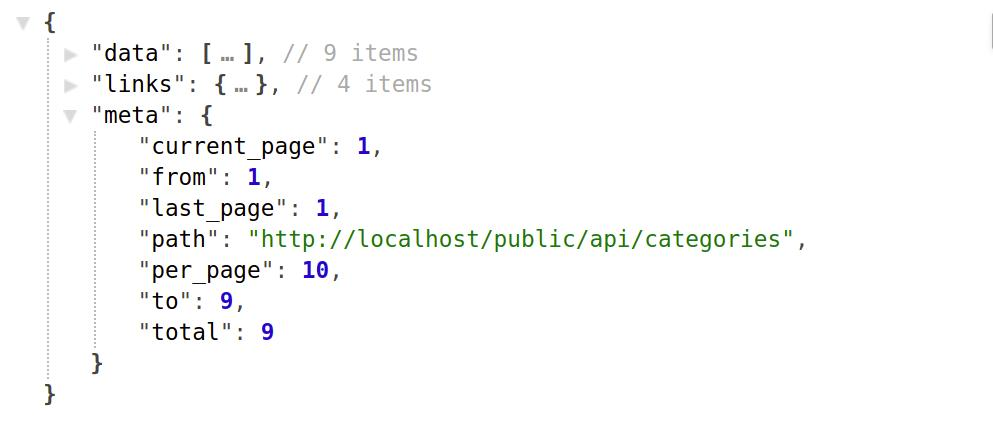
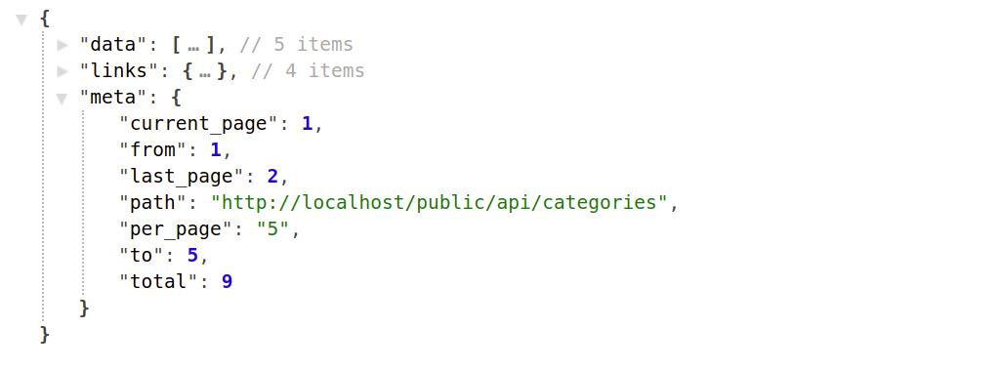
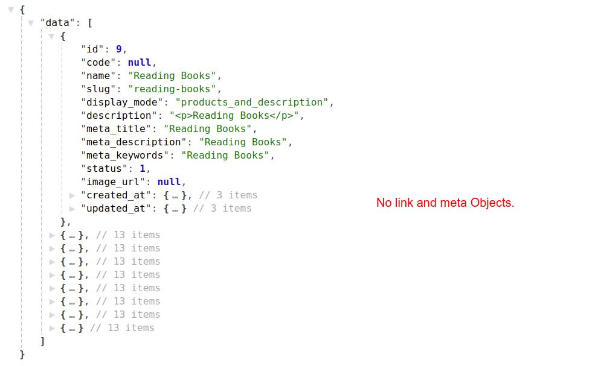
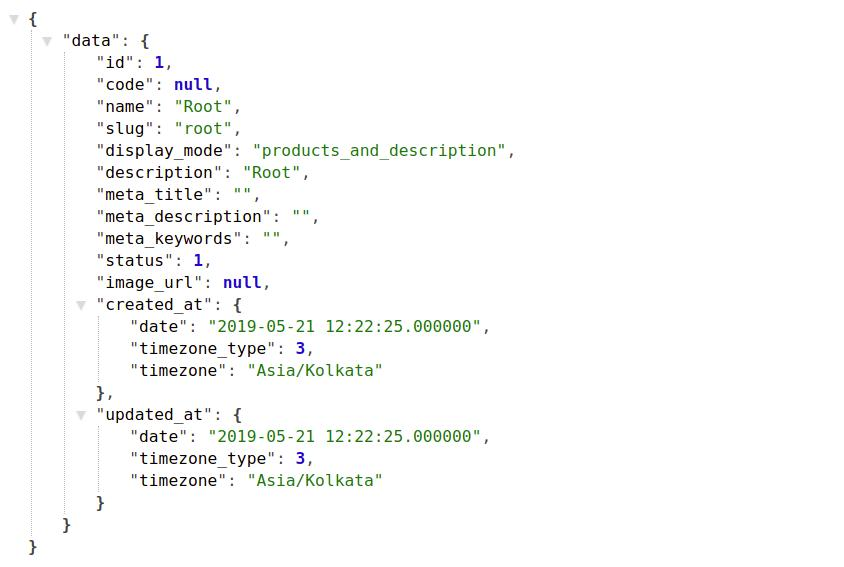
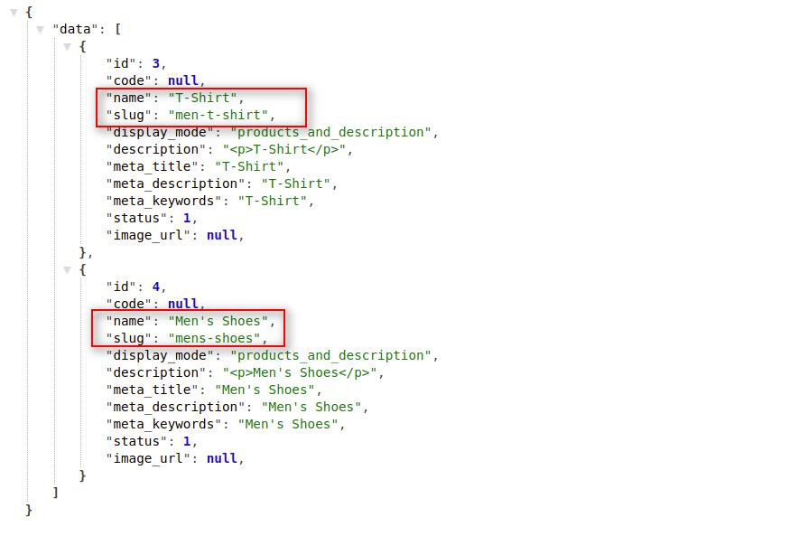

# How To Create Requests For Categories
{:.pencil-icon}
[edit on github](https://github.com/bagisto/bagisto-docs/blob/master/api_category.md){:class="edit-github" target="_blank"}

To get all the Bagisto Categories with the pagination, you have to place a request by using the below API Call with the resource i.e. `categories` :

## 1. Get Categories With Pagination: 

> *http(s)://example.com/public/api/categories*

> *http(s)://example.com/public/api/categories?page=1*

**Note: If you didn't use the page(?page=x) filter, then it returns the data of the first page by default.**

##### Response:

{:class="screenshot-dimension center"}
    
        {
            "data": [
                {
                "id": 9,
                "code": null,
                "name": "Reading Books",
                "slug": "reading-books",
                "display_mode": "products_and_description",
                "description": "
Reading Books
",
                "meta_title": "Reading Books",
                "meta_description": "Reading Books",
                "meta_keywords": "Reading Books",
                "status": 1,
                "image_url": null,
                "created_at": {},
                "updated_at": {}
                },
                {...},
                {...},
                {...},
            ],
            "links": {},
            "meta": {}
        }

##### Explanation:

* In the above response, you will find the three Objects with below mentioned indexes:
    1. data
    2. link
    3. meta

#### data object: 

Under the data object, you will find the collection of many objects which represent the bagisto store's categories. you can use the category's index data by accessing these categories sub-objects.

#### link object: 
* Under link object, you will find four indexes, which will be used only with the pagination:

{:class="screenshot-dimension center"}

**1. `first`: It will represent the first url link of the called API with filter variable `page:first_page`**

> *http(s)://example.com/public/api/categories?page=1*

**2. `last`: It will represent the last url link of the called API with filter variable `page:last_page`**

> *http(s)://example.com/public/api/categories?page=10*

**3. `prev`: It will represent the previous url of the currently called API url. For Example:**

* Current_URL -
> *http(s)://example.com/public/api/categories?page=4*

* prev_URL -
> *http(s)://example.com/public/api/categories?page=3*

**4. `next`: It will show you the next url of the currently called API url. If no next url will available then it will contain the `null` value.**
    
* Current_URL -
> *http(s)://example.com/public/api/categories?page=4*

* prev_URL -
> *http(s)://example.com/public/api/categories?page=5*

#### meta object: 
* `meta` object will only used with pagination. Under meta object, you will find seven indexes:

{:class="screenshot-dimension center"}

**1. `current_page`: It will contain the value of currently called page `current_page:1`**

> *http(s)://example.com/public/api/categories?page=2*
{
    "meta": {
        "current_page": 2,
    }
}

**2. `from`: It will contain the first count of the returned data object based on the provided page and limit filters as parameter `from = (limit * (page-1)) + 1`.**

* For Example: If you called categories API with page filter 2 `i.e. ?page=2` and a limit filter of 5 `i.e. ?limit=5`, then `from` will contain the value `6`.

> *http(s)://example.com/public/api/categories?limit=5&page=2*
~~~
limit = 5
page = 2
from = (5 * (2-1)) + 1  i.e. 6
~~~

        {
            "meta": {
                "current_page": 2,
                "from": 6,
            }
        }

**3. `to`: It will return, the last count of the returned data object based on the provided page and limit filters as parameter `to = (limit * page)`.**
* For Example: If you called categories API with page filter 2 `i.e. ?page=2` and a limit filter of 5 `i.e. ?limit=5`, then `to` will contain the value `10`.

> *http(s)://example.com/public/api/categories?limit=5&page=2*
~~~
limit = 5
page = 2
from = (5 * 2)  i.e. 10
~~~

        {
            "meta": {
                "current_page": 2,
                "from": 6,
                "to": 10,
            }
        }

**4. `per_page`: It will contain the total of record number that will want in a single page `per_page = limit`.**

> *http(s)://example.com/public/api/categories?limit=5&page=1*

        {
            "meta": {
                "current_page": 2,
                "from": 6,
                "to": 10,
                "per_page": 5,
            }
        }

**5. `last_page`: It will contain the value of total of pages. This index value will depend on the limit input parameter and the total number of records `last_page = (total number of records / limit)`.**

* For Example: Suppose there are total 50 categies and you want to fetch them in slot of 10 in each pages, then there will be total 5 total pages `last_page = ( ceil(50) / 10)`.

> *http(s)://example.com/public/api/categories?limit=10&page=1*

        {
            "meta": {
                "current_page": 1,
                "from": 1,
                "to": 10,
                "per_page": 10,
                "last_page": 5,
            }
        }

**6. `total`: It will contain the value of total number of records in the store. `total = total number of records`.**

> *http(s)://example.com/public/api/categories?limit=10&page=1*

        {
            "meta": {
                "current_page": 1,
                "from": 1,
                "to": 10,
                "per_page": 10,
                "last_page": 5,
                "total": 50,
            }
        }

**7. `path`: It will contain the current api url without input parameters.**

> *http(s)://example.com/public/api/categories?limit=10&page=1*

        {
            "meta": {
                "current_page": 1,
                "from": 1,
                "to": 10,
                "per_page": 10,
                "last_page": 5,
                "total": 50,
                "path": "http(s)://example.com/public/api/categories",
            }
        }

{:class="screenshot-dimension center"}

## 2. Get All Categories Without Pagination: 
If you don't want to use the pagination and want to access all the store's categories at once, then you have to send a filter parameter named: `pagination` with value `zero`. By doing this you will get all categories objects at once under the data object and will not get the both link and meta objects.

> **Like: pagination=0**

> *http(s)://example.com/public/api/categories?pagination=0*

{:class="screenshot-dimension center"}

## 3. Get Specific Category: 
If you want the record of any specific category, then you have to provide the category id as as input parameter in API url.

> *http(s)://example.com/public/api/categories/1*

{:class="screenshot-dimension center"}

**Note: Here you will see in the API response `data Object` will only contain the single object of category record**

## 4. Get Direct Descendant Categories Of Specific Category: 
If you want to get the direct descendant categories (sub-categories) of any particular category, then you have to follow the below structure of calling the API.

> *http(s)://example.com/public/api/descendant-categories?parent_id=1*

* In the above API url we passed `parent_id` as an input parameter for which we want to access the direct sub-categories.

* For Example: Suppose there is a category named as `Men's Collection` with `category_id=2`  that have two direct sub-categories named as `T-Shirt` and `Men's Shoes`, then the API url will be:

> *http(s)://example.com/public/api/descendant-categories?parent_id=2*

{:class="screenshot-dimension center"}