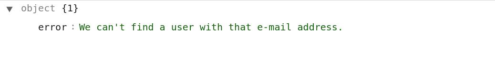
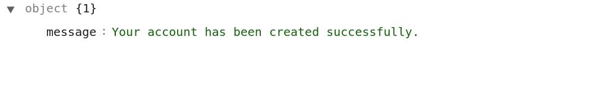

# How To Create Requests For Customers
{:.pencil-icon}
[edit on github](https://github.com/bagisto/bagisto-docs/blob/master/api_customer.md){:class="edit-github" target="_blank"}

In the customer's APIs: Firstly, we will look for the customer's authentication with the help of login credentials. Because customer can't access/add/modify their addresses, orders, reviews and wishlists without login into the front store. To logined in at the Bagisto front store, customer need a valid email address and password.

## 1. Customer's Login Authentication: 

> *http(s)://example.com/public/api/customer/login*

**Note: For the customer's login, you have to send your data `(i.e. email and password)` using `POST HTTP verb` .**

##### Response:

{:class="screenshot-dimension center"}

## 2. Customer's Reset Password: 
You can also use the API for reset the customer's password by providing the valid customer's email address. In this API request, you have to use `customer/forgot-password` resource with `email` as a Request Payload. An email will be send on the provided email address, only if the same email address will exist in the Bagisto Store.

> *http(s)://example.com/public/api/customer/forgot-password*

##### Request:
    {
        email: "johndoe@example.com"
    }

**Note: For the customer's `forgot-password` API call, you have to send your request data `(i.e. email)` using `POST HTTP verb` .**

##### Response:
    {
        "message": "We have e-mailed your password reset link!"
    }

{:class="screenshot-dimension center"}

* In case you provide wrong email address or email address that is not registered in the Bagisto store, then no email will be send to provided email address and response will be like:

##### Response:
    {
        "error": "We can't find a user with that e-mail address."
    }

{:class="screenshot-dimension center"}

## 3. Customer's Logout: 
You can use logout the customer from the Bagisto store with the help of `customer/logout` resource. No need to provide any request payload in the API call.

> *http(s)://example.com/public/api/customer/logout*

**Note: The customer's `logout` API call send through `GET HTTP verb` .**

##### Response:
    {
        "message": "Logged out successfully!"
    }

{:class="screenshot-dimension center"}

## 4. Get Customer's Information: 
You can get the customer information only for the login customer. To achieve customer inforamtion you can use the `customer/get` resource. This API call will return you the personal details of login customer.

> *http(s)://example.com/public/api/customer/get*

**Note: In the `customer/get` API call resource, we used `GET HTTP verb` to get the customer's profile information.**

##### Response:

    {
        "data": {
            "id": 1,
            "email": "viveksh047@webkul.com",
            "first_name": "John",
            "last_name": "Doe",
            "name": "John Doe",
            "gender": "Male",
            "date_of_birth": null,
            "phone": null,
            "status": 1,
            "group": {
                "id": 1,
                "name": "General",
                "created_at": null,
                "updated_at": null
            },
            "created_at": {},
            "updated_at": {}
        }
    }

{:class="screenshot-dimension center"}

## 5. Modify Customer's Profile Details: 
You can update the customer's account information (only for the currently login customer). To achieve this task, you can use the `customer/profile` API call resource. This API call will return you the personal details of login customer.

> *http(s)://example.com/public/api/customer/profile*

##### Request:
    {
        id: 1
        first_name: "John"
        last_name: "Doe"
        name: "John Doe"
        email: "johndoe@example.com"
        password: "******"
        password_confirmation: "******"
        gender: "Male"
        group: {...}
        date_of_birth: null
        phone: null
        status: 1
        created_at: {...}
        updated_at: {...}
    }

**Note: In the `customer/profile` resource API call, we used `PUT HTTP verb` to sent the customer's profile information for update.**

##### Response:
    {
        "message": "Your account has been updated successfully.",
        "data": {
            id: 1
            first_name: "John",
            last_name: "Doe",
            name: "John Doe",
            email: "johndoe@example.com"
            phone: null,
            status: 1,
            ...
        }
    }

{:class="screenshot-dimension center"}

## 6. Customer Registration In Bagisto Store: 
You can create/register a new customer in the Bagisto store. To achieve this task, you can use the `customer/register` API call resource.

> *http(s)://example.com/public/api/customer/register*

##### Request:
    {
        email: "peterdoe@example.com"
        first_name: "Peter"
        last_name: "Doe"
        password: "******"
        password_confirmation: "******"
    }

**Note: In the `customer/register` resource API call, we used `POST HTTP verb` to sent the customer's information for registration.**

##### Response:
    {
        message: "Your account has been created successfully."
    }

{:class="screenshot-dimension center"}

* In case there is already a customer in the Bagisto Store with the email address for which you are going to create new customer, then you will get a error message in response like:

##### Response:
    {
        message: "The given data was invalid.",
        errors: {
            email: [
                "The email has already been taken."
                ]
        }
    }

{:class="screenshot-dimension center"}

## 7. Get Customer Information Based On Id: 
You can also get the customer information (like: `customer/get` resource) by using customer_id as a request payload. To achieve this task, you can use the `customers/{id}` API call resource.

> *http(s)://example.com/public/api/customers/{id}*

* This `customers/{id}` API call resource will return the customer's details only if the customer has logged in currently.

**Note: In the `customers/{id}` resource API call, we used `GET HTTP verb` to get the login customer's information.**

##### Request:

> *http(s)://example.com/public/api/customers/1*

##### Response:
    {
        "data": {
            "id": 1,
            "email": "johndoe@example.com",
            "first_name": "John",
            "last_name": "Doe",
            "name": "John Doe",
            "gender": "Male",
            "date_of_birth": null,
            "phone": null,
            "status": 1,
            "group": {
                "id": 1,
                "name": "General",
                "created_at": null,
                "updated_at": null
            },
            "created_at": {},
            "updated_at": {}
        }
    }

{:class="screenshot-dimension center"}