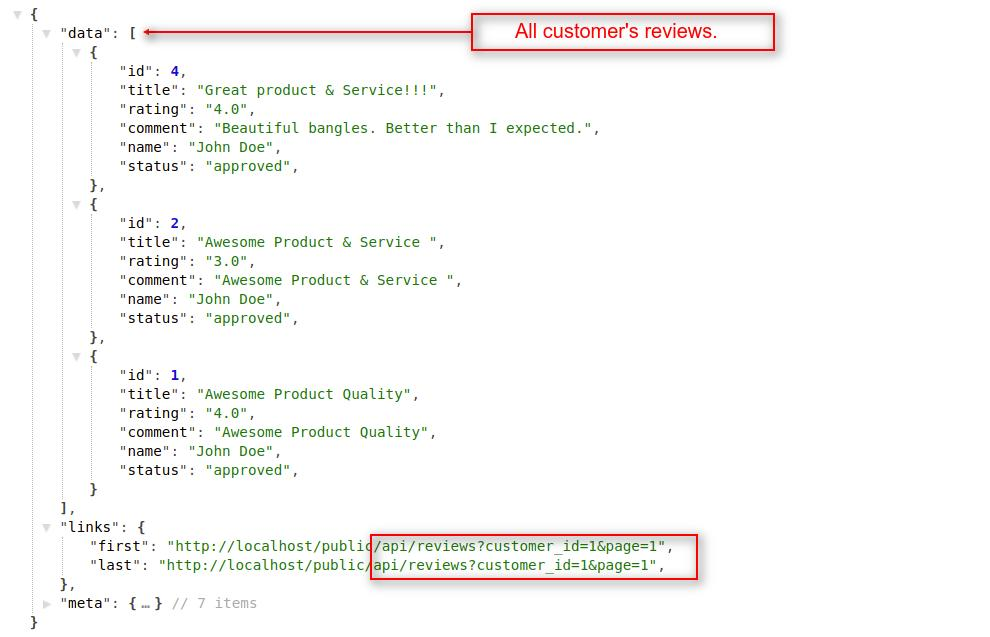
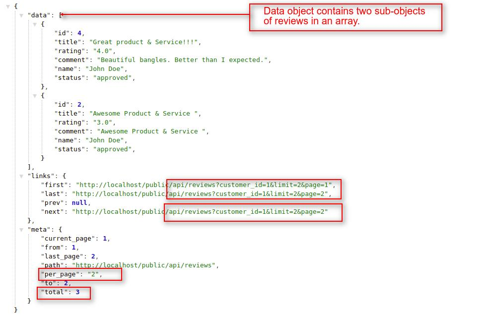
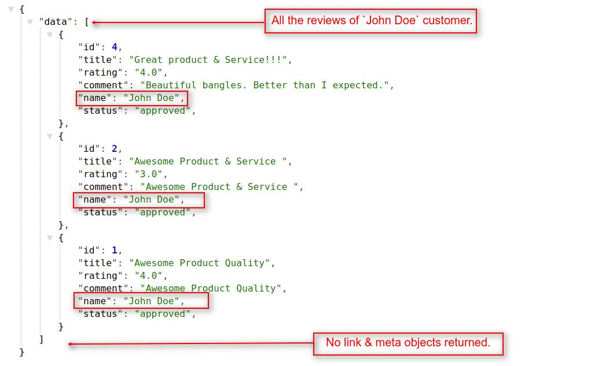

# How To Requests For Customer's Reviews
{:.pencil-icon}
[edit on github](https://github.com/bagisto/bagisto-docs/blob/master/api_customer_review.md){:class="edit-github" target="_blank"}

## 1. Get All Reviews Of Specific Customer: 
To get all the reviews of a specific customer, you have to pass a **`customer_id`** as a query parameter like **`reviews?customer={id}`** in API url. To use this API call customer authentication is not required.

> *http(s)://example.com/public/api/reviews?customer_id={id}*

**Note: In the `reviews?customer_id={id}` resource API call, we used `GET HTTP verb` to get all the reviews of a customer.**

##### Request:

> *http(s)://example.com/public/api/reviews?customer_id=6*

##### Response:
    {
        "data": [
            {
                "id": 4,
                "title": "Great product & Service!!!",
                "rating": "4.0",
                "comment": "Beautiful bangles. Better than I expected.",
                "name": "John Doe",
                "status": "approved",
            },
            {
                "id": 2,
                "title": "Awesome Product & Service ",
                "rating": "3.0",
                "comment": "Awesome Product & Service ",
                "name": "John Doe",
                "status": "approved",
            },
            {...}
        ],
        "links": {
            "first": "http://localhost/public/api/reviews?customer_id=1&page=1",
            "last": "http://localhost/public/api/reviews?customer_id=1&page=1",
        },
        "meta": {...}
    }

{:class="screenshot-dimension center"}

### 1.1 Get Customer's Reviews With Pagination: 
You can get customer's reviews according to the pagination. You can define the limit that how many records of reviews you want in each page.

###### Request:

> *http(s)://example.com/public/api/reviews?customer_id=1&page=1*

> *http(s)://example.com/public/api/reviews?customer_id=1&limit=3&page=1*

**Note: If you didn't use the page(?page=x) filter, then it returns the data of the first page by default. You can also provide the limit request parameter in the api url.**

###### Response:
    {
        "data": [
            {
                "id": 2,
                "title": "Awesome Product & Service ",
                "rating": "3.0",
                "comment": "Awesome Product & Service ",
                "name": "John Doe",
                "status": "approved",
            },
            {
                "id": 1,
                "title": "Awesome Product Quality",
                "rating": "4.0",
                "comment": "Awesome Product Quality",
                "name": "John Doe",
                "status": "approved",
            }
        ],
        "links": {
            "first": "http://localhost/public/api/reviews?customer_id=1&limit=2&page=1",
            "last": "http://localhost/public/api/reviews?customer_id=1&limit=2&page=2",
            "prev": "http://localhost/public/api/reviews?customer_id=1&limit=2&page=1",
            "next": null
        },
        "meta": {...}
    }

{:class="screenshot-dimension center"}

##### Explanation:

* In the above response, you will find the three Objects with below mentioned indexes:
    1. data
    2. link
    3. meta

#### data object:

Under the data object, you will find a array of multiple objects which contain the details of the customer's reviews. you can use these objects to access the data of each individual customer's review.

**Note: Regarding both link and meta objects, we already explained these objects functionality in <a href="api_category.html#link-object" target="_blank" class="bagsito-link"> Category API </a> section.**

### 1.2 Get Customer's Reviews Without Pagination: 
You can also get all the customer's reviews of Bagisto Store in a single API call without using pagination. For this you have to pass **`pagination=0`** in the query parameter with the **`reviews?customer_id={id}`** resource in API URL.

###### Request:

> *http(s)://example.com/public/api/reviews?customer_id=1pagination=0*

##### Response:
    {
        "data": [
            {
                "id": 4,
                "title": "Great product & Service!!!",
                "rating": "4.0",
                "comment": "Beautiful bangles. Better than I expected.",
                "name": "John Doe",
                "status": "approved",
            },
            {...},
            {...},
            {...}
        ]
    }

{:class="screenshot-dimension center"}