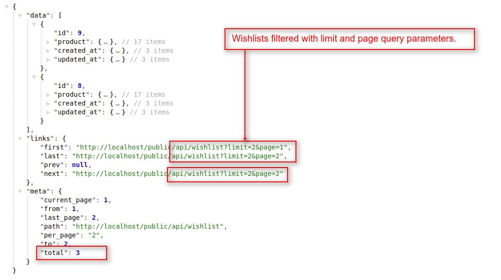
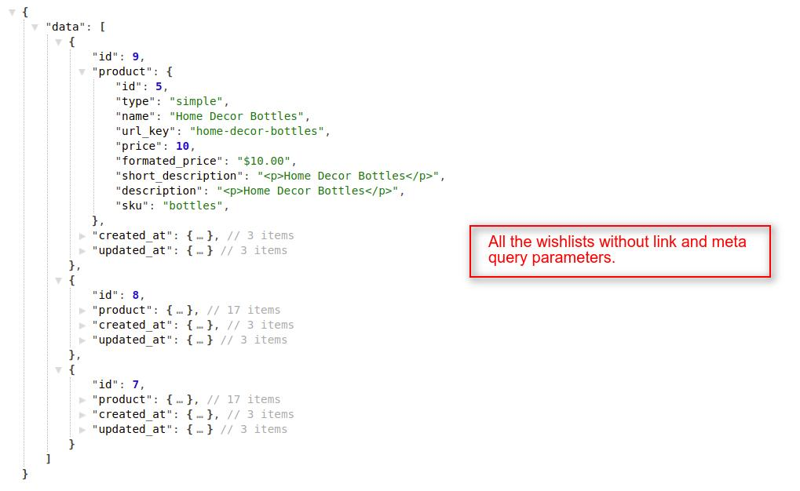

# How To Requests For Customer's Wishlist
{:.pencil-icon}
[edit on github](https://github.com/bagisto/bagisto-docs/blob/master/api_customer_wishlist.md){:class="edit-github" target="_blank"}

## 1. Get All Wishlists of Customers: 
You can get all the wishlists of Bagisto Store's customers. To call this API customer must be login into the Bagisto Store. You can achieve this job by using `wishlist` API call resource.

**Note: In the `wishlist` resource API call, we used `GET HTTP verb` to get all the wishlist of Bagisto's Store customers.**

###### Request:

> *http(s)://example.com/public/api/wishlist*

###### Response:
    {
        "data": [
            {
                "id": 9,
                "product": {}
            },
            {
                "id": 8,
                "product": {}
            },
            {
                "id": 7,
                "product": {}
            }
        ],
        "links": {
            "first": "http://localhost/public/api/wishlist?page=1",
            "last": "http://localhost/public/api/wishlist?page=1",
            "prev": null,
            "next": null
        },
        "meta": {
            "current_page": 1,
            "from": 1,
            "last_page": 1,
            "path": "http://localhost/public/api/wishlist",
            "per_page": 10,
            "to": 3,
            "total": 3
        }
    }

{:class="screenshot-dimension center"}

### 1.1 Get Wishlists With Pagination: 

> *http(s)://example.com/public/api/wishlist?page=1*

> *http(s)://example.com/public/api/wishlist?limit=5&page=1*

**Note: If you didn't use the page(?page=x) filter, then it returns the data of the first page by default. You can also provide the limit request parameter in the API url.**

{:class="screenshot-dimension center"}

###### Explanation:

* In the above response, you will find the three Objects with below mentioned indexes:
    1. data
    2. link
    3. meta

#### data object:

Under the data object, you will find the collection of many objects which will contain the details of wishlists of the store's customer.

**Note: Regarding both link and meta objects, we already explained these objects functionality in <a href="api_category.html#link-object" target="_blank" class="bagsito-link"> Category API </a> section.**

### 1.2 Get Wishlists Without Pagination: 
You can also get all the wishlists of Store's customers at once without pagination. To get the wishlists, customer must be login into the Bagisto Store. For this you have to pass **`pagination=0`** in the query parameter in API URL.

###### Request:

> *http(s)://example.com/public/api/wishlist?pagination=0*

##### Response:
    {
        "data": [
            {
                "id": 9,
                "product": {
                    "id": 5,
                    "type": "simple",
                    "name": "Home Decor Bottles",
                    "url_key": "home-decor-bottles",
                    "price": 10,
                    "formated_price": "$10.00",
                    "short_description": "
Home Decor Bottles
",
                    "description": "
Home Decor Bottles
",
                    "sku": "bottles",
                }
            },
            {
                "id": 8,
                "product": {}
            },
            {
                "id": 7,
                "product": {}
            }
        ]
    }

{:class="screenshot-dimension center"}

## 2. Get all Wishlists Of A Customer: 
To get all wishlists of a specific customer, you have to pass a `customer_id` as a query parameter like **`wishlist?customer_id={id}`** in API url. By using this resource and query parameter, you will get a array of wishlist(s) objects of a customer under **`data object`** in response.

> *http(s)://example.com/public/api/wishlist?customer_id={id}*

**Note: In the `wishlist/?customer_id={id}` resource API call, we used `GET HTTP verb` to get all the wishlist(s) of a customer.**

##### Request:

> *http(s)://example.com/public/api/wishlist?customer_id=1*

##### Response:
    {
        "data": [
            {
                "id": 7,
                "product": {...},
            }
        ],
        "links": {
            "first": "http://localhost/public/api/wishlist?customer_id=1&page=1",
            "last": "http://localhost/public/api/wishlist?customer_id=1&page=1",
            "prev": null,
            "next": null
        },
        "meta": {
            "current_page": 1,
            "from": 1,
            "last_page": 1,
            "path": "http://localhost/public/api/wishlist",
            "per_page": 10,
            "to": 1,
            "total": 1
        }
    }

{:class="screenshot-dimension center"}

## 3. Add Product To Wishlist: 
To add a product to customer's wishlist, you have to pass a `product_id` as a request payload like **`wishlist/add/{id}`** in API url.

> *http(s)://example.com/public/api/wishlist/add/{id}*

* This `wishlist/add/{id}` API call resource will add a new wishlist for a specific product, only if the customer has logged in currently into the store.

**Note: In the `wishlist/add/{id}` resource API call, we used `GET HTTP verb` to add a new wishlist for a login customer.**

##### Request:

> *http(s)://example.com/public/api/wishlist/add/{id}*
    
##### Response:
    {
        "data": {
            "id": 11,
            "product": {
                "id": 1,
                "type": "simple",
                "name": "Leather Shoes",
                "url_key": "leather-shoes",
                "price": 50,
                "formated_price": "$50.00",
                "short_description": "
Leather Shoes
",
                "description": "
Leather Shoes
",
                "sku": "men-leather-shoes"
            }
        },
        "message": "Item Successfully Added To Wishlist"
    }

{:class="screenshot-dimension center"}