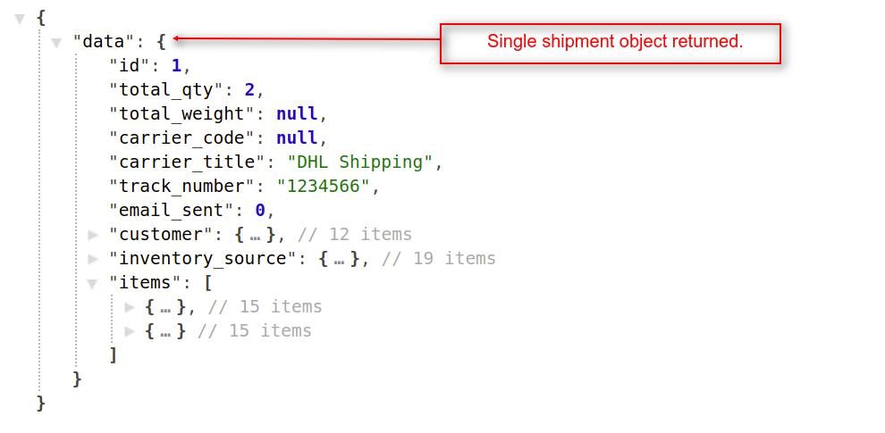

# How To Create Requests For Invoices
{:.pencil-icon}
[edit on github](https://github.com/bagisto/bagisto-docs/blob/master/api_invoice_shipment.md){:class="edit-github" target="_blank"}

## 1. Get All Invoices Of All Orders: 
You can get all the invoices of the Bagisto Store's orders. To get the invoices of the store, the customer must be login into the Bagisto Store. You can achieve this job by using **`invoices`** API call resource.
Currently, this **`invoices`** resource is helpful for both admin user and customer too.

> *http(s)://example.com/public/api/invoices*

**Note: In the `invoices` resource API call, we used `GET HTTP verb` to get all the invoices of the Bagisto Store's orders.**

##### Request:

> *http(s)://example.com/public/api/invoices*

##### Response:
    {
        "data": [
            {
                "id": 2,
                "state": "paid",
                "email_sent": 0,
                "total_qty": 4,
                "sub_total": "190.0000",
                "base_sub_total": "190.0000",
                "grand_total": "230.0000",
                "order_address": {...},
                "transaction_id": null,
                "items": [
                    {...},
                    {...}
                ],
            },
            {...}
        ],
        "links": {
            "first": "http://localhost/public/api/invoices?page=1",
            "last": "http://localhost/public/api/invoices?page=1",
            "prev": null,
            "next": null
        },
        "meta": {...}
    }

{:class="screenshot-dimension center"}

### 1.1 Get Invoices With Pagination: 

> *http(s)://example.com/public/api/invoices?&limit=5&page=1*

**Note: If you didn't use the page(?page=x) filter, then it returns the data of the first page by default. You can provide both limit and page request parameters in the api url.**

### 1.2 Get Invoices Without Pagination: 

> *http(s)://example.com/public/api/invoices?pagination=0*

**Note: If you didn't want invoices records according to page wise, then you can pass the `pagination=0` query parameter in the API url.**

## 2. Get Specific Order's Invoice Based On Order Id: 
To get the detail of specific order's invoice, you have to pass an order_id as a query parameter like **`invoies?order_id={id}`** in API url. By using this resource and query parameter, you will get only a single invoice detail regarding the provided `order_id` in response.

> *http(s)://example.com/public/api/invoices?order_id={id}*

**Note: In the `'invoices?order_id={id}'` resource API call, we used `GET HTTP verb` to get the invoice of a single order.**

##### Request:

> *http(s)://example.com/public/api/invoices?order_id=3*

##### Response:
    {
        "data": [
            {
                "id": 1,
                "state": "paid",
                "email_sent": 0,
                "total_qty": 2,
                "sub_total": "60.0000",
                "grand_total": "80.0000",
                "shipping_amount": "20.0000",
                "items": [
                    {...},
                    {...}
                ],
            }
        ],
        "links": {
            "first": "http://localhost/public/api/invoices?order_id=3&page=1",
            "last": "http://localhost/public/api/invoices?order_id=3&page=1",
            "prev": null,
            "next": null
        },
        "meta": {...}
    }

{:class="screenshot-dimension center"}

## 3. Get Specific Invoice Based On Invoice Id: 
To get the detail of specific invoice, you have to pass an invoice_id as a request payload like **`invoies/{id}`** in API url. By using this resource and request payload, you will get only `a single object` of invoice detail under the **`data object`** in response.

> *http(s)://example.com/public/api/invoices/{id}*

* This **`invoices/{id}`** API call resource will return the single invoice details, only if the customer has logged into the store.

**Note: In the **`'invoices/{id}'`** resource API call, we used `GET HTTP verb` to get the single invoice detail based on invoice_id.**

##### Request:

> *http(s)://example.com/public/api/invoices/2*

##### Response:
    {
        "data": {
            "id": 2,
            "state": "paid",
            "email_sent": 0,
            "total_qty": 4,
            "sub_total": "190.0000",
            "grand_total": "230.0000",
            "shipping_amount": "40.0000",
            "tax_amount": "0.0000",
            "discount_amount": "0.0000",
            "order_address": {...},
            "transaction_id": null,
            "items": [
                {...},
                {...}
            ],
        }
    }

{:class="screenshot-dimension center"}

# How To Create Requests For Shipments 
{:.pencil-icon}
[edit on github](https://github.com/bagisto/bagisto-docs/blob/master/api_invoice_shipment.md){:class="edit-github" target="_blank"}

## 1. Get All Shipments Of All Orders: 
You can get all the shipments of the Bagisto Store. To get the shipments of the store, the customer must be login into the Bagisto Store. You can achieve this job by using **`shipments`** API call resource.
Currently, this **`shipments`** resource is helpful for both admin user and customer too.

> *http(s)://example.com/public/api/shipments*

**Note: In the **`'shipments'`** resource API call, we used `GET HTTP verb` to get all the shipments of the Bagisto Store.**

##### Request:

> *http(s)://example.com/public/api/shipments*

##### Response:
    {
        "data": [
            {
                "id": 1,
                "total_qty": 2,
                "total_weight": null,
                "carrier_title": "DHL Shipping",
                "track_number": "1234566",
                "customer": {...},
                "inventory_source": {
                    "id": 1,
                    "name": "Default",
                    "contact_name": "Detroit Warehouse",
                    "contact_email": "warehouse@example.com",
                    "contact_number": "1234567899",
                    "country": "US",
                    "state": "MI",
                    "city": "Detroit",
                    "street": "12th Street",
                    "postcode": "48127",
                },
                "items": [{...},{...}]
            }
        ],
        "links": {...},
        "meta": {...}
    }

{:class="screenshot-dimension center"}

### 1.1 Get Shipments With Pagination: 

> *http(s)://example.com/public/api/shipments?&limit=5&page=1*

**Note: If you didn't use the page(?page=x) filter, then it returns the data of the first page by default. You can provide both limit and page request parameters in the api url.**

### 1.2 Get Shipments Without Pagination: 

> *http(s)://example.com/public/api/shipments?pagination=0*

**Note: If you didn't want shipments records according to page wise, then you can pass the `pagination=0` query parameter in the API url.**

## 2. Get Specific Order's Shipment Based On Order Id: 
To get the detail of specific order's shipment, you have to pass an **`'order_id'`** as a query parameter like **`shipments?order_id={id}`** in API url. By using this resource and query parameter, you will get only a single shipment detail in API response based on the provided `order_id`.

> *http(s)://example.com/public/api/shipments?order_id={id}*

**Note: In the `'shipments?order_id={id}'` resource API call, we used `GET HTTP verb` to get the shipment of a single order.**

##### Request:

> *http(s)://example.com/public/api/shipments?order_id=3*

##### Response:
    {
        "data": [
            {
                "id": 1,
                "total_qty": 2,
                "total_weight": null,
                "carrier_code": null,
                "carrier_title": "DHL Shipping",
                "track_number": "1234566",
                "customer": {...},
                "inventory_source": {...},
                "items": [
                    {...},
                    {...}
                ]
            }
        ],
        "links": {
            "first": "http://localhost/public/api/shipments?order_id=3&page=1",
            "last": "http://localhost/public/api/shipments?order_id=3&page=1",
            "prev": null,
            "next": null
        },
        "meta": {...}
    }

{:class="screenshot-dimension center"}

## 3. Get Specific Shipment Based On Shipment Id: 
To get the detail of specific shipment, you have to pass a **`shipment_id`** as a request payload like **`shipments/{id}`** in API url. By using this resource and request payload, you will get only `a single object` of shipment detail under the **`data object`** in response.

> *http(s)://example.com/public/api/shipments/{id}*

* This **`shipments/{id}`** API call resource will return the single shipment details, only if the customer has logged into the store.

**Note: In the **`'shipments/{id}'`** resource API call, we used `GET HTTP verb` to get the single shipment detail based on `shipment_id`.**

##### Request:

> *http(s)://example.com/public/api/shipments/1*

##### Response:
    {
        "data": {
            "id": 1,
            "total_qty": 2,
            "total_weight": null,
            "carrier_code": null,
            "carrier_title": "DHL Shipping",
            "track_number": "1234566",
            "email_sent": 0,
            "customer": {...},
            "inventory_source": {...},
            "items": [
                {...},
                {...}
            ]
        }
    }

{:class="screenshot-dimension center"}