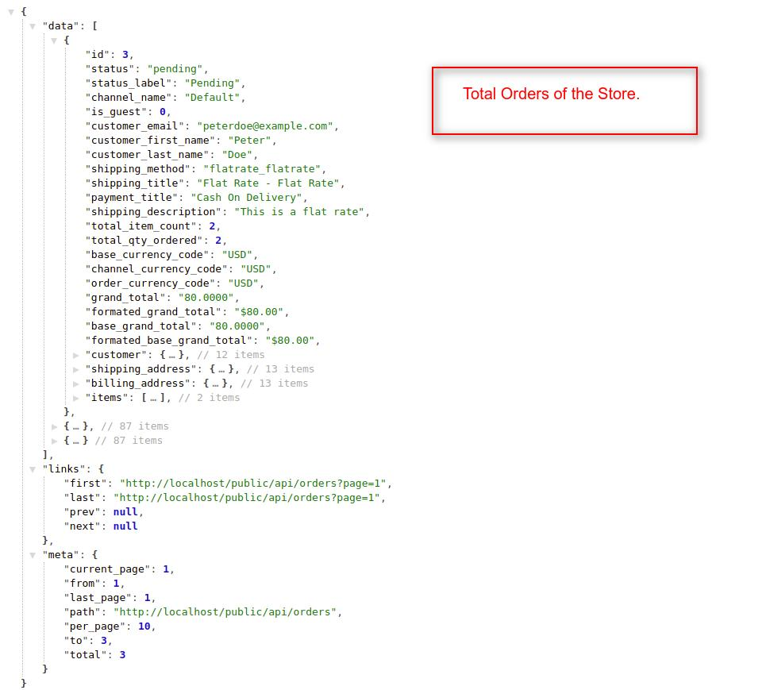
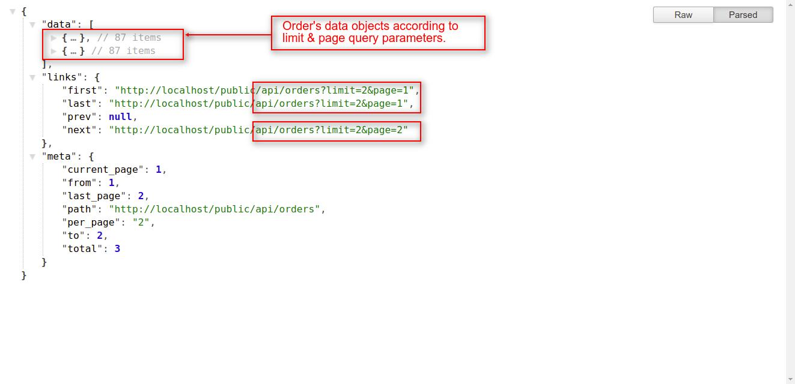
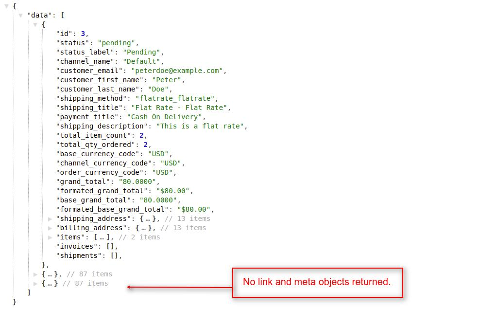
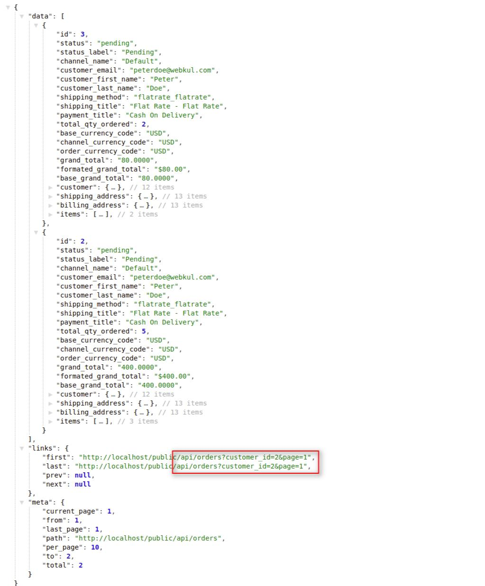
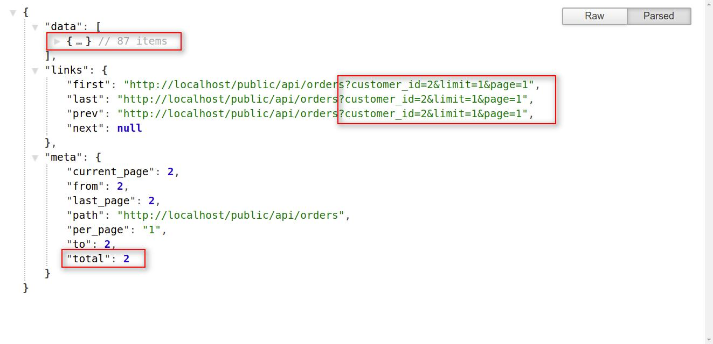
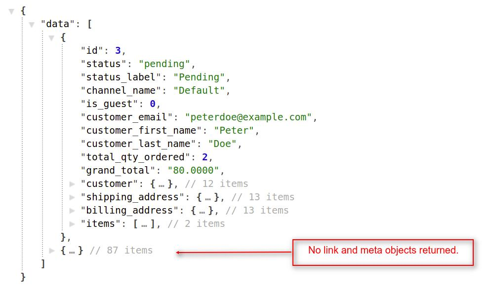
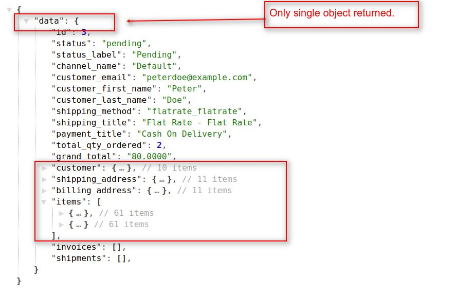

# How To Create Requests For Orders  <a href="https://github.com/bagisto/bagisto-docs/blob/master/create_module.md">Edit On github</a>

## 1. Get All Bagisto's Orders:
You can get all the orders of the Bagisto Store. To get the orders of the store, the customer must be logged into the Bagisto Store. You can achieve this job by using **`orders`** API call resource.
Currently, this **`orders`** resource is helpful for both admin,user and customer too.

> *http(s)://example.com/public/api/orders*

**Note: In the `orders` resource API call, we used `GET HTTP verb` to get all the orders of the Bagisto Store.**

#### Request:

> *http(s)://example.com/public/api/orders*

#### Response:
    {
        "data": [
            {
                "id": 3,
                "status": "pending",
                "status_label": "Pending",
                "channel_name": "Default",
                "is_guest": 0,
                "customer_email": "peterdoe@example.com",
                "customer_first_name": "Peter",
                "customer_last_name": "Doe",
                "shipping_method": "flatrate_flatrate",
                "shipping_title": "Flat Rate - Flat Rate",
                "payment_title": "Cash On Delivery",
                "shipping_description": "This is a flat rate",
                "items": [{...}, {...}, {...}],
                ...

            },
            {...},
            {...},
        ],
        "links": {...},
        "meta": {...}
    }

<a href="assets/images/Bagisto_Api/bagisto_orders.jpg" target="_blank">
{: height="50%" width="50%" .center}
</a>

### 1.1 Get Orders With Pagination:

> *http(s)://example.com/public/api/orders?page=1*

> *http(s)://example.com/public/api/orders?limit=5&page=1*

**Note: If you didn't use the page(?page=x) filter, then it returns the data of the first page by default. You can also provide the limit request parameter in the api url.**

<a href="assets/images/Bagisto_Api/bagisto_orders_page.jpg" target="_blank">
{: height="50%" width="50%" .center}
</a>

#### Explanation:

* In the above response, you will find the three Objects with below mentioned indexes:
    1. data
    2. link
    3. meta

#### data object:

Under the data object, you will find an array with multiple objects that contains the details of the orders. you can use the order's index data by accessing these order sub-objects.

**Note: Regarding both link and meta objects, we already explained these objects functionality in <a href="api_category.html#link-object" target="_blank" class="bagsito-link"> Category API </a> section.**

### 1.2 Get Orders Without Pagination:
You can also get all the orders at once of Bagisto Store without pagination. To get the orders, customer must be logged into the Bagisto Store. For this you have to pass **`pagination=0`** in the query parameter with the **`orders`** resource in API URL.

#### Request:

> *http(s)://example.com/public/api/orders?pagination=0*

### Response:
    {
        "data": [
            {
                "id": 3,
                "status": "pending",
                "status_label": "Pending",
                "channel_name": "Default",
                "is_guest": 0,
                "customer_email": "peterdoe@example.com",
                "customer_first_name": "Peter",
                "customer_last_name": "Doe",
                "shipping_method": "flatrate_flatrate",
                "shipping_title": "Flat Rate - Flat Rate",
                "payment_title": "Cash On Delivery",
                "shipping_description": "This is a flat rate",
                "items": [{...}, {...}, {...}],
                ...

            },
            {...},
            {...},
        ]
    }

<a href="assets/images/Bagisto_Api/bagisto_orders_no_pag.jpg" target="_blank">
{: height="50%" width="50%" .center}
</a>

## 2. Get All Orders Of Specific Customer:
To get all the orders of a specific customer, you have to pass a customer_id as a query parameter like **`orders?customer_id={id}`** in API url. To use this API call customer authentication is required, means that customer must be logged in the store.

> *http(s)://example.com/public/api/orders?customer_id={id}*

* This **`'orders?customer_id={id}'`** API call resource will return the customer's orders details, only if that customer has logged into the store.

**Note: In the `orders?customer_id={id}` resource API call, we used `GET HTTP verb` to get all the orders of a customer.**

### Request:

> *http(s)://example.com/public/api/orders?customer_id=2*

### Response:
    {
        "data": [
            {
                "id": 3,
                "status": "pending",
                "customer_email": "peterdoe@webkul.com",
                "customer_first_name": "Peter",
                "customer_last_name": "Doe",
                "shipping_method": "flatrate_flatrate",
                "shipping_title": "Flat Rate - Flat Rate",
                "payment_title": "Cash On Delivery",
                "total_qty_ordered": 2,
                "grand_total": "80.0000",
                "customer": {...},
                "shipping_address": {...},
                "billing_address": {...},
                "items": [{...},{...},{...}],
            },
            {
                "id": 2,
                "status": "pending",
                "customer_email": "peterdoe@webkul.com",
                "customer_first_name": "Peter",
                "customer_last_name": "Doe",
                "shipping_method": "flatrate_flatrate",
                "shipping_title": "Flat Rate - Flat Rate",
                "payment_title": "Cash On Delivery",
                "total_qty_ordered": 5,
                "grand_total": "400.0000",
                "customer": {...},
                "shipping_address": {...},
                "billing_address": {...},
                "items": [{...},{...},{...}],
            }
        ],
        "links": {...},
        "meta": {...}
    }

<a href="assets/images/Bagisto_Api/bagisto_orders_custId.jpg" target="_blank">
{: height="50%" width="50%" .center}
</a>

### 2.1 Get Customer's Orders With Pagination

> *http(s)://example.com/public/api/orders?customer_id=2&limit=5&page=1*

#### Response
    {
        "data": [
            {...}
        ],
        "links": {
            "first": "http://localhost/public/api/orders?customer_id=2&limit=1&page=1",
            "last": "http://localhost/public/api/orders?customer_id=2&limit=1&page=1",
            "prev": "http://localhost/public/api/orders?customer_id=2&limit=1&page=1",
            "next": null
        },
        "meta": {
            "current_page": 2,
            "from": 2,
            "last_page": 2,
            "path": "http://localhost/public/api/orders",
            "per_page": "1",
            "to": 2,
            "total": 2
        }
    }
<a href="assets/images/Bagisto_Api/bagisto_orders_cust_pag.jpg" target="_blank">
{: height="50%" width="50%" .center}
</a>

**Note: If you didn't use the page(?page=x) filter, then it returns the data of the first page by default. You can also provide the limit and page request parameters with the customer_id query parameter in the api url.**

### 2.2 Get Customer's Orders Without Pagination

> *http(s)://example.com/public/api/orders?customer_id=2&pagination=0*

#### Response
    {
        "data": [
            {
                "id": 3,
                "status": "pending",
                "customer_email": "peterdoe@webkul.com",
                "customer_first_name": "Peter",
                "customer_last_name": "Doe",
                "total_qty_ordered": 2,
                "grand_total": "80.0000",
                "customer": {...},
                "shipping_address": {...},
                "billing_address": {...},
                "items": [{...},{...},{...}],
            },
            {
                "id": 2,
                "status": "pending",
                "customer_email": "peterdoe@webkul.com",
                "customer_first_name": "Peter",
                "customer_last_name": "Doe",
                "total_qty_ordered": 5,
                "grand_total": "400.0000",
                "customer": {...},
                "shipping_address": {...},
                "billing_address": {...},
                "items": [{...},{...},{...}],
            },
            {...}
        ]
    }
<a href="assets/images/Bagisto_Api/bagisto_orders_cust_no_pag.jpg" target="_blank">
{: height="50%" width="50%" .center}
</a>

**Note: If you didn't want customer's order data according to page wise, then you can pass the `pagination=0` query parameter with the `customer_id` parameter in the API url.**

## 3. Get Specific Order Based On Order Id:
To get the specific order details, you have to pass an order_id as a request payload like **`orders/{order_id}`** in API url. By using this resource and request payload, you will get only `a single object` under **`data object`** in response.

> *http(s)://example.com/public/api/orders/{id}*

* This **`orders/{id}`** API call resource will return the single order details, only if the customer of that order has logged into the store.

**Note: In the `orders/{id}` resource API call, we used `GET HTTP verb` to get the single order of logged in customer.**

### Request:

> *http(s)://example.com/public/api/order/3*

### Response:
    {
        "data": {
            "id": 3,
            "status": "pending",
            "status_label": "Pending",
            "channel_name": "Default",
            "customer_email": "peterdoe@example.com",
            "customer_first_name": "Peter",
            "customer_last_name": "Doe",
            "shipping_method": "flatrate_flatrate",
            "shipping_title": "Flat Rate - Flat Rate",
            "payment_title": "Cash On Delivery",
            "total_qty_ordered": 2,
            "grand_total": "80.0000",
            "customer": {...},
            "shipping_address": {...},
            "billing_address": {...},
            "items": [
                {...},
                {...}
            ],
            "invoices": [],
            "shipments": [],
            }
        }
    }

<a href="assets/images/Bagisto_Api/bagisto_orders_id.jpg" target="_blank">
{: height="50%" width="50%" .center}
</a>

