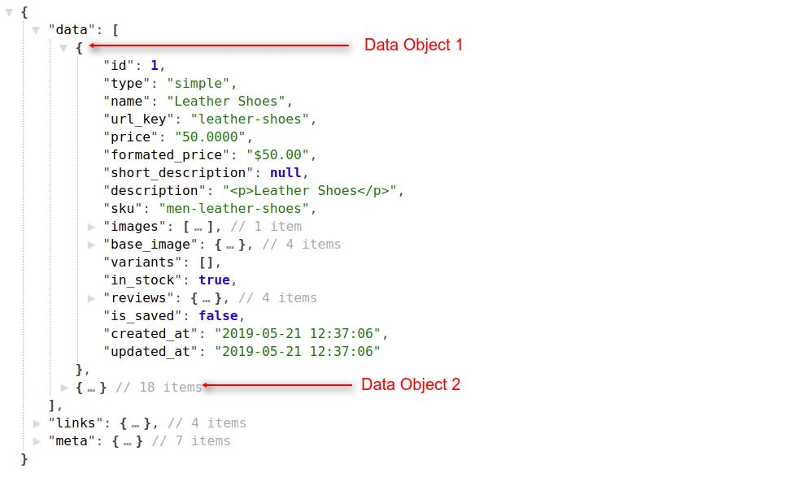
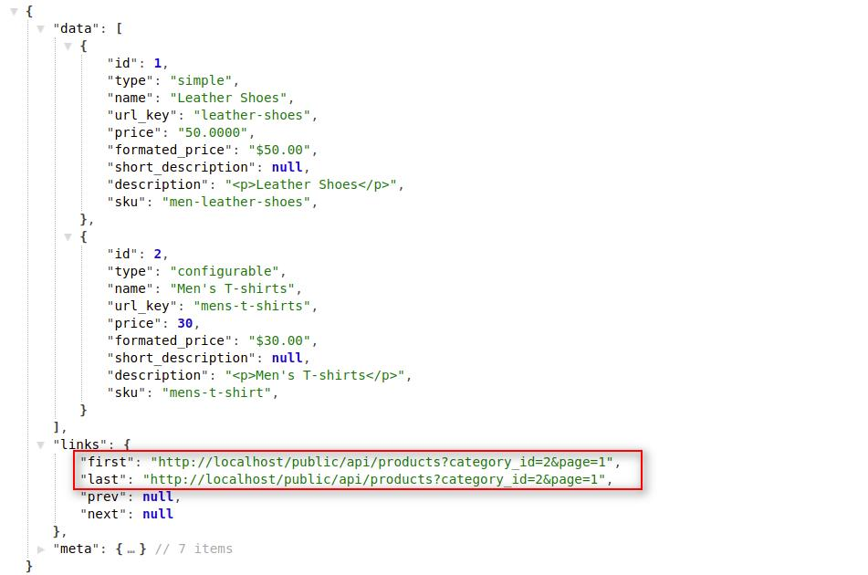
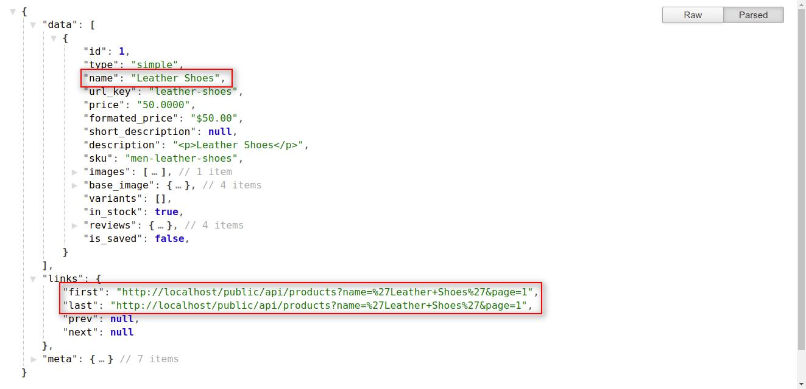
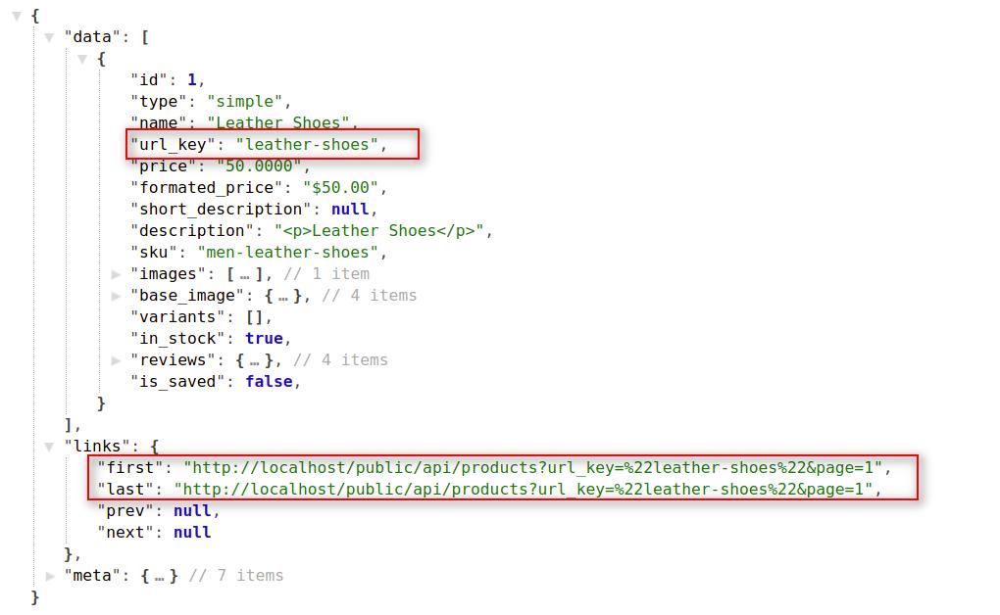
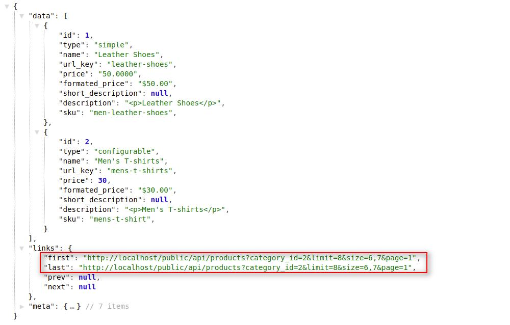
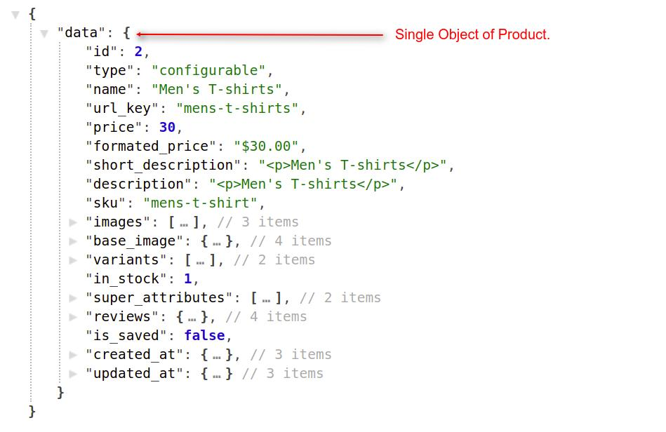
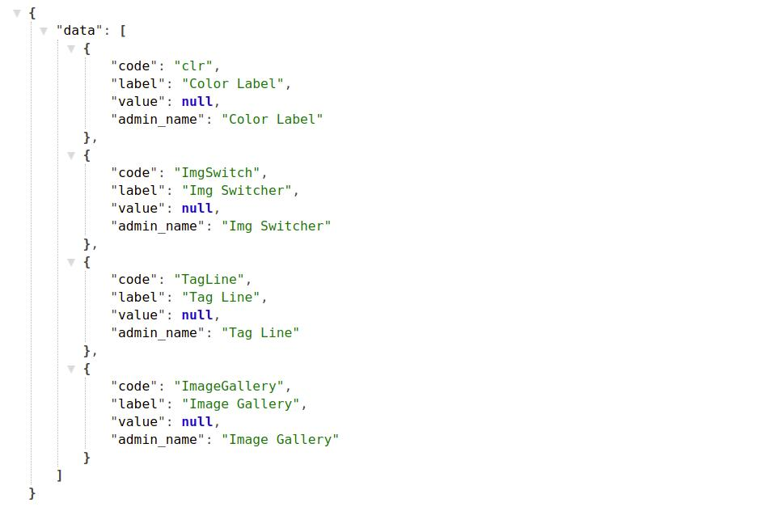
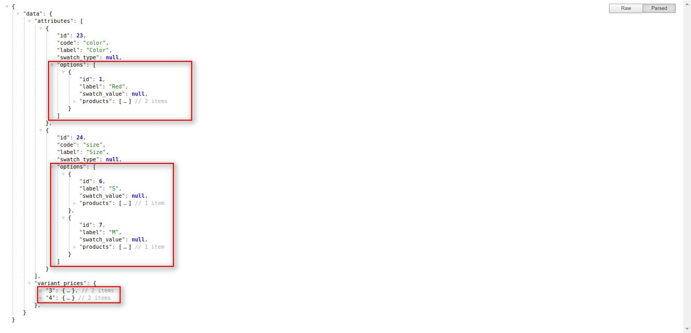

# How To Create Requests For Products  <a href="https://github.com/bagisto/bagisto-docs/blob/master/create_module.md">Edit On github</a>

To get all the Bagisto Store Products with the pagination, you have to place a request by using the below API Call with the resource i.e. `products` :

## 1. Get Products With Pagination:

> *http(s)://example.com/public/api/products*

> *http(s)://example.com/public/api/products?page=1*

**Note: If you didn't use the page(?page=x) filter, then it returns the data of the first page by default.**

### Response:

<a href="assets/images/Bagisto_Api/bagisto_prod_all.jpg" target="_blank">
{: height="50%" width="50%" .center}
</a>
    
       {
            "data": [
                {
                    "id": 1,
                    "type": "simple",
                    "name": "Leather Shoes",
                    "url_key": "leather-shoes",
                    "price": "50.0000",
                    "formated_price": "$50.00",
                    "short_description": null,
                    "description": "
Leather Shoes
",
                    "sku": "men-leather-shoes",
                    "images": [],
                    "base_image": {},
                    "variants": [],
                    "in_stock": true,
                    "reviews": {},
                    "is_saved": false,
                    "created_at": "2019-05-21 12:37:06",
                    "updated_at": "2019-05-21 12:37:06"
                },
                {...}
            ],
            "links": {},
            "meta": {}
        }

### Explanation:

* In the above response, you will find the three Objects with below mentioned indexes:
    1. data
    2. link
    3. meta

#### data object:

Under the data object, you will find the collection of many objects which contain the details of bagisto store's products. you can use the product's index data by accessing these products sub-objects.

**Note: Regarding link and meta objects, we already explained these objects functionality in <a href="api_category.html#link-object" target="_blank" class="bagsito-link"> Category API </a> section.**

### 1.1. Get Product(s) With Query Parameters:

* category_id : You can find out the store products based on any specific category. You can achieve this task by just passing **`category_id`** as the query parameter in API url. **For example: `category_id=1`**

> *http(s)://example.com/public/api/products?category_id=2*

~~~
* You can also use the limit and page query parameters with the category_id parameter.
~~~
> *http(s)://example.com/public/api/products?category_id=2&limit=5&page=1*

> *http(s)://example.com/public/api/products?category_id=2&limit=5&page=1*

<a href="assets/images/Bagisto_Api/bagisto_prod_category.jpg" target="_blank">
{: height="50%" width="50%" .center}
</a>

* new : If you want to get the store's product(s) those are having new condition then you can use **`new=1`** in the query parameter and if want to get product(s) without new condition then use **`new=0`**.

> *http(s)://example.com/public/api/products?new=1*

~~~
* You can also use the limit and page query parameters with the new query parameter:
~~~
> *http(s)://example.com/public/api/products?new=1&limit=5&page=1*

> *http(s)://example.com/public/api/products?new=0&limit=5&page=1*

<a href="assets/images/Bagisto_Api/bagisto_prod_new.jpg" target="_blank">
{: height="50%" width="50%" .center}
</a>

* featured : If you want to get the store's product(s) those are featured then you can use **`featured=1`** query parameter and use **`featured=0`** for vice-versa.

> *http(s)://example.com/public/api/products?featured=1*

~~~
* You can also use the limit and page in query parameters with featured query parameter:
~~~
> *http(s)://example.com/public/api/products?featured=1&limit=5&page=1*

> *http(s)://example.com/public/api/products?featured=0&limit=5&page=1*

<a href="assets/images/Bagisto_Api/bagisto_prod_new.jpg" target="_blank">
{: height="50%" width="50%" .center}
</a>

* name : Suppose you want to find out the data of your product in the Bagisto store, here you can use **`name` query parameter**. You have to provide the product name to the **`name`** query parameter in API url. **For example: `name=<product-name>`**

> *http(s)://example.com/public/api/products?name='Leather Shoes'*

<a href="assets/images/Bagisto_Api/bagisto_prod_name.jpg" target="_blank">
{: height="50%" width="50%" .center}
</a>

* sku : You can also get your product related details with the help of product's sku. Sku will be unique for each product in Bagisto Store. For this you have to use **`sku`** as query parameter in API url. **For example: `sku=<product-sku>`**

> *http(s)://example.com/public/api/products?name='Leather Shoes'*

<a href="assets/images/Bagisto_Api/bagisto_prod_sku.jpg" target="_blank">
{: height="50%" width="50%" .center}
</a>

* url_key : **`url_key`** is a unique field for every product in Bagisto Store. You can also find out product details by using **`url_key`**. For this you have to pass `url_key` as query parameter in API url. **For example: `url_key=<product-url-key>`**

> *http(s)://example.com/public/api/products?url_key='leather-shoes'*

<a href="assets/images/Bagisto_Api/bagisto_prod_url_key.jpg" target="_blank">
{: height="50%" width="50%" .center}
</a>

### 1.2. Get Product(s) With Filterable Query Parameters:

You can also filter your store product(s) by using **`filterable attributes query parameters`**. These filter will only work with the **`category_id`** input query parameter. There are two system defined filterable attributes in the Bagisto E-commerce framework i.e. **`Size`** and **`Color`**. Admin user can also create their own **`Custom Attribute`** and can make these custom attributes as **`filterable`**. By using these filterable attributes, customer can filter the category's product(s) to get the desired result.

* size : You can filter bagisto product catalog with the help of `size` filter. `size` filter will work only on the category layout. You can pass the multiple attribute's values to the `size` filterable attributes as a query parameter in API url. Suppose you want to filter **`Men's T-Shirt`** with **`M and L size`**, then you can pass the value of both M & L. **For Example: `size=6,7`**

> *http(s)://example.com/public/api/products?category_id=2&size=6,7*

~~~
* You can also use the limit and page in query parameters with category & size filterable parameters:
~~~
> *http(s)://example.com/public/api/products?category_id=2&size=6,7&limit=10&page=1*

<a href="assets/images/Bagisto_Api/bagisto_prod_size.jpg" target="_blank">
{: height="50%" width="50%" .center}
</a>

* color : You can also filter bagisto product catalog with the help of `color` filter. `color` filter will work only on the category layout. You can pass the multiple attribute's values to the `color` filterable attributes as a query parameter in API url. Suppose you want to filter **`Men's T-Shirt`** with **`White and Red color`**, then you can pass the value of both White & Red. **For Example: `color=1,2`**

> *http(s)://example.com/public/api/products?category_id=2&color=1,2*

~~~
* You can also use the limit and page in query parameters with category & color filterable parameters:
~~~
> *http(s)://example.com/public/api/products?category_id=2&color=1,2&limit=10&page=1*

<a href="assets/images/Bagisto_Api/bagisto_prod_color.jpg" target="_blank">
{: height="50%" width="50%" .center}
</a>

* price : You can also filter bagisto product catalog with the help of `price` filter.

#### In case of simple product:
* You can set range of a minimun price and maximum price. Same like **`size and color`**, `price` filter will also work on the category layout only. Suppose you want to filter product(s) those are having price between price range from 50 to 100, then you have to pass value like: **`price=10,50`** as the query parameter in API url.

> *http(s)://example.com/public/api/products?category_id=2&price=50,100*

~~~
* You can also use the limit and page in query parameters with category & price filterable parameters:
~~~
> *http(s)://example.com/public/api/products?category_id=2&price=50,100&limit=10&page=1*

<a href="assets/images/Bagisto_Api/bagisto_prod_price_simple.jpg" target="_blank">
{: height="50%" width="50%" .center}
</a>

#### In case of configurable product:
* **`price`** filter will also work with product's variants. Suppose you want to filter product(s) with the **`40$ min and 100$ max`** price range. And there is configurable product named **`Men's T-shirts`** having price **`30$`** and there is any variant of same product having `45$ price`, then **`Men's T-shirts`** product will show you in the filtered product's list. For Example: **`price=30,100`**.

> *http(s)://example.com/public/api/products?category_id=2&price=30,100*

<a href="assets/images/Bagisto_Api/bagisto_prod_price_config.jpg" target="_blank">
{: height="50%" width="50%" .center}
</a>

**Note: The above explained `filter query parameters` (i.e. size,color,price) can be use together.**

## 2. Get Specific Product:
If you want the record of any specific product, then you have to provide the product id as as input parameter in api url.

> *http(s)://example.com/public/api/products/1*

<a href="assets/images/Bagisto_Api/bagisto_prod_id.jpg" target="_blank">
{: height="50%" width="50%" .center}
</a>

**Note: Here you will see in the api response `data Object` will only contain the single object of category record**

## 3. Get Product's Additional Information:
`Additional Information` relates all the attributes and their values for which Admin set the `'Yes'` value for the **`Visible on Product View Page on Front-end`** field.

Product's additional information means those attributes which describes the product's specification.

<a href="assets/images/Bagisto_Api/bagisto_attribute.jpg" target="_blank">
{: height="50%" width="50%" .center}
</a>

By using this API call, you will get all the attributes (both system defined and custom) of a product those are having `'Yes'` value for the **`Visible on Product View Page on Front-end`** field by providing `product_id` of that product in the API url.

*http(s)://example.com/public/api/product-additional-information/1*

    {
        "data": [
            {
                "code": "description",
                "label": "Description",
                "value": "
Men's T-shirts
",
                "admin_name": "Description"
            }
        ]
    }

<a href="assets/images/Bagisto_Api/bagisto_add_info.jpg" target="_blank">
{: height="50%" width="50%" .center}
</a>

## 4. Get Product's Variants Information:
You can get all the configurable attributes of a product by using `product-configurable-config` resource in API call. It will return all the variants of a product with their `label`, `options`, `regular_price` and `final_price` also.

Admin can set the `'Yes'` value for the **`Use To Create Configurable Product`** field under the attribute panel to make that attribute as variant.

<a href="assets/images/Bagisto_Api/bagisto_config.jpg" target="_blank">
{: height="50%" width="50%" .center}
</a>

By using this API call, you will get all the configurable attributes (both system defined and custom) of a product those are having `'Yes'` value for the **`Use To Create Configurable Product`** field by providing `product_id` of that product in the API url.

*http(s)://example.com/public/api/product-configurable-config/1*

    {
        "data": {
            "attributes": [
                {
                    "id": 24,
                    "code": "size",
                    "label": "Size",
                    "swatch_type": null,
                    "options": [
                        {
                            "id": 7,
                            "label": "M",
                            "swatch_value": null,
                            "products": [
                                4
                            ]
                        }
                    ]
                }
            ],
            "variant_prices": {
                "4": {
                    "regular_price": {
                        "formated_price": "$45.00",
                        "price": 45
                    },
                    "final_price": {
                        "formated_price": "$45.00",
                        "price": 45
                    }
                }
            }
        }
    }

<a href="assets/images/Bagisto_Api/bagisto_config_attr.jpg" target="_blank">
{: height="50%" width="50%" .center}
</a>
