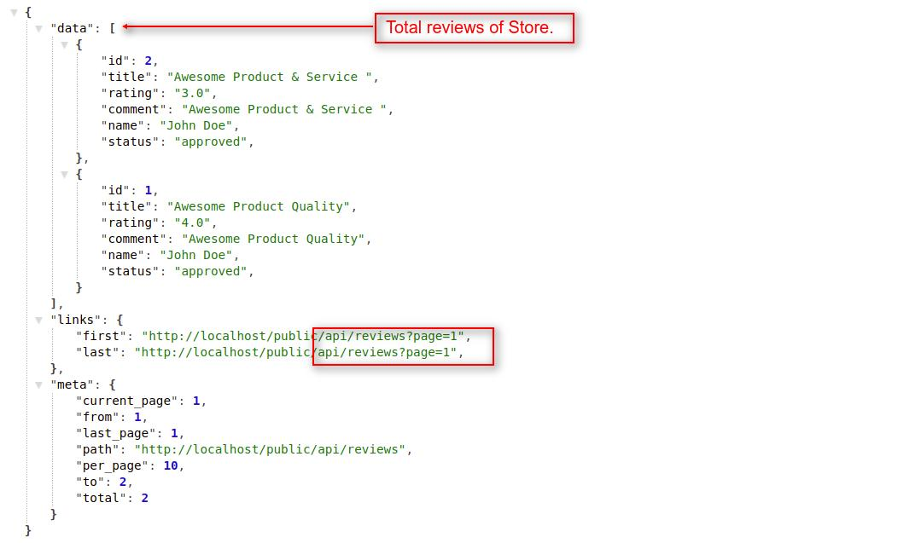
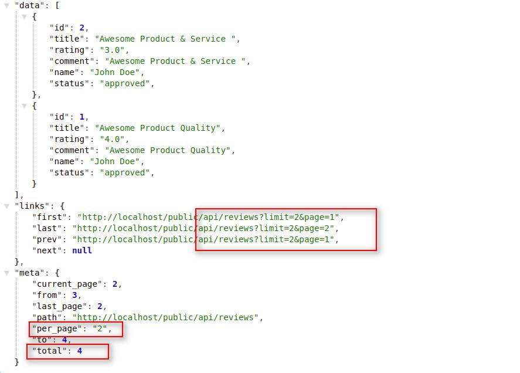
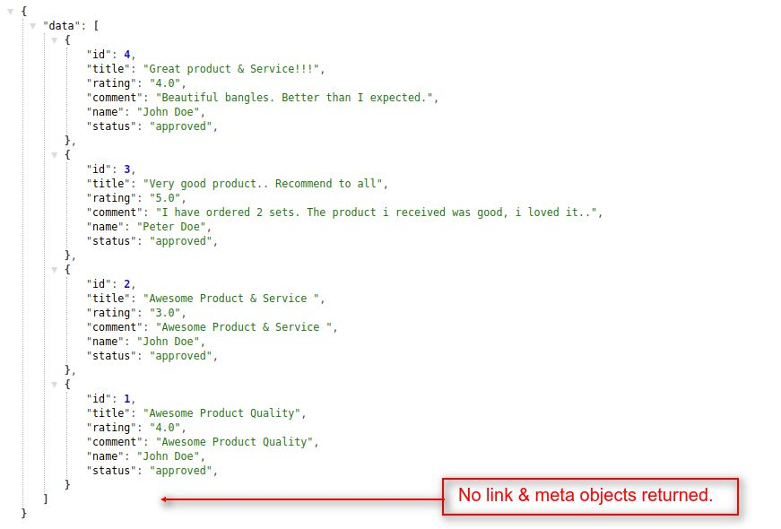
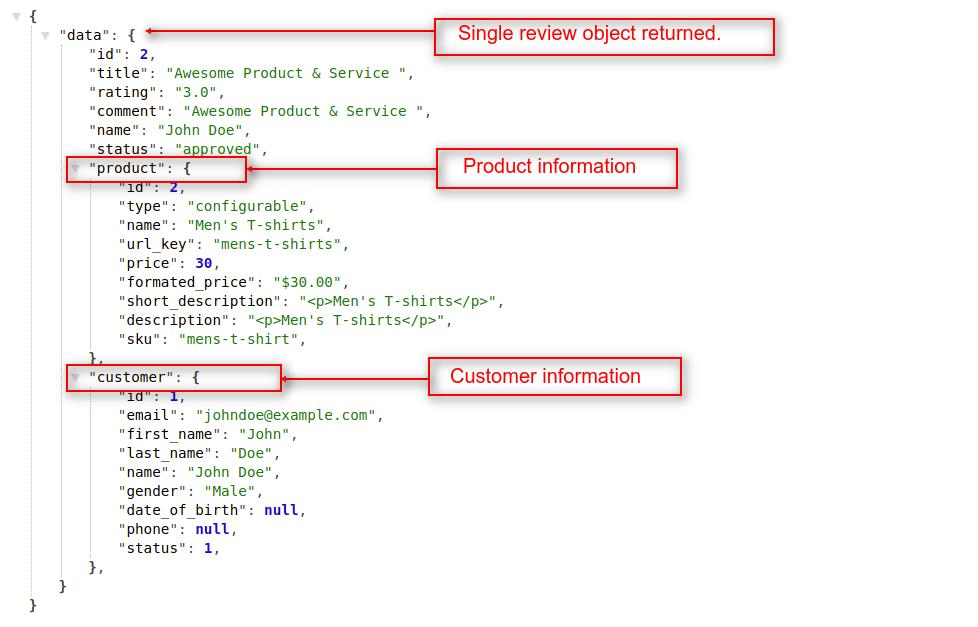
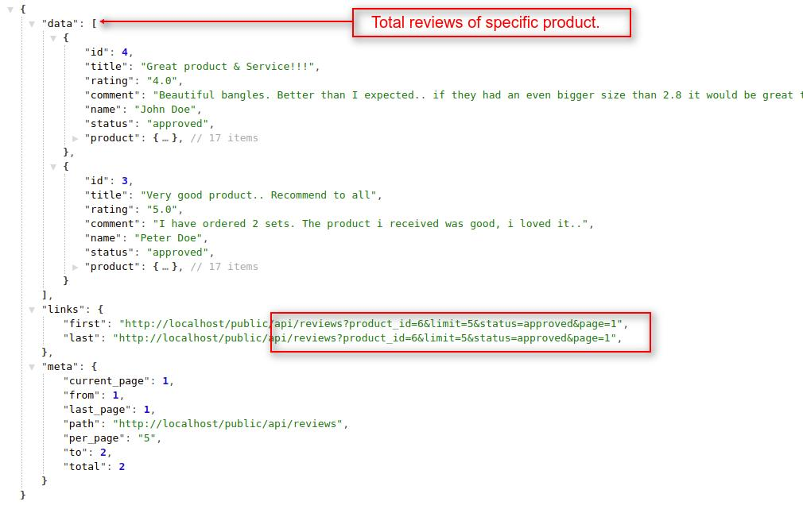

# How To Create Requests For Product's Reviews  <a href="https://github.com/bagisto/bagisto-docs/blob/master/create_module.md">Edit On github</a>

## 1. Get All Bagisto's Reviews:
You can get all the reviews of the Bagisto Store. You can achieve this job by using **`reviews`** API call resource.
Currently, this **`reviews`** resource is helpful for both admin user and customer too. There is no need of customer authentication.

> *http(s)://example.com/public/api/reviews*

**Note: In the `reviews` resource API call, we used `GET HTTP verb` to get all the reviews of the Bagisto Store.**

#### Request:

> *http(s)://example.com/public/api/reviews*

#### Response:
    {
        "data": [
            {
                "id": 4,
                "title": "Great product & Service!!!",
                "rating": "4.0",
                "comment": "Beautiful bangles. Better than I expected.",
                "name": "John Doe",
                "status": "approved",
            },
            {
                "id": 3,
                "title": "Very good product.. Recommend to all",
                "rating": "5.0",
                "comment": "I have ordered 2 sets. The product i received was good, i loved it.",
                "name": "Peter Doe",
                "status": "approved",
            },
            {
                "id": 2,
                "title": "Awesome Product & Service ",
                "rating": "3.0",
                "comment": "Awesome Product & Service ",
                "name": "John Doe",
                "status": "approved",
            },
            {...},
            {...}
        ],
        "links": {
            "first": "http://localhost/public/api/reviews?page=1",
            "last": "http://localhost/public/api/reviews?page=1",
        },
        "meta": {...}
    }

<a href="assets/images/Bagisto_Api/bagisto_reviews.jpg" target="_blank">
{: height="50%" width="50%" .center}
</a>

### 1.1 Get Reviews With Pagination:
You can get store's review according to the pagination. You can define the limit that how many records you want in each page.

#### Request:

> *http(s)://example.com/public/api/reviews?page=1*

> *http(s)://example.com/public/api/reviews?limit=3&page=1*

**Note: If you didn't use the page(?page=x) filter, then it returns the data of the first page by default. You can also provide the limit request parameter in the api url.**

#### Response:
    {
        "data": [
            {
                "id": 2,
                "title": "Awesome Product & Service ",
                "rating": "3.0",
                "comment": "Awesome Product & Service ",
                "name": "John Doe",
                "status": "approved",
            },
            {
                "id": 1,
                "title": "Awesome Product Quality",
                "rating": "4.0",
                "comment": "Awesome Product Quality",
                "name": "John Doe",
                "status": "approved",
            }
        ],
        "links": {
            "first": "http://localhost/public/api/reviews?limit=2&page=1",
            "last": "http://localhost/public/api/reviews?limit=2&page=2",
            "prev": "http://localhost/public/api/reviews?limit=2&page=1",
            "next": null
        },
        "meta": {...}
    }

<a href="assets/images/Bagisto_Api/bagisto_reviews_page.jpg" target="_blank">
{: height="50%" width="50%" .center}
</a>

#### Explanation:

* In the above response, you will find the three Objects with below mentioned indexes:
    1. data
    2. link
    3. meta

#### data object:

Under the data object, you will find an array of multiple objects which contain the details of the store's reviews. You can use these objects to access the data of each individual review.

**Note: Regarding both link and meta objects, we already explained these objects functionality in <a href="api_category.html#link-object" target="_blank" class="bagsito-link"> Category API </a> section.**

### 1.2 Get Reviews Without Pagination:
You can also get all the reviews of Bagisto Store in a single API call without pagination. For this you have to pass **`pagination=0`** in the query parameter with the **`reviews`** resource in API URL.

#### Request:

> *http(s)://example.com/public/api/reviews?pagination=0*

### Response:
    {
        "data": [
            {
                "id": 4,
                "title": "Great product & Service!!!",
                "rating": "4.0",
                "comment": "Beautiful bangles. Better than I expected.",
                "name": "John Doe",
                "status": "approved",
            },
            {...},
            {...},
            {...}
        ]
    }

<a href="assets/images/Bagisto_Api/bagisto_reviews_no_page.jpg" target="_blank">
{: height="50%" width="50%" .center}
</a>

## 2. Get Specific Review Based On Review Id:
To get the specific review detail, you have to pass a review id i.e. **`id`** as a request payload like **`reviews/{id}`** in API url. By using this resource and request payload, you will get only `a single object` under **`data object`** in response.

> *http(s)://example.com/public/api/reviews/{id}*

**Note: In the `reviews/{id}` resource API call, we used `GET HTTP verb` to get the single review of Bagisto Store.**

### Request:

> *http(s)://example.com/public/api/reviews/2*

### Response:
    {
        "data": {
            "id": 2,
            "title": "Awesome Product & Service ",
            "rating": "3.0",
            "comment": "Awesome Product & Service ",
            "name": "John Doe",
            "status": "approved",
            "product": {...},
            "customer": {...}
        }
    }

<a href="assets/images/Bagisto_Api/bagisto_reviews_id.jpg" target="_blank">
{: height="50%" width="50%" .center}
</a>

## 3. Get All Reviews Of Specific Product:
To get all the reviews of a specific product, you have to pass a **`product_id`** as a query parameter like **`reviews?product_id={id}`** in API url. To use this API call customer authentication is not required.

> *http(s)://example.com/public/api/reviews?product_id={id}*

**Note: In the `reviews?product_id={id}` resource API call, we used `GET HTTP verb` to get all the reviews of a product.**

### Request:

> *http(s)://example.com/public/api/reviews?product_id=6*

### Response:
    {
        "data": [
            {
                "id": 4,
                "title": "Great product & Service!!!",
                "rating": "4.0",
                "comment": "Beautiful bangles. Better than I expected.",
                "name": "John Doe",
                "status": "approved",
                "product": {...},
            },
            {
                "id": 3,
                "title": "Very good product.. Recommend to all",
                "rating": "5.0",
                "comment": "I have ordered 2 sets. The product i received was good, i loved it..",
                "name": "Peter Doe",
                "status": "approved",
                "product": {...},
            }
        ],
        "links": {
            "first": "http://localhost/public/api/reviews?product_id=6&limit=5&status=approved&page=1",
            "last": "http://localhost/public/api/reviews?product_id=6&limit=5&status=approved&page=1",
        },
        "meta": {...}
    }

<a href="assets/images/Bagisto_Api/bagisto_reviews_prod_id.jpg" target="_blank">
{: height="50%" width="50%" .center}
</a>
