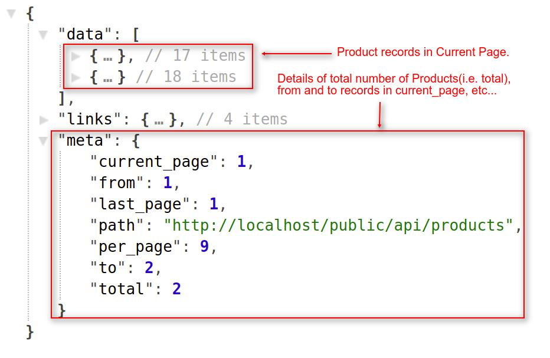

# Getting Started with Bagisto Web APIs

{:.pencil-icon}
[edit on github](https://github.com/bagisto/bagisto-docs/blob/master/bagisto_api.md){:class="edit-github" target="\_blank"}

## Introduction 

Bagisto Web Api is a medium to use the features of the core Bagisto System. By using Bagisto Web Api, you can integrate your application with the Bagisto System to serve the default content of Bagisto.

##### Key Features:

- Bagisto APIs supports REST (Representational State Transfer).
- Authentication: Customer Authentication with Login Details.
- Provide access to performed CURD operations (Create, Update, Read & Delete).
- Also Provide the option to filter the responses based on Attribute Fields.
- The Framework supports the Pagination which helps to increase the performance of application.

### Where can I use Bagisto Web APIs?

We can use the Bagisto APIs in different areas. Some of them are:

- To build a PWA (Progressive Web Application) application, which uses modern web capabilities to deliver an application like experience to the users and provide more user friendly experience than a web application.

- Use to integrate an Online-Shopping Mobile Application with the Bagisto Store to helps the customers make purchase.

- Use to integrate with CRM (Customer Relationship Management) systems Like: HubSpot, Salesforce etc. which allows you to manage the business relationships with your customers to help you grow your business.

## How to use Bagisto APIs? 

To use the Bagisto Web APIs, you simply have to call/access the defined routes.

##### For Example:

You want to get all the store products according to pagination, then you just simply have to call the below URL:

> **http(s)://example.com/public/api/products**

{:target="\_blank"}{: .screenshot-dimension .center}
