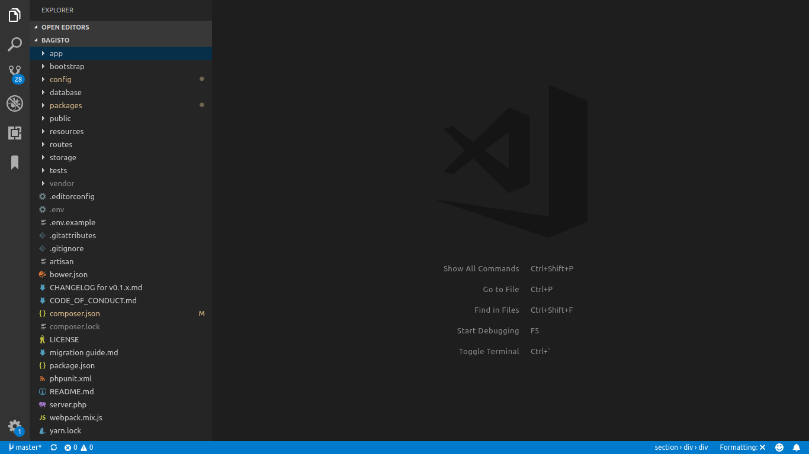
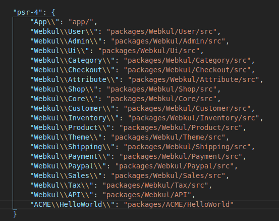
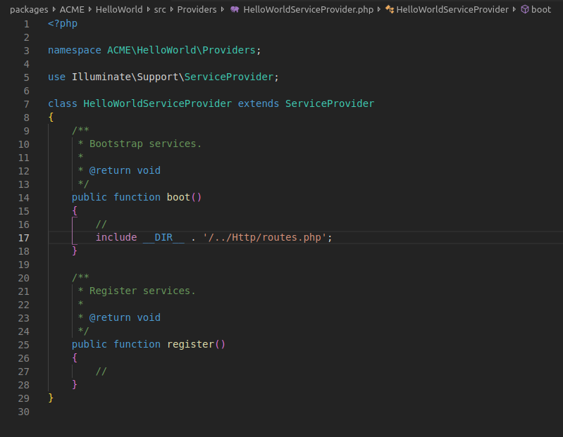
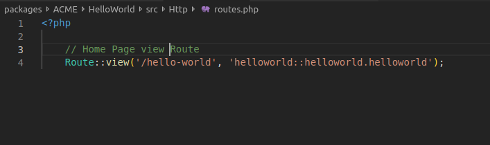
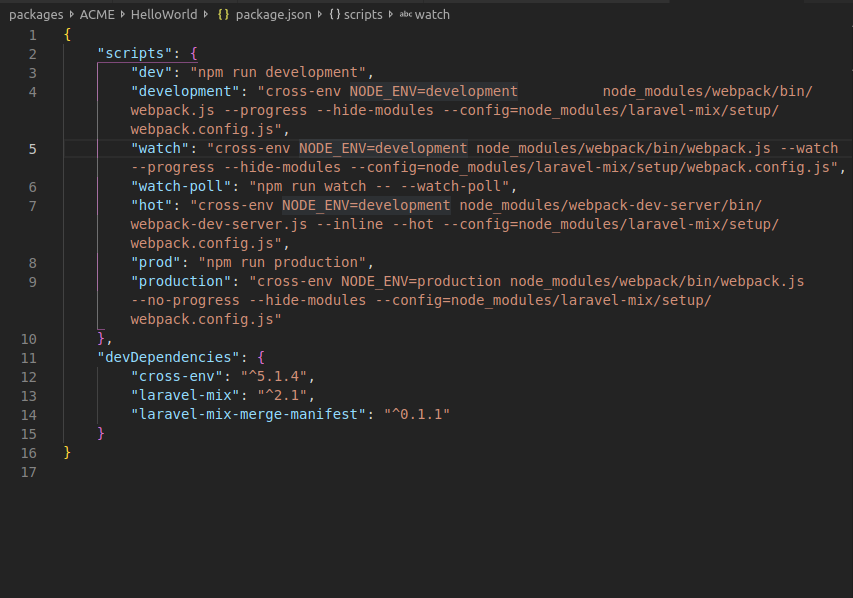

## Package  <span class="edit-github"> <a href="https://github.com/bagisto/bagisto-docs/blob/master/create_module.md">Edit On github</a></span>

A package is like Laravel packages that includes views, controller and models. Packages are  created to manage your large laravel applications into smaller units. In the bagisto, we have created the plenty of packages at path `packages/Webkul/`. can refer bagisto's root directory shown's in fig

{: height="50%" width="50%" .center}

## How To Create Module <a id="how-to-create-module"></a>

### Step-1

* Inside packages folder of bagisto, create a folder with your company name or namespace and inside it create a folder with your package name.
Ex – Here namespace is specified as ACME

>packages/ACME/HelloWorld

### Step-2

* Inside your package create a file named as package.json and a folder named as 'src', we will use it later.

### Step-3

* Inside ‘src’ folder create a folder named as ‘Providers’ and under it create a file named as ‘PackagenameServiceProvider.php’.

    Ex – HelloWorldServiceProvider.php

    The Service Provider consist two methods.
    1. boot
    2. register

        ```php
        <?php

        namespace ACME\HelloWorld\Providers;

        use Illuminate\Support\ServiceProvider;

        /**
        * HelloWorld service provider
        *
        * @author    Jane Doe <janedoe@gmail.com>
        * @copyright 2018 Webkul Software Pvt Ltd (http://www.webkul.com)
        */
        class HelloWorldServiceProvider extends ServiceProvider
        {
            /**
            * Bootstrap services.
            *
            * @return void
            */
            public function boot()
            {

            }

            /**
            * Register services.
            *
            * @return void
            */
            public function register()
            {

            }
        }
        ```

### Step-4

* Now, to register the service provider, go to ‘app.php’ file inside ‘config’ folder & add your service provider inside ‘providers’ array.

    ```php
    'providers' => [
        //ACME package
        ACME\HelloWorld\Providers\HelloWorldServiceProvider::class,
    ],
    ```

{: height="50%" width="50%" .center}

### Step-5

* Now, we need to add our package to ‘composer.json’ file of project root for autoloading in psr-4.

    ```php
    "psr-4": {
        "ACME\\HelloWorld\\": "packages/ACME/HelloWorld"
    }
    ```
{: height="50%" width="50%" .center}

### Step-6

* Now, we are going to add some routing & views for our package.

   1. For routes: create a ‘Http’ folder inside ‘src’ folder of package & inside `Http` create a file name as ‘routes.php’. In this file, we can create routes for the package.

    Now, we need to register our route file to service provider’s boot method i.e. HelloWorldServiceProvider.php

    ```php
    public function boot()
    {
        include __DIR__ . '/../Http/routes.php';
    }
    ```

{: height="50%" width="50%" .center}


To load routes, you can also use ‘loadRoutesFrom’ method.

2) For views: Create a ‘Resources’ folder inside ‘src’ folder of package. Inside ‘Resources’ folder create a folder name as ‘views’. Now, in the ‘views’ folder, we can create a views for the package.

Right now, we are going to create a folder ‘helloworld’ inside the views. In this ‘helloworld’ folder we will create a file name as helloworld.blade.php.

Now just like route file, we need to register our view folder inside service provider to specify path where views are located.

    ```php
    public function boot()
    {
        $this->loadViewsFrom(__DIR__ . '/../Resources/views', 'helloworld');
    }
    ```

{: height="50%" width="50%" .center}

### Step-7

* Now, we need to create a route & render a view on that route.

Go to ACME->src->Http->routes.php file and create a route to render view

        ```php
        <?php

            Route::view('/hello-world', 'helloworld::helloworld.helloworld');
        ```

{: height="50%" width="50%" .center}

Now, you can append ‘hello-world’ to your local path in the browser's url to see the output.

{: height="50%" width="50%" .center}


### Step-8

* Now, we are going to create language file for our package.

For this create a ‘lang’ folder inside ‘Resources’ folder.

Inside lang folder, you can create different folder for languages translations like for English 'en' , Hindi ‘hn’ etc. Moving forward, we will create a folder name ‘en’ (`say language code`) & inside ‘en’ folder, create a file name as ‘app.php’ to perform language translation

Now, we need to register the language file to service provider.

        ```php
        public function boot()
        {
            $this->loadTranslationsFrom(__DIR__ . '/../Resources/lang', 'helloworld');
        }
        ```


Now we can write translation in app.php like below.

        ```php
        <?php
        return [
            'hello-world' => [
                'name' => 'Jane Doe'
            ]
        ];
        ```

Add {{ __(‘helloworld::app.hello-world.name’) }} to your application’s view & it will automatically translate it.

{: height="50%" width="50%" .center}

### Step-9

* Now we will add CSS to our package. To add CSS create ‘package.json’ file & ‘webpack.mix.js’ file inside the root of your package.

Create a ‘Resources’ folder inside the ‘src’ folder. Inside ‘Resources’ folder creates a folder name ‘assests’& inside it create ‘sass’ folder & inside it create a folder name ‘app.scss’. This ‘app.scss’ will consist SASS for a package. In ‘package.json’ file, you can mention your npm dependencies.  Create a webpack.mix.js file, this will be used for compiling our assets.


‘package.json' file consist

        ```javascript
        {
            "scripts": {
                "dev": "npm run development",
                "development": "cross-env NODE_ENV=development          node_modules/webpack/bin/webpack.js --progress --hide-modules --config=node_modules/laravel-mix/setup/webpack.config.js",
                "watch": "cross-env NODE_ENV=development node_modules/webpack/bin/webpack.js --watch --progress --hide-modules --config=node_modules/laravel-mix/setup/webpack.config.js",
                "watch-poll": "npm run watch -- --watch-poll",
                "hot": "cross-env NODE_ENV=development node_modules/webpack-dev-server/bin/webpack-dev-server.js --inline --hot --config=node_modules/laravel-mix/setup/webpack.config.js",
                "prod": "npm run production",
                "production": "cross-env NODE_ENV=production node_modules/webpack/bin/webpack.js --no-progress --hide-modules --config=node_modules/laravel-mix/setup/webpack.config.js"
            },

            "devDependencies": {
                "cross-env": "^5.1.4",
                "laravel-mix": "^2.1",
                "laravel-mix-merge-manifest": "^0.1.1"
            }
        }
        ```

{: height="50%" width="50%" .center}


 webpack.mix.js will consist

        ```javascript
        const { mix } = require("laravel-mix");
        require("laravel-mix-merge-manifest");

        if (mix.inProduction()) {
            var publicPath = 'publishable/assets';
        } else {
            var publicPath = "../../../public/vendor/webkul/helloworld/assets";
        }

        mix.setPublicPath(publicPath).mergeManifest();

        mix.disableNotifications();

        mix.sass(__dirname + "/src/Resources/assets/sass/app.scss", "css/helloworld.css").options({
            processCssUrls: false
        });

        if (mix.inProduction()) {
            mix.version();
        }
        ```

All dependency can be updated according to need.

After doing this go to the root of your package & run ‘npm install’ which will install all dependencies. After installing dependencies run ‘npm run watch’, which will compile all your CSS & publish it inside public folder according to path mention in webpack.mix.js according to the environment.

In the same way, we can also add images & js. Inside ‘assests’ folder of ‘Resources’, create two folders ‘js’ & ‘images’ in which create ‘app.js’ file for js & inside ‘images’ folder, download images.

Now we need to publish these two also as we did for CSS. We will add this too to our webpack.mix.js.


        ```javascript
        mix.js(__dirname + "/src/Resources/assets/js/app.js", "js/helloworld.js")
            .copyDirectory( __dirname + '/src/Resources/assets/images', publicPath + '/images')
        ```

{: height="50%" width="50%" .center}


Once again, we need to run ‘npm run watch’ to compile assets.

After doing this we need to add an event listener so that admin layouts include our CSS. For this we need to add an Event Listener in service provider & Inside views create a folder called layouts & inside it create a file called ‘style.blade.php’ & mention compiled CSS path inside this file.

        ```html
        <link rel="stylesheet"
        href="{{ bagisto_asset('css/helloworld.css') }}">
        ( In style.blade.php)
        ```

**For Event Listener –**

        ```php
        public function boot()
        {
            Event::listen('bagisto.admin.layout.head', function($viewRenderEventManager) {
                $viewRenderEventManager->addTemplate('helloworld::helloworld.layouts.style');
            });
        }
        ```

Now we need to extend admin::layouts.master as @extends(‘admin::layouts.master’) to packages/acme/HelloWorld/src/Resources & we can write CSS for our packages. If you don’t want to include this one then you need to create your own master file which includes your packages CSS & js.

{: height="50%" width="50%" .center}


### Step-10

* Now we will add Database to our package.

Create a ‘Database’ folder inside ‘src’ folder & inside ‘Database’ create ‘Migrations’ & ‘Seeders’ folder.

Now, we need to add migrations to our service provider to load them.

        ```php
        public function boot()
        {
            $this->loadMigrationsFrom(__DIR__ .'/../Database/Migrations');
        }
        ```

{: height="50%" width="50%" .center}

<!-- ### Step-11

* Now, it's time to create controllers for packages. Create 'Controllers' folder inside 'Http' folder e.g., HelloWorldController.php


       (image) -->

### How to Add Menu in Admin/Customer <a id="add-menu"></a>

### Step-1
-> Now, we will show how to add menu in admin panel.
For this, we need to create a ‘Config’ folder inside ‘src’.
Inside this src folder, create a file name as 'menu.php'.

        ```php
        <?php

        return [
            [
                'key' => 'helloworld',          // uniquely defined key for menu-icon
                'name' => 'Hello World',        //  name of menu-icon
                'route' => 'helloworld.index',  // the route for your menu-icon
                'sort' => 1,                    // Sort number on which your menu-icon should display
                'icon-class' => 'dashboard-icon',   //class of menu-icn
            ]
        ];
        ```
In this file we provide name of menu, its route & its icon.

Now for route stated in `menu.php`, we need to create a controller to display view file.

So inside Controllers we will create HelloWorldController.php and controller.php as:

{: height="50%" width="50%" .center}

        ```php
        <?php

        namespace ACME\HelloWorld\Http\Controllers;

        use Illuminate\Foundation\Bus\DispatchesJobs;
        use Illuminate\Routing\Controller as BaseController;
        use Illuminate\Foundation\Validation\ValidatesRequests;
        use Illuminate\Foundation\Auth\Access\AuthorizesRequests;

        class Controller extends BaseController
        {
            use AuthorizesRequests, DispatchesJobs, ValidatesRequests;
        }
        ```


        ```php
        class HelloWorldController extends Controller
        {
            protected $_config;

            public function __construct()
            {
                $this->_config = request('_config');
            }

            /**
            * Display a listing of the resource.
            *
            * @return \Illuminate\Http\Response
            */

            public function index()
            {
                return view($this->_config['view']);
            }
        }
        ```


For the route we will create a named route as

```php
Route::get('hello-dashboard', 'ACME\HelloWorld\Http\Controllers\HelloWorldController@index')->defaults('_config', ['view' => 'helloworld::helloworld.index'
])->name('helloworld.index');
```

After creating controller & route we need to merge this `menu.php` folder with core menu file.For this purpose we will use method  ‘mergeConfigFrom’ method in register function of service provider.

    ```php
    public function register()
    {
        $this->mergeConfigFrom(
            dirname(__DIR__) . '/Config/menu.php', 'menu.admin'
        );
    }
    ```

{: height="50%" width="50%" .center}

And, now we need to add `@extends('admin::layouts.master')` to our view files to extend the bagisto default layout

{: height="50%" width="50%" .center}

Now, this menu will comes in admin login. You can change icon accordingly your need.By clicking, upon icon it will open the view file provided in `Route` facade


### How to Create ACL in Bagisto? <a id="create-acl"></a>

In term to manage an ecommerce site becomes clumsy and ambiguous. Here, in bagisto, it has been taken care of, bagisto has provided an functionality 'ACL'(Access Control List). Mainly,with ACL, admin has power to disable the menu whatever not-in-use for admin .

### Creating an ACL file

 There are some steps which the user have to follow to create ACL. User have to create an file in the config folder of module named as 'acl.php'. Below, the image of acl.php is attached

   {: height="50%" width="100%" .center}

 1. As you can see in above image, the acl.php includes some parameters (you can refer to       how to add menu in admin/customer section above)

 2. Array is created for individual's menu with the parameters (key, name, route, sort)
    All we need to defined the menu which we want to be included in ACL functionality such as- in our case, in images attached the below image is includes the menu whatever defined in above image within code

    {: height="50%" width="100%" .center}


## Custom Configuration <a id="custom-configuration"></a>

Creating a custom configuration ease the task for developer or any non-developer person. It lets you option of enable/disable with the dropdown or any input *type* attribute. Generally, in bagisto, you can find it in admin panel **Configuration menu** .

### Steps to create custom configuration

* To create custom configuration for your application, you just need to create system.php file under *config* folder of your package.

* Inside the file, you can include the below code as shown in image

{: height="50%" width="100%" .center}


### Explanation for the keys:

* **key** : these values provided are unique and nested with '.' (dot) operator. After creation of two nested, other keys written are display in browser in form of accordian {figure needed}

* **name** : these keys accept the value as placeholder of your configuration. Generally, in bagisto, we consider writing it using translation.

* **sort** : these key accept the sort position for the configuration menu.

* **fields** : these key accepts the array for the value of custom configuration.


# What is Contracts, Repositories and proxies ?<a id="create_models"></a>

## Contracts

Laravel's Contracts are a set of interfaces that define the core services provided by the framework. For example, a Illuminate\Contracts\Queue\Queue contract defines the methods needed for queueing jobs, while the Illuminate\Contracts\Mail\Mailer contract defines the methods needed for sending e-mail.

Each contract has a corresponding implementation provided by the framework. For example, Laravel provides a queue implementation with a variety of drivers, and a mailer implementation that is powered by SwiftMailer.

All of the Laravel contracts live in their own GitHub repository. This provides a quick reference point for all available contracts, as well as a single, decoupled package that may be utilized by package developers.

## Repositories


## Proxies


# Store data through Repository <a id="store-data-through-repository"></a>

 Steps to store data through repository :

* Beginning with the creation of models, generally models are created using command stated below. The model is created on specified path/location.

>php artisan make:model HelloWorld --path=""

* Now, at the same location create a model proxy file as 'HelloWorldProxy.php'. This Proxy class will extends  ModelProxy. Also, you have to add "use Konekt\Concord\Proxies\ModelProxy; " like below stated

><?php

>namespace Acme\HelloWorld\Models;

>use Konekt\Concord\Proxies\ModelProxy;

>class DataFlowProfileProxy extends ModelProxy
>{
>}

* Now ,make a Folder named as Contracts and inside it create a interface file named as HelloWorld.php

* Now, make a repository folder and inside it create a file 'HelloWorldRepository.php' and
write the model method for repository class and under the method return path of your contract class.

><?php

>namespace Webkul\Marketplace\Repositories;

>use Webkul\Core\Eloquent\Repository;


>class HelloWorldRepository extends Repository

>{

    /**
     * Specify Model class name
     *
     * @return mixed
     */
>    function model()

>    {

>        return 'ACME\HelloWorld\Contracts\HelloWorld';

>    }

>}

