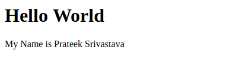
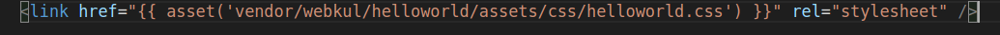
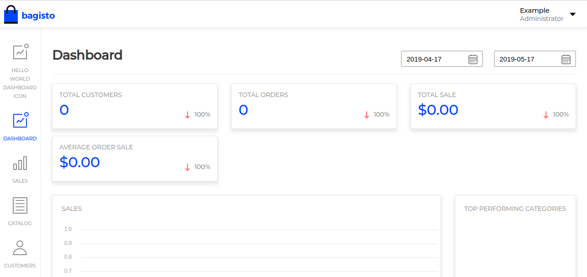
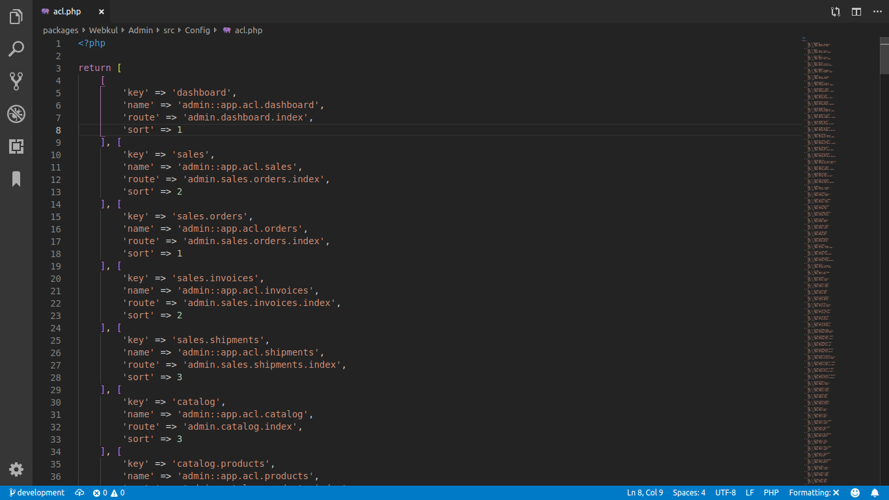

## Package

{:.pencil-icon}
[edit on github](https://github.com/bagisto/bagisto-docs/blob/master/create_package.md){:.edit-github target="\_blank"}

A package is a unit added to your application for enhancement which includes routes, controllers, views, and configuration specifically. Packages are created to manage your large applications into smaller units. In the bagisto, we have created plenty of packages at path `packages/Webkul/`. You can find a basic tree-structure of package below:

- module-name/
  - src/
    - Config/
    - Contracts/
    - Database/
    - Events/
    - Helpers/
    - Http/
      - Controllers/
      - Middleware/
      - Routes/
    - Listeners/
    - Models/
    - Providers/
      - ModuleServiceProvider.php
      - EventServiceProvider.php
    - Repositories/
    - Resources/
      - assets/
      - lang/
      - views/
  - package.json
  - webpack.mix.js

### How To Create Package <a id="how-to-create-package"></a>

There are two ways to create a package.

1. By using Bagisto Package Generator (**Recommended**)
2. By manually setting up all files (**Expert Level**)

#### 1. By using Bagisto Package Generator

You need to install Bagisto Package Generator with the help of composer. If you have not installed then you can check [here](https://github.com/bagisto/bagisto-package-generator#3-installation).

So, we are assuming that you have installed Bagisto Package Generator.

Now, to generate your package you need to use this command.

~~~php
php artisan package:make ACME/HelloWorld
~~~

If somehow package directory already present then you can use force command as well. For that you just need to pass the '**--force**' command.

~~~php
php artisan package:make ACME/HelloWorld --force
~~~

Now check your package directory, everything is setup for you.

#### 2. By manually setting up all files

By manually setting up package, we assume that you are familiar with packages directory structures and flow. If not then you can check the basic tree structure above.

Let's start with first step by creating the packages folder.

##### Step-1

- Inside **packages** folder, create a folder with your company name or namespace and inside it create a folder with your package name.
  e.g., here namespace is specified as ACME

  ~~~php
  packages/ACME/HelloWorld
  ~~~

##### Step-2

- Inside your package create a file named **_package.json_** and a folder named **src**, we will use it later.

##### Step-3

- Inside **src** folder create a folder named as **Providers** and under it create a file named as **_PackagenameServiceProvider.php_**.

  **Example** – HelloWorldServiceProvider.php

  The Service Provider consists of two methods.

  - [Boot Method](https://laravel.com/docs/7.x/providers#the-boot-method){: target="\_blank"}

  - [Register Method](https://laravel.com/docs/7.x/providers#the-register-method){: target="\_blank"}

   If you want to do with **Bagisto Package Generator** then you need to type this command, this command will generate service provider for you.

  ~~~php
  php artisan package:make-provider HelloWorldServiceProvider ACME/HelloWorld
  ~~~

  If somehow you don't have **Bagisto Package Generator**, then you can do manually also.

  ~~~php
  <?php
  namespace ACME\HelloWorld\Providers;

  use Illuminate\Support\ServiceProvider;

  /**
  * HelloWorld service provider
  *
  * @author    Jane Doe <janedoe@gmail.com>
  * @copyright 2018 Webkul Software Pvt Ltd (http://www.webkul.com)
  */
  class HelloWorldServiceProvider extends ServiceProvider
  {
      /**
      * Bootstrap services.
      *
      * @return void
      */
      public function boot()
      {

      }

      /**
      * Register services.
      *
      * @return void
      */
      public function register()
      {

      }
  }
  ~~~

##### Step-4

- Now, to register the service provider, go to the **_app.php_** file inside the **config** folder & add your service provider inside the ‘providers’ array.

  ~~~php
  ACME\HelloWorld\Providers\HelloWorldServiceProvider::class,
  ~~~

##### Step-5

- Now, we need to add our package to the **_composer.json_** file of project root for auto loading in psr-4.

  ~~~json
  "ACME\\HelloWorld\\": "packages/ACME/HelloWorld/src"
  ~~~

##### Step-6

- Now, we are going to add routing & views in our package.

  1. **For routes**: Create **Http** folder inside **src** folder of your package & inside **Http** create two files name as **_admin-routes.php_** and **_shop-routes.php_**.
  
  - **admin-routes.php**: This file is for the admin routes. Add below codes to this file,

  ~~~php
  <?php
      Route::group(['middleware' => ['web', 'admin']], function () {

          // all admin routes will place here

      });
  ~~~

  - **shop-routes.php**: This file is for the shop routes. Add below codes to this file,

  ~~~php
  <?php
      Route::group(['middleware' => ['web', 'theme', 'locale', 'currency']], function () {

          // all shop routes will be place here

      });
  ~~~

  Or if you don't want to do it manually then you can use our **Bagisto Package Generator**. For that you need to use this command,

  For **admin-routes.php**,

  ~~~php
  php artisan package:make-admin-route ACME/HelloWorld
  ~~~

  For **shop-routes.php**,

  ~~~php
  php artisan package:make-shop-route ACME/HelloWorld
  ~~~

  Now, we need to register our route file to service provider’s boot method i.e. **_HelloWorldServiceProvider.php_**

  ~~~php
  <?php

  namespace ACME\HelloWorld\Providers;

  use Illuminate\Support\ServiceProvider;

  /**
  * HelloWorld service provider
  *
  * @copyright 2018 Webkul Software Pvt Ltd (http://www.webkul.com)
  */
  class HelloWorldServiceProvider extends ServiceProvider
  {
      /**
      * Bootstrap services.
      *
      * @return void
      */
      public function boot()
      {
          $this->loadRoutesFrom(__DIR__ . '/../Http/admin-routes.php');

          $this->loadRoutesFrom(__DIR__ . '/../Http/shop-routes.php');
      }

      /**
      * Register services.
      *
      * @return void
      */
      public function register()
      {

      }
  }
  ~~~

  2. **For views**: Create **Resources** folder inside **src** folder of the package. Inside the **Resources** folder create a folder name as **views**. Now, in the **views** folder, we need to create a two more folder i.e. **admin** and **shop**. So structure will look like this,

      - Resources/
        - assets/
        - lang/
        - views/
          - admin/
          - shop/

  Inside each folder i.e. **admin** and **shop** create a file named as **index.blade.php**. Add some data to **index.blade.php**,

  **__admin/index.blade.php__**

  ~~~php
  <h2>Hello World Admin</h2>
  ~~~

  **__shop/index.blade.php__**

  ~~~php
  <h2>Hello World Shop</h2>
  ~~~

  Now just like the route file, we need to register our view folder inside the service provider to specify a path where views are located.

  ~~~php
  <?php

  namespace ACME\HelloWorld\Providers;

  use Illuminate\Support\ServiceProvider;

  /**
  * HelloWorld service provider
  *
  * @copyright 2018 Webkul Software Pvt Ltd (http://www.webkul.com)
  */
  class HelloWorldServiceProvider extends ServiceProvider
  {
      /**
      * Bootstrap services.
      *
      * @return void
      */
      public function boot()
      {
          $this->loadRoutesFrom(__DIR__ . '/../Http/admin-routes.php');

          $this->loadRoutesFrom(__DIR__ . '/../Http/shop-routes.php');

          $this->loadViewsFrom(__DIR__ . '/../Resources/views', 'helloworld');
      }

      /**
      * Register services.
      *
      * @return void
      */
      public function register()
      {

      }
  }
  ~~~

  Now run `composer dump-autoload`, so laravel can detect the new route files.

##### Step-7

- Now, we need to create a route & render a view on that route.

Go to `packages/ACME/HelloWorld/src/Http/shop-routes.php` file and create a route to render view.

~~~php
<?php

Route::group(['middleware' => ['web', 'admin']], function () {

    // all admin routes will place here
    Route::view('/admin/hello-world', 'helloworld::admin.index');

});
~~~

Same for admin routes in file `packages/ACME/HelloWorld/src/Http/admin-routes.php`.

~~~php
<?php

Route::group(['middleware' => ['web', 'theme', 'locale', 'currency']], function () {

    // all shop routes will be place here
    Route::view('/hello-world', 'helloworld::shop.index');

});
~~~

Now, you can append ‘hello-world’ to your local path in the browser's URL to see the output.

**__Admin Output__**

{: .screenshot-dimension .center}

**__Shop Output__**

{: .screenshot-dimension .center}

##### Step-8

- Now, we are going to create a language file for our package.

For this create a **lang** folder inside the **Resources** folder.

Inside the **lang** folder, you can create a different folder for language translations like for English 'en', Hindi ‘hn’ etc. Moving forward, we will create a folder name **en** (`say language code`) & inside **en** folder, create a file name as **_app.php_** to perform language translation

Now, we need to register the language file to the service provider.

~~~php
<?php

namespace ACME\HelloWorld\Providers;

use Illuminate\Support\ServiceProvider;

/**
* HelloWorld service provider
*
* @copyright 2018 Webkul Software Pvt Ltd (http://www.webkul.com)
*/
class HelloWorldServiceProvider extends ServiceProvider
{
    /**
    * Bootstrap services.
    *
    * @return void
    */
    public function boot()
    {
        $this->loadRoutesFrom(__DIR__ . '/../Http/admin-routes.php');

        $this->loadRoutesFrom(__DIR__ . '/../Http/shop-routes.php');

        $this->loadViewsFrom(__DIR__ . '/../Resources/views', 'helloworld');

        $this->loadTranslationsFrom(__DIR__ . '/../Resources/lang', 'helloworld');
    }

    /**
    * Register services.
    *
    * @return void
    */
    public function register()
    {

    }
}
~~~

Now we can write a translation in **_app.php_** like below.

~~~php
<?php

return [
    'hello-world' => [
        'name' => 'Prateek Srivastava'
    ]
];
~~~

Add `{{ __('helloworld::app.hello-world.name') }}` to your application’s view & it will automatically translate it.

{: .screenshot-dimension .center}

##### Step-9

- Now we will add CSS to our package. To add CSS create **_package.json_** file & **_webpack.mix.js_** file inside the root of your package.

Create a **Resources** folder inside the **src** folder of your package. Inside **Resources** folder creates a folder name **assets** & inside it create **sass** folder & inside it create a file **_app.scss_** like `package/src/Resources/assets/app.scss`. This **_app.scss_** will consist SASS for a package. In **_package.json_** file, you can mention your npm dependencies. Create a **_webpack.mix.js_** file, this will be used for compiling our assets.

**_package.json_** file consist,

~~~json
{
    "scripts": {
        "dev": "npm run development",
        "development": "cross-env NODE_ENV=development          node_modules/webpack/bin/webpack.js --progress --hide-modules --config=node_modules/laravel-mix/setup/webpack.config.js",
        "watch": "cross-env NODE_ENV=development node_modules/webpack/bin/webpack.js --watch --progress --hide-modules --config=node_modules/laravel-mix/setup/webpack.config.js",
        "watch-poll": "npm run watch -- --watch-poll",
        "hot": "cross-env NODE_ENV=development node_modules/webpack-dev-server/bin/webpack-dev-server.js --inline --hot --config=node_modules/laravel-mix/setup/webpack.config.js",
        "prod": "npm run production",
        "production": "cross-env NODE_ENV=production node_modules/webpack/bin/webpack.js --no-progress --hide-modules --config=node_modules/laravel-mix/setup/webpack.config.js"
    },

    "devDependencies": {
        "cross-env": "^7.0.2",
        "laravel-mix": "^5.0.1",
        "laravel-mix-merge-manifest": "^0.1.2"
    }
}
~~~

**_webpack.mix.js_** file consist,

~~~javascript
const mix = require("laravel-mix");
require("laravel-mix-merge-manifest");

if (mix.inProduction()) {
  var publicPath = "publishable/assets";
} else {
  var publicPath = "../../../public/vendor/webkul/helloworld/assets";
}

mix.setPublicPath(publicPath).mergeManifest();

mix.disableNotifications();

mix.js(__dirname + "/src/Resources/assets/js/app.js", "js/helloworld.js")
  .copyDirectory(
    __dirname + "/src/Resources/assets/images",
    publicPath + "/images"
  );
  .sass(__dirname + "/src/Resources/assets/sass/app.scss", "css/helloworld.css")
  .options({
    processCssUrls: false
  });

if (mix.inProduction()) {
  mix.version();
}
~~~

After doing this go to the root of your package & run ‘npm install’ which will install all dependencies. After installing dependencies run ‘npm run watch’, which will compile all your CSS & publish it inside public folder according to path mention in **_webpack.mix.js_** according to the environment.

In the same way, we can also add images & js. Inside **assets** folder of **Resources**, create two folders **js** & **images** in which create **_app.js_** file for js & inside **images** folder, place the images.

Once again, we need to run ‘npm run watch’ to compile assets.

After doing this we need to add an event listener so that admin layouts include our CSS. For this we need to add an Event Listener in service provider & Inside views create a folder called **layouts** & inside it create a file called **_style.blade.php_** & mention compiled CSS path inside this file.

~~~html
<link
  rel="stylesheet"
  href=" {{ asset('vendor/webkul/helloworld/assets/css/helloworld.css') }} "
/>
( In style.blade.php)
~~~

{: .screenshot-dimension .center}

**For Event Listener –**

Initially, add facade 'Event' into your **_HelloWorldServiceProvider.php_** file, else it will throw an error.

~~~php
<?php

namespace ACME\HelloWorld\Providers;

use Illuminate\Support\ServiceProvider;
use Illuminate\Support\Facades\Event;

/**
* HelloWorld service provider
*
* @copyright 2018 Webkul Software Pvt Ltd (http://www.webkul.com)
*/
class HelloWorldServiceProvider extends ServiceProvider
{
    /**
    * Bootstrap services.
    *
    * @return void
    */
    public function boot()
    {
        include __DIR__ . '/../Http/routes.php';

        $this->loadViewsFrom(__DIR__ . '/../Resources/views', 'helloworld');

        $this->loadTranslationsFrom(__DIR__ . '/../Resources/lang', 'helloworld');

        Event::listen('bagisto.admin.layout.head', function($viewRenderEventManager) {
            $viewRenderEventManager->addTemplate('helloworld::helloworld.layouts.style');
        });
    }

    /**
    * Register services.
    *
    * @return void
    */
    public function register()
    {

    }
}
~~~

<!-- {: .screenshot-dimension .center} -->

Till now, we configured our package HelloWorld and now we need to extend the default layout of our admin panel by using '@extends('admin::layouts.content')' in file `packages/acme/HelloWorld/src/Resources/views/admin/index.php`. If you don’t want to include this one then you can create your own master file which includes your packages CSS & JS.

{: .screenshot-dimension .center}

##### Step-10

- Now we will add Database to our package.

Create a **Database** folder inside **src** folder & inside **Database** folder create **Migrations** & **Seeders** folder like `package/src/Database/Migrations`.

Now, we need to add migrations to our service provider to load them.

```php
        <?php

        namespace ACME\HelloWorld\Providers;

        use Illuminate\Support\ServiceProvider;
        use Illuminate\Support\Facades\Event;

        /**
        * HelloWorld service provider
        *
        * @copyright 2018 Webkul Software Pvt Ltd (http://www.webkul.com)
        */
        class HelloWorldServiceProvider extends ServiceProvider
        {
            /**
            * Bootstrap services.
            *
            * @return void
            */
            public function boot()
            {
                include __DIR__ . '/../Http/routes.php';

                $this->loadViewsFrom(__DIR__ . '/../Resources/views', 'helloworld');

                $this->loadTranslationsFrom(__DIR__ . '/../Resources/lang', 'helloworld');

                Event::listen('bagisto.admin.layout.head', function($viewRenderEventManager) {
                    $viewRenderEventManager->addTemplate('helloworld::helloworld.layouts.style');
                });

                $this->loadMigrationsFrom(__DIR__ .'/../Database/Migrations');
            }

            /**
            * Register services.
            *
            * @return void
            */
            public function register()
            {

            }
        }
```

<!-- {: .screenshot-dimension .center} -->

### How to create Migrations ?<a id="create-migrations"></a>

To create a migration, use the 'make:migration Artisan command':

```php
php artisan make:migration create_users_table
```

The new migration will be placed in your `database/migrations` directory. Each migration file name contains a timestamp which allows Laravel to determine the order of the migrations.

The --table and --create options may also be used to indicate the name of the table and whether the migration will be creating a new table.

You may also specify a --path option when creating the migration. The path should be relative to the root directory of your installation:

```php
php artisan make:migration create_demo_table --path=packages/ACME/HelloWorld/src/Database/Migrations
```

### How to Add Menu in Admin <a id="add-menu"></a>

### Step-1

1. Within your package `HelloWorld/src/`, create **Config** folder and create a file as **_menu.php_**'.

```php
<?php

return [
    [
        'key' => 'helloworld',          // uniquely defined key for menu-icon
        'name' => 'Hello World',        //  name of menu-icon
        'route' => 'helloworld.index',  // the route for your menu-icon
        'sort' => 1,                    // Sort number on which your menu-icon should display
        'icon-class' => 'dashboard-icon',   //class of menu-icon
    ]
];
```

{: .screenshot-dimension .center}

In this file, we provide the name of the menu, its route & its icon.

Now for route stated in **_menu.php_**, we need to create a controller to display view file.

So inside Controllers we will create **_HelloWorldController.php_** and **_controller.php_** as:

<!-- {: .screenshot-dimension .center} -->

Controller.php file consists of

```php
        <?php

        namespace ACME\HelloWorld\Http\Controllers;

        use Illuminate\Foundation\Bus\DispatchesJobs;
        use Illuminate\Routing\Controller as BaseController;
        use Illuminate\Foundation\Validation\ValidatesRequests;
        use Illuminate\Foundation\Auth\Access\AuthorizesRequests;

        class Controller extends BaseController
        {
            use AuthorizesRequests, DispatchesJobs, ValidatesRequests;
        }
```
HelloWorldController.php file consists of

```php
        <?php

        namespace ACME\HelloWorld\Http\Controllers;

        use Illuminate\Http\Request;

        class HelloWorldController extends Controller
        {
            protected $_config;

            public function __construct()
            {
                $this->_config = request('_config');
            }

            /**
            * Display a listing of the resource.
            *
            * @return \Illuminate\Http\Response
            */
            public function index()
            {
                return view($this->_config['view']);
            }
        }
```

<!-- {: .screenshot-dimension .center} -->

For the route, we will create a named route as

```php
Route::get('hello-dashboard', 'ACME\HelloWorld\Http\Controllers\HelloWorldController@index')->defaults('_config', ['view' => 'helloworld::helloworld.index'
])->name('helloworld.index');
```

After creating the controller & route we need to merge this **_menu.php_** folder with a core menu file. For this purpose, we will use the method ‘mergeConfigFrom’ method in the register function of the service provider.

<!-- ```php
public function register()
{
    $this->mergeConfigFrom(
        dirname(__DIR__) . '/Config/menu.php', 'menu.admin'
    );
}
``` -->

```php
        <?php

        namespace ACME\HelloWorld\Providers;

        use Illuminate\Support\ServiceProvider;
        use Illuminate\Support\Facades\Event;

        /**
        * HelloWorld service provider
        *
        * @copyright 2018 Webkul Software Pvt Ltd (http://www.webkul.com)
        */
        class HelloWorldServiceProvider extends ServiceProvider
        {
            /**
            * Bootstrap services.
            *
            * @return void
            */
            public function boot()
            {
                include __DIR__ . '/../Http/routes.php';

                $this->loadViewsFrom(__DIR__ . '/../Resources/views', 'helloworld');

                $this->loadTranslationsFrom(__DIR__ . '/../Resources/lang', 'helloworld');

                Event::listen('bagisto.admin.layout.head', function($viewRenderEventManager) {
                    $viewRenderEventManager->addTemplate('helloworld::helloworld.layouts.style');
                });

                $this->loadMigrationsFrom(__DIR__ .'/../Database/Migrations');
            }

            /**
            * Register services.
            *
            * @return void
            */
            public function register()
            {
                $this->mergeConfigFrom(
                    dirname(__DIR__) . '/Config/menu.php', 'menu.admin'
                );
            }
        }
```

<!-- {: .screenshot-dimension .center} -->

And, now we need to extend the default layout of our admin panel by using '@extends('admin::layouts.content')' in our package master file.

{: .screenshot-dimension .center}

Now, this menu will come in the admin login. You can change the icon accordingly to your needs. By clicking, upon the icon, it will open the view file provided in `Route` facade

### How to Create ACL in Bagisto? <a id="create-acl"></a>

In term to manage an eCommerce site becomes clumsy and ambiguous. Here, in bagisto, it has been taken care of, bagisto has provided a functionality 'ACL'(Access Control List). Mainly, with ACL, admin has the power to disable the menu whatever not-in-use for admin.

##### Creating an ACL file

There are some steps that the user has to follow to create ACL. The user has to create a file in the **Config** folder of a module named **_acl.php_**.

```php
<?php

return [
    [
        'key' => 'dashboard',
        'name' => 'admin::app.acl.dashboard',
        'route' => 'admin.dashboard.index',
        'sort' => 1
    ], [
        'key' => 'sales',
        'name' => 'admin::app.acl.sales',
        'route' => 'admin.sales.orders.index',
        'sort' => 2
    ], [
        'key' => 'sales.orders',
        'name' => 'admin::app.acl.orders',
        'route' => 'admin.sales.orders.index',
        'sort' => 1
    ], [
        'key' => 'sales.invoices',
        'name' => 'admin::app.acl.invoices',
        'route' => 'admin.sales.invoices.index',
        'sort' => 2
    ], [
        'key' => 'sales.shipments',
        'name' => 'admin::app.acl.shipments',
        'route' => 'admin.sales.shipments.index',
        'sort' => 3
    ], [
        'key' => 'catalog',
        'name' => 'admin::app.acl.catalog',
        'route' => 'admin.catalog.index',
        'sort' => 3
    ], [
        'key' => 'catalog.products',
        'name' => 'admin::app.acl.products',
        'route' => 'admin.catalog.products.index',
        'sort' => 1
    ]
];
```

<!-- {: .screenshot-dimension .center} -->

1. **_acl.php_** includes some parameters (you can refer to how to add menu in admin/customer section above)

2.  The array is created for an individual's menu with the parameters (key, name, route, sort).
    All we need is to define the menu which we want to be included in ACL functionality.

    {: .screenshot-dimension .center}

### Custom Configuration <a id="custom-configuration"></a>

Creating a custom configuration ease the task for a developer or any non-developer person. It lets you option of enable/disable with the dropdown or any input _type_ attribute. Generally, in bagisto, you can find it in admin panel **Configuration menu**.

##### Steps to create custom configuration

- To create a custom configuration for your application, you just need to create a **_system.php_** file under the **Config** folder of your package.

- Inside the file, you can include the code below as shown in image

```php
<?php

return [
    [
        'key' => 'ShowPriceAfterLogin',
        'name' => 'ShowPriceAfterLogin::app.showpriceafterlogin.name',
        'sort' => 5
    ], [
        'key' => 'ShowPriceAfterLogin.settings',
        'name' => 'ShowPriceAfterLogin::app.showpriceafterlogin.settings',
        'sort' => 1,
    ], [
        'key' => 'ShowPriceAfterLogin.settings.settings',
        'name' => 'ShowPriceAfterLogin::app.showpriceafterlogin.settings',
        'sort' => 1,
        'fields' => [
            [
                'name' => 'enableordisable',
                'title' => 'ShowPriceAfterLogin::app.showpriceafterlogin.toggle',
                'type' => 'boolean',
                'channel_based' => true,
                'locale_based' => false
            ]
        ]
    ]
];
```

{: .screenshot-dimension .center}

##### Explanation for the keys:

- **key** : these values provided are unique and nested with '.' (dot) operator. After the creation of two nested, other keys written are display in the browser in the form of accordion {figure needed}

- **name** : these keys accept the value as a placeholder of your configuration. Generally, in bagisto, we consider writing it using translation.

- **sort** : these keys accept the sort position for the configuration menu.

- **fields** : these keys accept the array for the value of the custom configuration.

### Creating Models<a id="create_models"></a>

Models typically live in the app directory, but you are free to place them anywhere that can be auto-loaded according to your **_composer.json_** file. All Eloquent models extend `Illuminate\Database\Eloquent\Model` class.

The simple way to create a model is executing the command _make:model Artisan command_:

> `php artisan make:model User`

After creating model, to generate database migration, you may append `--migration or -m option` artisan command as stated below

> `php artisan make:model User --migration`

> `php artisan make:model User -m`

**Note** : _For more details check_ <a href="https://laravel.com/docs/5.8/eloquent#defining-models" target="_blank" class="bagsito-link"> Laravel Models </a>

#### What is Contracts, Repositories and proxies ?<a id="about"></a>

##### Contracts

Laravel's Contracts are a set of interfaces that define the core services provided by the framework. For example, an `Illuminate\Contracts\Queue\Queue` contract defines the methods needed for queueing jobs, while the `Illuminate\Contracts\Mail\Mailer` contract defines the methods needed for sending an e-mail.

Each contract has a corresponding implementation provided by the framework. For example, Laravel provides a queue implementation with a variety of drivers, and a mailer implementation that is powered by SwiftMailer.

All of the Laravel contracts live in their own GitHub repository. This provides a quick reference point for all available contracts, as well as a single, decoupled package that may be utilized by package developers.

**Note** : _For more details check_ <a href="https://laravel.com/docs/5.8/contracts" target="_blank" class="bagsito-link"> Laravel Contracts </a>

##### Repositories

Generally, we wrote all of our application logic in the controller. There’s an alternative approach of development that abstracts some calls into PHP classes called Repositories. The idea is that we can decouple models from controllers and assign a readable name's to complicated queries.

This file defines our Repository class. Instances of this class have a model property that we tie to an Eloquent model. Once this is bound in the constructor we can call Eloquent methods like findOrFail, update or all from the class methods.

##### Proxies

Proxies as their name state will drive you to the actual model class. The concept of model proxies has been introduced to override the functionality of the existing Model. It is a type of model inheritance without creating a new table in the database.

##### Store data through Repository <a id="store-data-through-repository"></a>

Steps to store data through repository :

- Beginning with the creation of models, generally, models are created using command stated below.

> php artisan make:model HelloWorld

- Now, at the same location create a model proxy file as **_HelloWorldProxy.php_**. This Proxy class will extends ModelProxy. Also, you have to add `use Konekt\Concord\Proxies\ModelProxy;` like below stated

```php
<?php

namespace Acme\HelloWorld\Models;

use Konekt\Concord\Proxies\ModelProxy;

class DataFlowProfileProxy extends ModelProxy
{

}
```

- Now, make a folder named as **Contracts** and inside it create an interface file named as **_HelloWorld.php_**

- Now, make a **Repository** folder and inside it create a file **_HelloWorldRepository.php_** and
  write the model method for repository class and under the method return path of your contract class.

```php
<?php
namespace Acme\HelloWorld\Repositories;

use Webkul\Core\Eloquent\Repository;

class HelloWorldRepository extends Repository
{
   /**
    * Specify Model class name
    *
    * @return mixed
    */
    function model()
    {
        return 'ACME\HelloWorld\Contracts\HelloWorld';
    }
}
```

After creating all the files stated above for our package, we have to create a provider as **_ModuleServiceProvider.php_** and register it in `config/concord.php`. Inside this file, models used within the package are registered. You may check below code

```php
    <?php

    namespace  Acme\HelloWorld\Providers;

    use Konekt\Concord\BaseModuleServiceProvider;

    class ModuleServiceProvider extends BaseModuleServiceProvider
    {
        protected $models = [
            \Acme\HelloWorld\Models\HelloWorld::class,
        ];
    }
```

**Now**, Registering **_ModuleServiceProvider.php_** in `config/concord.php` file

```php
<?php

return [
    'modules' => [
        /**
         * Example:
         * VendorA\ModuleX\Providers\ModuleServiceProvider::class,
         * VendorB\ModuleY\Providers\ModuleServiceProvider::class
         *
         */

        \Acme\HelloWorld\Providers\ModuleServiceProvider::class
    ]
];
```
