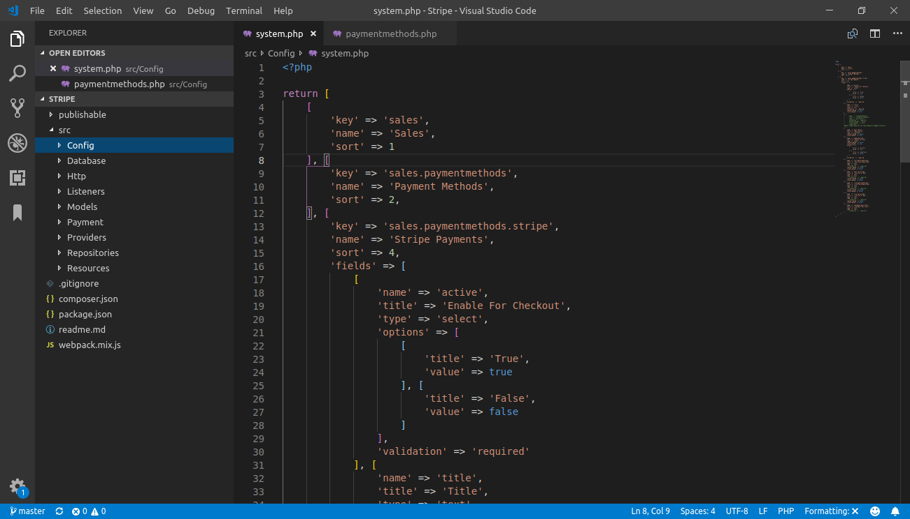
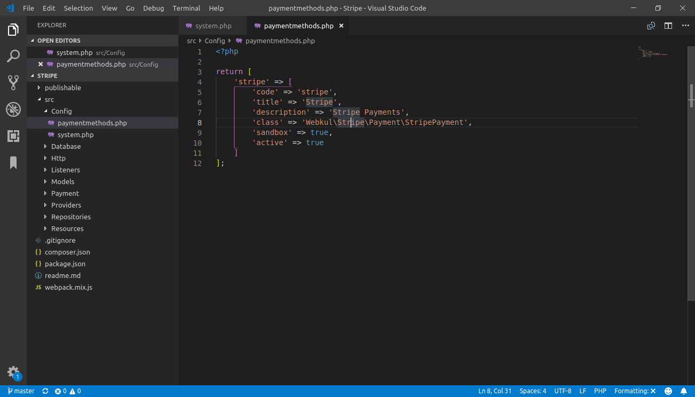

## Payment Method (text placing )  <a href="https://github.com/bagisto/bagisto-docs/blob/master/create_payment_method.md">edit on github</a>

I hope that you know how to create package, if not(refer ( [Package development](create_module.md)), and I will skip package development step

Bagisto ease the task of payment method creation so novice to professional developers can easily create payment methods. As diversity payment method provide the options for customer when they proceed to checkout. On another perspective, multiple payment methods  is a great strategy to reach out the global marketplace.

In this article, we will understand how to create payment method by own with just following below steps:

### Steps to create payment method

* Following the module development process, firstly, you must create 'Config', 'Database'
  'Resources', 'Providers', 'Models', 'Payment', 'Repositories', 'Http', 'Listeners' folders under src folder of your company's namespace.

* Within Config folder, contains all of your application's configuration files. Let's just create two files as 'system.php' and 'paymentmethod.php'

    1. system.php

        * Inside the file, you can include the below code as shown in image

            {: height="50%" width="100%"}

### Explanation for the keys:

* **key** : these values provided are unique and nested with '.' (dot) operator. After creation of two nested, other keys written are display in browser in form of accordian {figure needed}

* **name** : these keys accept the value as placeholder of your configuration. Generally, in bagisto, we consider writing it using translation.

* **sort** : these key accept the sort position for the configuration menu.

* **fields** : these key accepts the array for the value of custom configuration.

    2. paymentmethod.php

    {: height="50%" width="100%"}

### An Explanation For These Parameters:

*  **code** : a text to represent payment method

*  **title** : in this field, the name of payment method is specified

*  **description** : a brief description of payment method.

*  **class** : this field includes the class namespace where all functions of payment                method is written

*  **sandbox** :

*  **active** : this field accepts true/false to enable or disbale module.

* Within Database folder, the migration's and seeder(if needed) files are stored.

* Within Resources folder, contains your views as well as your raw, un-compiled assets such as  SASS, or JavaScript. This directory also houses all of your language files.

* Within Providers folder, contains all of the service providers for your application. Service providers bootstrap your application by binding services in the service container, registering events, or performing any other tasks to prepare your application for incoming requests.

     Here, in our case we have created two providers files i.e.,

    1. EventServiceProvider : In this file, events included with your application provides a convenient place to register all of your application's event listeners.

    2. PaymentServiceProvider : In this file, you may register all your configuration, language and routes within register and boot methods.

* Within Models folder, the models are stored for the application.

* Within Payment folder, write the code needed to operate your payment method

* Within Repositories folder, create a file as 'HelloWorldRepository.php' which must extends   repository class

* Within Http folder, define your routes and controller application.

* Within Listeners folder, this folder incudes listender files to listen respective events.

