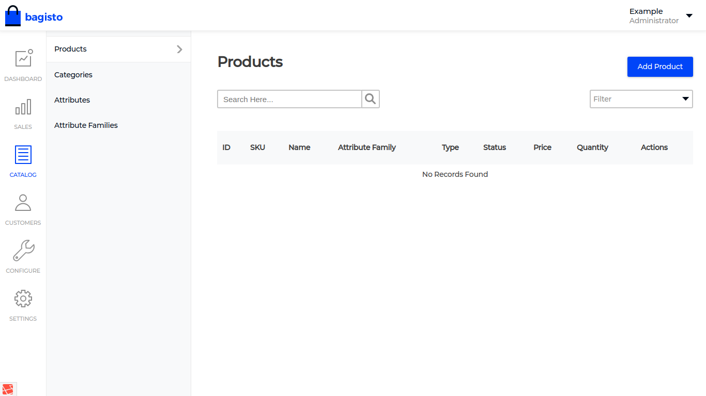
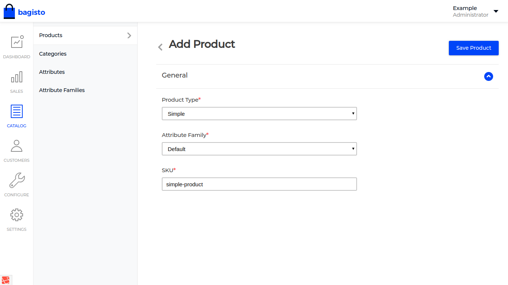

### How to Create Product <a class="nav-link" href="https://github.com/bagisto/bagisto-docs">Edit On github</a>

Bagisto provide the feature to add product easily from novice to professional users by just following some simple steps. As every e-commerce platform needs product but adding product sometimes become clumsy and hard for novice users. Within bagisto, to create product you can refer to the below steps to create product

Product creation incudes some flow as

Categories->Attributes->Attributes Family->Products

1. In bagisto, at the admin panel we have an catalog menu option where you will find every needed option to create product from creating/editing/deleting attributes, attribute family, categories, product.

{: height="50%" width="100%"}

### Choose the Product Category

2. A product category is a set of products that are closely related to each other in that they can satisfy the same or a similar need. So before creating products we must need to confirm if particular products may be under present categories or is there need to create category. To get the list of categories you not needed to refer to siome other section you can easily create and see the list of category at a single page. or can search for categories.

### Choose the Product Attributes

3. When categories are created, we need to list down the attributes that our product have. In bagisto, we have provided commonly used attributes needed for every product as color, size, price but at another end we also have an option to create attibute if some attributes are not present in default list of attributes you can easily created it.

### Choose the Attribute Family

4. As above stated we have an option to create attribute families. Attribute family is nothing just of group of attributes. This option, especially from my point of view, is most important for every store owner . As in bagisto we have provided an `default` attribute family of color, size, price. Admin can also create own attribute family for product and when editing the attribute family admin have option to add attributes.

5. As in above steps we have created options, generally, needed to create produt now we have categories, attribute family with attributes included under which product lies,

6. In product menu, we provided the `Add product` button. On clicking it, form page of dropdowns is displayed containing labels `Product Type`, `Attribute Family`, `SKU`.
Right now, we can create two types of products simple and configurable

# Creting products Main points

Choosing a product types comes at first priority before creating product. In bagito, products may be of two types

#### Product Types

>Simple : These are the products where we don't have any type of options/variants.

>Configurable: A configurable product is an item that requires the customer to choose one or more ‘options’ prior to purchase. For example, when buying shoes, the customer needs to select what shoe size they want to buy. Many clothing items may well have both colour and size choices that have to be made by the customer.

In bagisto products are generally created in two steps

##### Creating Simple Products

1. Firstly, we have an form containing dropdowns `Product Type`,  `Attribute Family`,   `SKU`.On filling and saving the form. We will redirected to edit page containing necessary products details option to be filled

   * If `Product Type` selected `simple` and save product button is clicked then a edit page form will be rendered. Here, admin have to fill up the form and click on save to create product.

{: height="50%" width="100%"}

{: height="50%" width="100%" border="1px solid "}

   * If `Product Type` selected `configurable` then clicking on save button will include a new accordian to provide you option to create product variants based on color, size.  saving the form will rendered to edit page. Admin have to fill the required attributes needed for products and their variants and save the form .

{: height="50%" width="100%"}

| Field | Description        |
| ------------- |:-------------:|
| Product Types    | |
| SKU  |  The unique Stock Keeping Unit that is assigned to the product.  |
| Attribute Family | name of attribute family product belongs to |

