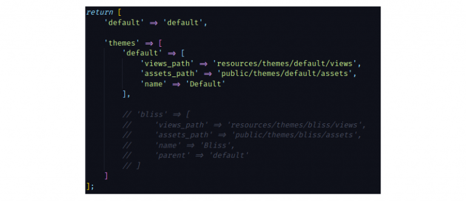
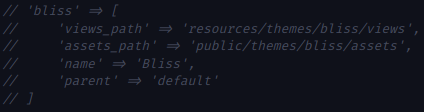

## Create Theme <a href="https://github.com/bagisto/bagisto-docs/blob/master/create_theme.md">edit on github</a>

I hope that you know how to create package, if not(refer ( [Package development](create_module.md)), and I will skip package development step

Creating a custom theme for Bagisto had been a hot topic lately. More and more users are actively trying our framework and we’re genuinely overwhelmed by it.

Coming on how to create a custom theme for Bagisto. It’s super easy!!!. With just a few lines of configuration code. Similarly following the traditional way of creating view files in Laravel would be enough.

### Steps to create theme

Please follow the below steps on how to create a custom theme in Bagisto.

* Go to your project’s root directory and check for `config` folder. Inside it, you will find a file called `themes.php`:

{: height="50%" width="100%"}
themes.php file inside the config directory of Bagisto’s root.

* Check contents of ‘themes.php’ file, it holds all necessary information of creating a custom theme.

{: height="50%" width="100%"}
Contents of themes.php file having information of currently active theme named default.

Let’s go through the parameters of this theme’s file. Because the understanding of those parameters will help you in creating a custom theme.

### An Explanation For These Parameters:

1. default: Declared at the top signifies the currently active or default theme in Bagisto. It is assigned with the value ‘default’. The (string)default indicates the name of the currently active theme.

{: height="50%" width="100%"}
Default parameter showing your currently active theme.

2. themes: This parameter is where you’ve to define all essentials for your own custom theme. Multiple themes can also be created and used at the same time in Bagisto.

3. Inside ‘themes’ there is another array by name ‘default‘ which is your currently active theme. Containing some key-value pairs.

    * ‘default‘: When you look inside this array name ‘default‘ it holds few more key-value pairs. such as ‘view_path‘, ‘assets_path‘, ‘name’ all those are explained below:

{: height="50%" width="100%"}
Bagisto’s default theme parameters.

   * views_path: It’ll take the path of your views or blade files that you wanna put up in your custom theme.

   * assets_path: Responsible for your assets i.e images, CSS and javascript files, etc.

   * name: Defines a global name for your theme inside Bagisto.

   * parent: This is a magic parameter that you can find in the commented code below the sub array ‘default‘. Using this parameter you can make use of existing themes inside Bagisto and just customise them even further. This parameter will take the value of the ‘name’ parameter listed in point 3rd above

{: height="50%" width="100%"}
parent parameter allows you to use previously existing theme files.

Finally, define your own paths and name of your custom theme inside ‘themes.php’ file. And start creating view files. Do not forget to cover all get routes of shop package having a parameter called ‘view’.

{: height="50%" width="100%"}
All storefront routes are inside this file.

Make sure the name of the blade file should be same as passed in this GET route file like this:

{: height="50%" width="100%"}
For all views check all GET routes as they hold a view parameter with the value of view to be used.