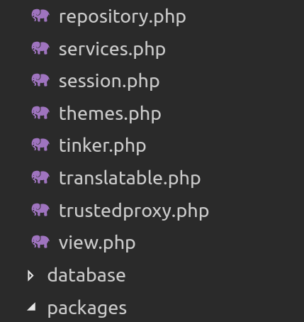
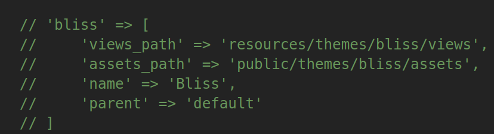
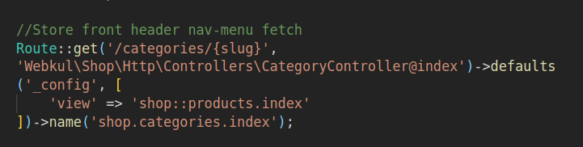

# Create Theme

{:.pencil-icon}
[edit on github](https://github.com/bagisto/bagisto-docs/blob/master/create_theme.md){:.edit-github target="\_blank"}

I hope that you know how to create package, if not refer [Package development](create_package.md){: target="\_blank" .link-color}.

Creating a custom theme for Bagisto had been a hot topic lately. More and more users are actively trying our framework and we’re genuinely overwhelmed by it.

Coming on how to create a custom theme for Bagisto. It’s super easy!!!. With just a few lines of configuration code. Similarly following the traditional way of creating view files in Laravel would be enough.

### Steps to create a theme

Please follow the steps mentioned below that how to create a custom theme in Bagisto.

- Go to your project’s root directory and check for **config** folder. Inside **config** folder, you will find a file called **_themes.php_** like directory below:

        - app/
        - bin/
        - bootstrap/
        - config/
           - themes.php
        - database/
        - packages/Webkul

<!-- {: width="30%" height="50%" .center} -->

- Check contents of **_themes.php_** file, it holds all necessary information of creating a custom theme.

```php
<?php

return [
    'default' => 'default',

    'themes' => [
        'default' => [
            'views_path' => 'resources/themes/default/views',
            'assets_path' => 'public/themes/default/assets',
            'name' => 'Default'
        ],

        // 'bliss' => [
        //     'views_path' => 'resources/themes/bliss/views',
        //     'assets_path' => 'public/themes/bliss/assets',
        //     'name' => 'Bliss',
        //     'parent' => 'default'
        // ]
    ]
];
```

<!-- {: .screenshot-dimension .center} -->

Let’s go through the parameters of **_themes.php_** file. Because the understanding of those parameters will help you in creating a custom theme.

##### An Explanation For These Parameters:

- default: Declared at the top signifies the currently active or default theme in Bagisto. It is assigned with the value 'default’. The default(string) indicates the name of the currently active theme.

- themes: This parameter is where you’ve to define all essentials for your own custom theme. Multiple themes can also be created and used at the same time in Bagisto.

    - Inside 'themes’ there is another array by name 'default' which is your currently active theme containing some key-value pairs.

        - <b>default:</b> Inside array 'default', it holds few more key-value pairs. such as 'view_path', 'assets_path', 'name’ all those are explained below:

           - <b>views_path:</b> It’ll take the path of your views or blade files that you want to put up in your custom theme.

           - <b>assets_path:</b> Responsible for your assets i.e. images, CSS and javascript files, etc.

           - <b>name:</b> Defines a global name for your theme inside Bagisto.

           - <b>parent:</b> This is a magic parameter that you can find in the commented code below the sub-array 'default'. Using            this parameter you can make use of existing themes inside Bagisto and just customize them even further. This        parameter will take the value of the 'name’ parameter listed in the 3rd point above.

<!-- {: .screenshot-dimension .center} -->

Finally, define your own paths and name of your custom theme inside **_themes.php_** file, and start creating view files. Do not forget to cover all get routes of shop package having a parameter called 'view’. You can get route file of shop package located at `packages/Webkul/Shop/src/Http/routes.php`

<!-- {: width="30%" height="50%" .center} -->

Make sure the name of the blade file should be same as passed in this GET route file like this:

```php
//Store front header nav-menu fetch
    Route::get('/categories/{slug}', 'Webkul\Shop\Http\Controllers\CategoryController@index')
    ->defaults('_config', [
        'view' => 'shop::products.index'
    ])->name('shop.categories.index');
```

<!-- {: .screenshot-dimension .center} -->

For all views check all GET routes as they hold a view parameter with the value of view to be used.
