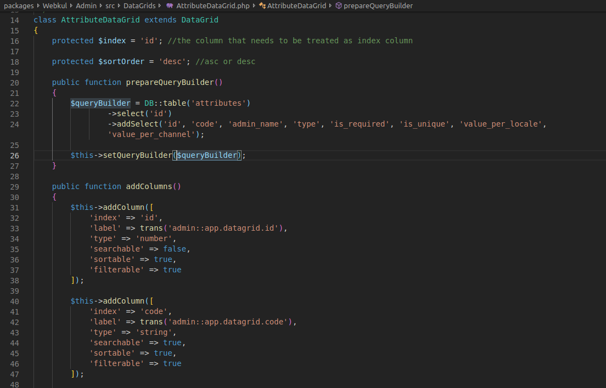

# DataGrid

{:.pencil-icon}
[edit on github](https://github.com/bagisto/bagisto-docs/blob/master/data_grid.md){:.edit-github  target="_blank"}

DataGrid is just a concept of displaying your database records in tabular format. We have implemented this system in Bagisto either you can use it to display data in tabular format or write code from scratch to display data in tabular format. In addition to Datagrid, we have implemented additional features such as - sorting, filter, mass action. You may refer to the table below for detailed information about the features.

```php
class AttributeDataGrid extends DataGrid
{
    protected $index = 'id'; //the column that needs to be treated as index column

    protected $sortOrder = 'desc'; //asc or desc

    public function prepareQueryBuilder()
    {
        $queryBuilder = DB::table('attributes')
                ->select('id')
                ->addSelect('id', 'code', 'admin_name', 'type', 'is_required', 'is_unique', 'value_per_locale', 'value_per_channel');

        $this->setQueryBuilder($queryBuilder);
    }

    public function addColumns()
    {
        $this->addColumn([
            'index' => 'id',
            'label' => trans('admin::app.datagrid.id'),
            'type' => 'number',
            'searchable' => false,
            'sortable' => true,
            'filterable' => true
        ]);

        $this->addColumn([
            'index' => 'code',
            'label' => trans('admin::app.datagrid.code'),
            'type' => 'string',
            'searchable' => true,
            'sortable' => true,
            'filterable' => true
        ]);

        $this->addColumn([
            'index' => 'admin_name',
            'label' => trans('admin::app.datagrid.admin-name'),
            'type' => 'string',
            'searchable' => true,
            'sortable' => true,
            'filterable' => true
        ]);

        $this->addColumn([
            'index' => 'type',
            'label' => trans('admin::app.datagrid.type'),
            'type' => 'string',
            'sortable' => true,
            'searchable' => true,
            'filterable' => true
        ]);

        $this->addColumn([
            'index' => 'is_required',
            'label' => trans('admin::app.datagrid.required'),
            'type' => 'boolean',
            'sortable' => true,
            'searchable' => false,
            'wrapper' => function($value) {
                if ($value->is_required == 1)
                    return 'True';
                else
                    return 'False';
            }
        ]);

        $this->addColumn([
            'index' => 'is_unique',
            'label' => trans('admin::app.datagrid.unique'),
            'type' => 'boolean',
            'sortable' => true,
            'searchable' => false,
            'filterable' => true,
            'wrapper' => function($value) {
                if ($value->is_unique == 1)
                    return 'True';
                else
                    return 'False';
            }
        ]);

        $this->addColumn([
            'index' => 'value_per_locale',
            'label' => trans('admin::app.datagrid.per-locale'),
            'type' => 'boolean',
            'sortable' => true,
            'searchable' => false,
            'filterable' => true,
            'wrapper' => function($value) {
                if ($value->value_per_locale == 1)
                    return 'True';
                else
                    return 'False';
            }
        ]);

        $this->addColumn([
            'index' => 'value_per_channel',
            'label' => trans('admin::app.datagrid.per-channel'),
            'type' => 'boolean',
            'sortable' => true,
            'searchable' => false,
            'filterable' => true,
            'wrapper' => function($value) {
                if ($value->value_per_channel == 1)
                    return 'True';
                else
                    return 'False';
            }
        ]);
    }

    public function prepareActions()
    {
        $this->addAction([
            'type' => 'Edit',
            'method' => 'GET', //use post only for redirects only
            'route' => 'admin.catalog.attributes.edit',
            'icon' => 'icon pencil-lg-icon'
        ]);

        $this->addAction([
            'type' => 'Delete',
            'method' => 'POST', //use post only for requests other than redirects
            'route' => 'admin.catalog.attributes.delete',
            'icon' => 'icon trash-icon'
        ]);
    }

    public function prepareMassActions()
    {
        $this->addMassAction([
            'type' => 'delete',
            'action' => route('admin.catalog.attributes.massdelete'),
            'label' => 'Delete',
            'method' => 'DELETE'
        ]);
    }
}
```

<!-- {: .screenshot-dimension .center} -->


### Global Properties of DataGrid

|  Name                     | functionality |
| ------------------------------- | ------------- |
|           :---:                 | :---:         |
|    index      | This variable is defined in the grid, and the value assigned to this variable must be unique i.e., id so that data will be uniquely identified and operations performed will be based on your index variable   |
|    sortOrder      |  sortOrder is used to arrange the order in ascending/descending in the dataGrid file, we have to set sort order variable to asc/desc   |
|    queryBuilder      | It can be used to perform most database operations in your application  |
|    enableMassAction      | This accepts boolean values `true/false` to enable/disable the mass action on Datagrid  |
|    enableAction      | This accepts boolean values `true/false` to enable/disable the action column of datagrid   |
|    paginate      |  While creating your grid file you have to declare paginate variable and set it to `true` to allow pagination on your page |
|    itemsPerPage      | In itemsPerPage, a numeric value is assigned to `itemsPerPage` variable to display items per page  |
| enableFilterMap |  this accepts boolean values `true/false` to enable/disable the filter on the basis of columns |

### Steps for how to create DataGrid

1. Create a folder **DataGrid** in your package, inside **DataGrid** create a file for your datagrid folder.

2. We have created `DataGrid` abstract class in `UI` package. In the DataGrid file, a list of properties and methods are declared. So, while creating Datagrid only you have to extend the DataGrid abstract class and use it in your datagrid file.

3. In DataGrid abstract class, two abstract methods are declared 'prepareQueryBuilder()' and 'addColumns()'. We can prepare grid by defining these two methods

    - <b>prepareQueryBuilder():</b> In this method, records are retrieved through queries that is applicable on database and stored in a array. When records are retrieved,                           `$this->setQueryBuilder($queryBuilder)`
    setQueryBuilder method is called

       - <b>setQueryBuilder():</b> This method is written in DataGrid file of UI package. This is used for setting the '$queryBuilder' array


    - <b>addColumns():</b> In this method, the columns are created to be displayed in grid. Inside this method, `addColumn()` is called to create single column. Inside this function, parameter accepts the array in `"key" => "value"` pairs. Some of the essential keys are described below :

    |  Name                     | functionality |
| ------------------------------- | ------------- |
|           :---:                 | :---:         |
|    index      | This variable is defined in grid, and the value assigned to this variable must be unique i.e., id so that data will be uniquely identified and operation perform will be based on your index variable   |
|    label      |  In this key, the name of the column is defined  |
|    type      | This key accepts the type of data in column  |
|    searchable      |  This accepts boolean values `true/false` to make the column searchable |
|    sortable      |  This accepts boolean values `true/false` to make the column sortable |
|    filterable      |  This accepts boolean values `true/false` to make the column filterable  |
|    wrapper      | perform actions based on condition satisfied  |


   - <b>prepareActions():</b> Additionally, this method is defined when there is need to perform any action such as edit or delete on grid. Inside it, `addAction()` is called to define particular action

       - <b>addAction():</b> It is defined when you want to add action a number of times for individual action to be performed on grid

    |  Name                     | functionality |
| ------------------------------- | ------------- |
|            :---:                 | :---:         |
|    type      | Edit/delete |
|    method      |  HTTP methods are declared |
|    route      | This key accepts the route of icon |
|    icon      |  class of icon to be displayed in action column you may prefer text also |
|    confirm_text  | A confirm box is open on clicking action icon if you want the user to verify or accepts something. You can include message here |
|  label  | The text to be displayed in written here, you may use translation also here  |


```php
    public function prepareActions()
    {
        $this->addAction([
            'type' => 'Edit',
            'method' => 'GET', //use post only for redirects only
            'route' => 'admin.catalog.attributes.edit',
            'icon' => 'icon pencil-lg-icon'
        ]);

        $this->addAction([
            'type' => 'Delete',
            'method' => 'POST', //use post only for requests other than redirects
            'route' => 'admin.catalog.attributes.delete',
            'icon' => 'icon trash-icon'
        ]);
    }
```
<!-- {: .screenshot-dimension .center} -->

### Warning

- <b>Use JavaScript with wrapper property set to true when needed</b>

- <b>Return static blade files loaded with scripts in it with caution</b>