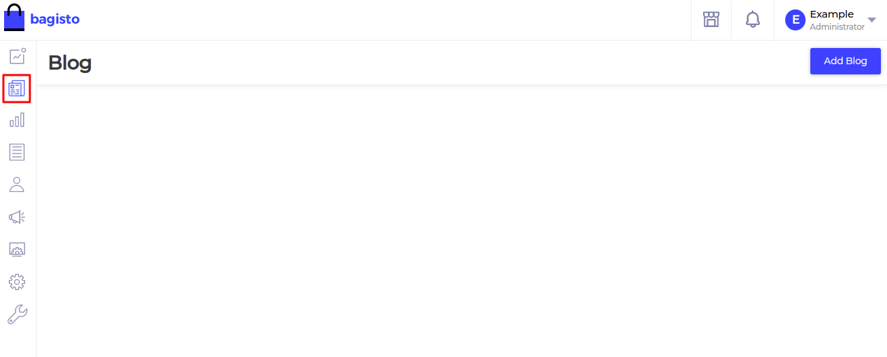

# Admin Menu

[[TOC]]

## Directory Structure

- In your package's source directory i.e. **`packages/Webkul/Blog/src`**, create the **`Config`** folder and create a file named **`admin-menu.php`**.

  ```
    - packages/
      - Webkul/Blog/
        - src/
          ...
          - Config/
            - admin-menu.php
  ```
- Copy Below content to your **`admin-menu.php`**.

  ~~~php
  <?php

  return [
      [
        'key'        => 'blogs',
        'name'       => 'Blogs',
        'route'      => 'blog.admin.index',
        'sort'       => 2,
        'icon-class' => 'blog-icon',
      ]
  ];
  ~~~

- For the route, just add the named route to **`admin-routes.php`** which specified above i.e. **`blog.admin.index`**.

  ~~~php
  Route::get('/blog', [PostController::class, 'index'])->name('blog.admin.index');
  ~~~

- In this file, we provide the name of the menu, route & its icon.

  | Params     | Description                                         |
  | ---------- | --------------------------------------------------- |
  | key        | Unique key for menu icon.                           |
  | name       | Name of menu icon.                                  |
  | route      | Route name for your menu icon.                      |
  | sort       | Sort number on which your menu icon should display. |
  | icon-class | Class for menu icon.                                |

## Adding Menu Icon

- We are using **`blog-icon`** for **`icon-class`** which CSS was previously not available in Bagisto. So we added some css to file **`assets/scss/admin.scss`** inside your package. Add below code to this file.

  ```css
  .blog-icon {
      background-image: url("../images/blog.png");
      width: 45px;
      height: 45px;
      opacity: 0.6;
      margin-left: 4px !important;
  }
  .active {
      .blog-icon {
          opacity: 1;
          background-image: url("../images/blog-active.png");
      }
  }
  ```

  ::: warning
    You can notice two **`.png`** files. So, you have to add these two files manualy inside **`assets/images`** folder.
  :::

## Merge Config

- After that, we need to merge this **`admin-menu.php`** folder with a core menu file. For this, we use the method **`mergeConfigFrom()`** in the register method of the service provider.

  ~~~php
  <?php

  namespace Webkul\Blog\Providers;

  use Illuminate\Support\Facades\Event;
  use Illuminate\Support\ServiceProvider;

  /**
  * BlogServiceProvider
  *
  * @copyright 2020 Webkul Software Pvt. Ltd. (http://www.webkul.com)
  */
  class BlogServiceProvider extends ServiceProvider
  {
      /**
      * Register services.
      *
      * @return void
      */
      public function register()
      {
          $this->mergeConfigFrom(
              dirname(__DIR__) . '/Config/admin-menu.php', 'menu.admin'
          );
      }
  }
  ~~~

- Now, Run the below command i.e.
  ```
  php artisan optimize
  ```

- Now, the menu will display in the admin panel. You can change the icon according to your needs.

  ::: details Admin Menu Output

  

  :::