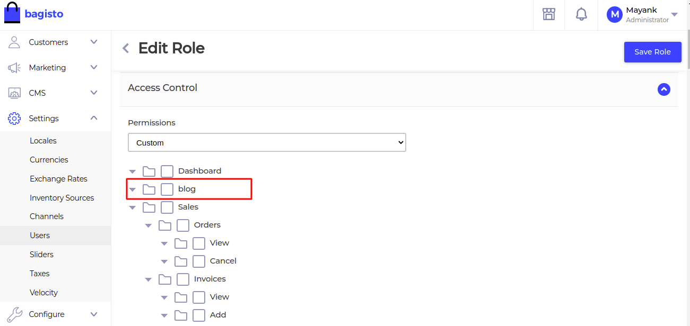

# Access Control List

[[TOC]]

## Introduction

In addition to providing authentication services out of the box, Bagisto also offers an Access Control List (ACL) functionality. This feature allows administrators to control user access to different parts of Bagisto.

## Directory Structure

To configure the ACL, follow these steps:

1. Create a new file named **`acl.php`** in the **`packages/Webkul/Blog/src/Config`** folder of your package. 

   ```
   └── packages
       └── Webkul
           └── Blog
               └── src
                   ├── ...
                   └── Config
                       ├── acl.php
                       └── ...
   ```

2. Add the following code to **`acl.php`**:

   ```php
   <?php

   return [
       [
           'key' => 'blog',
           'name' => 'blog',
           'route' => 'blog.admin.index',
           'sort' => 2
       ]
   ];
   ```

   In the above code, we have defined an array for each menu item with the parameters (key, name, route, and sort). You need to define the menus you want to include in the ACL here.

## Merge Configuration

To merge the ACL configuration, follow these steps:

1. Open the **`BlogServiceProvider`** class in the **`Webkul\Blog\Providers`** namespace.

2. In the **`register`** method, add the following code to merge the ACL configuration:

   ```php
    <?php

    namespace Webkul\Blog\Providers;

    use Illuminate\Support\ServiceProvider;

    class StripeServiceProvider extends ServiceProvider
    {
        /**
         * Register services.
         *
         * @return void
         */
        public function register()
        {
            //...
            
            $this->mergeConfigFrom(
               dirname(__DIR__) . '/Config/acl.php', 'acl'
            );
        }
    }
    ```

   This will merge the ACL configuration with the existing configuration.

3. After making the changes, run the following command to cache the latest changes:

   ```sh
   php artisan optimize
   ```

   This will ensure that the latest ACL configuration is used.

4. You can now check the updated ACL configuration in the admin panel:

   :::details Admin ACL Output

   

   :::

## Checking Roles and Permissions

To check roles and permissions, follow these steps:

1. Open the **`Admin`** model in the **`Webkul\User\Models`** namespace.

2. In this model, you will find a relationship binding with the **`Role`** model in the same namespace. You can use this relationship to access all the permissions of the current user.

3. We have provided the **`bouncer()`** helper function, which allows you to check permissions. Use the following code to check if the current user has a specific permission:

   ```php
   bouncer()->hasPermission($permission)
   ```

   Replace `$permission` with the actual permission you want to check.

By following these steps, you can configure and manage the Access Control List (ACL) in Bagisto.