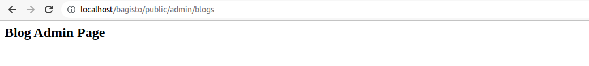

# Views

[[TOC]]

To learn in detail about Views you can visit Laravel doc from [here](https://laravel.com/docs/10.x/views)

## Directory Structure

- Create **`Resources`** folder in **`packages/Webkul/Blog/src`** path. In **`Resources`** folder, create another folder named as **`views`**. Now, in the **`views`** folder, we need to create two folder i.e. **`admin`** and **`shop`**. And finally, we need to create two more folder i.e. **`default`** and **`velocity`** under the **`shop`** folder. So updated structure will look like this.

  ```
  - packages/
    - Webkul/Blog/
      - src/
        ...
        - Resources/
          ...
          - views/
            - admin/
            - shop/
              - default/
              - velocity/
  ```

  ::: tip The default and velocity folders
  Whenever you are creating a blade file for the shop front then you have to keep the same file in the both folder i.e. **`default`** and **`velocity`**. Because, We are using **`theme`** middleware, So whenever we used the **`default`** theme files will be called from the **`default`** folder, and whenever we used the **`velocity`** theme files will be called from the **`velocity`** folder.
  :::

  ::: warning
  In this tutorial, We are using the **`theme`** middleware and **`velocity`** theme. So, It is necessary to keep files in the **`velocity`** folder. But, If we are not using the **`default`** theme then this is not necessary to keep the same files in the **`default`** folder also.
  :::
    
- Inside each folder i.e. **`admin`** and **`velocity`** create a file named as **`index.blade.php`**. And add some html to it.


  ```
  - packages/
    - Webkul/Blog/
      - src/
        ...
        - Resources/
          ...
          - views/
            - admin/
              - index.blade.php
            - shop/
              - default/
              - velocity/
                - index.blade.php
  ```

  - **`admin/index.blade.php`**

    ```html
    <h2>Blog Admin Page</h2>
    ```

  - **`shop/velocity/index.blade.php`**

    ```html
    <h2>Blog Shop Page</h2>
      ```

## Load Views from Package

- Now, we need to register our views to service provider’s boot method i.e. **`packages/Webkul/Blog/src/Providers/BlogServiceProvider.php`**.

  ```php
  <?php

  namespace Webkul\Blog\Providers;

  use Illuminate\Support\ServiceProvider;

  /**
  * BlogServiceProvider
  *
  * @copyright 2023 Webkul Software Pvt. Ltd. (http://www.webkul.com)
  */
  class BlogServiceProvider extends ServiceProvider
  {
      /**
      * Bootstrap services.
      *
      * @return void
      */
      public function boot()
      {
          $this->loadMigrationsFrom(__DIR__ .'/../Database/Migrations');

          $this->loadRoutesFrom(__DIR__ . '/../Routes/admin-routes.php');

          $this->loadRoutesFrom(__DIR__ . '/../Routes/shop-routes.php');

          $this->loadViewsFrom(__DIR__ . '/../Resources/views', 'blog');
      }

      /**
      * Register services.
      *
      * @return void
      */
      public function register()
      {

      }
  }
  ```

- Now, check your route in your browser,

  ::: details Shop Output

  

  :::

  ::: details Admin Output

  

  :::