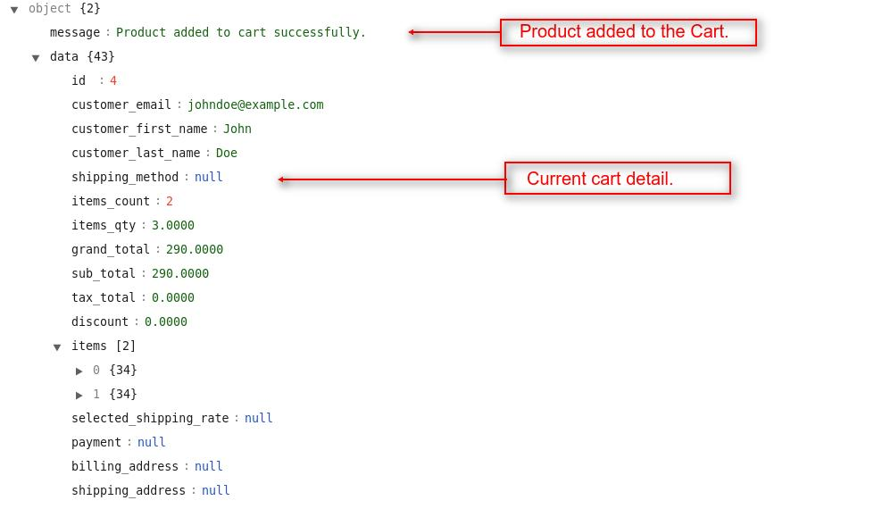
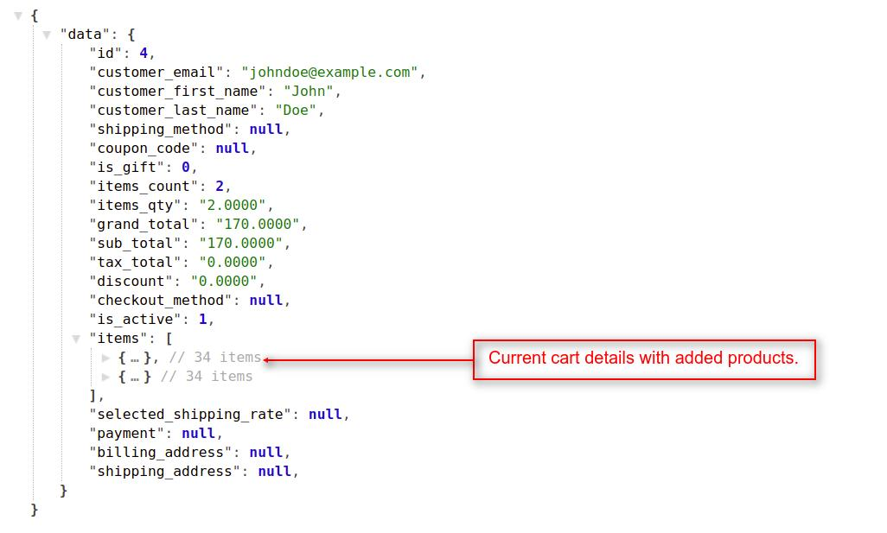
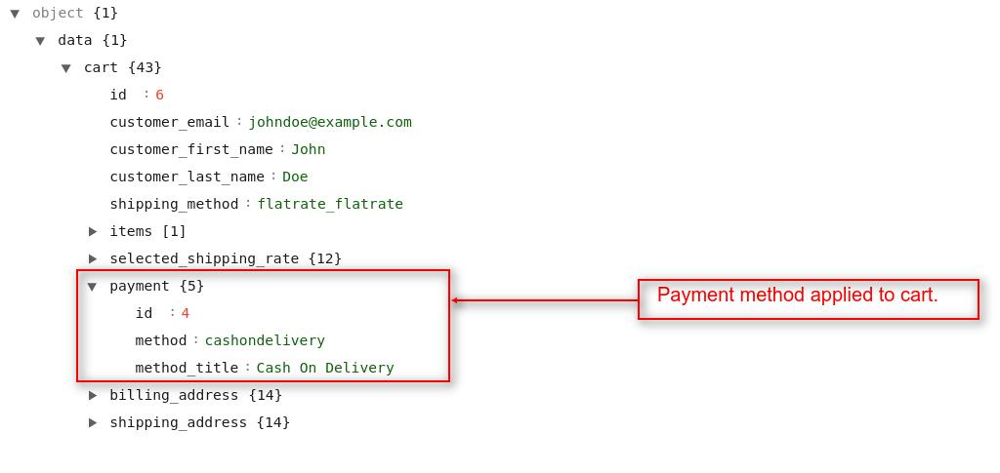

# Cart

In this section, we will use the cart's API. We will see how to add the product to the cart, fetching cart details, updating cart, and many more things related to the cart.

## Add product to cart

By using this API call you can add new products to the cart and also you can add quantity to the existing product in the cart. To do this task, you have to use the `checkout/cart/add/{product_id}` as a request payload in the API URL. This API call will work with both customer's authentication or without customer's authentication.

- Request

  `POST <host>/api/checkout/cart/add/{product_id}`

- Params

  - Post data for non-configurable product,

    | Name            | Info                                   | Type    |
    | --------------- | -------------------------------------- | ------- |
    | product_id      | Product's ID                           | Number  |
    | quantity        | Quantity                               | Number  |
    | is_configurable | Whether product is configurable or not | Boolean |

    ~~~json
    {
        "quantity": "quantity",
        "is_configurable": "is_configurable"
    }
    ~~~

  - Post data for configurable product,

    | Name                         | Info                                   | Type    |
    | ---------------------------- | -------------------------------------- | ------- |
    | product_id                   | Product's ID                           | Number  |
    | quantity                     | Quantity                               | Number  |
    | is_configurable              | Whether product is configurable or not | Boolean |
    | selected_configurable_option | Configurable product variant's ID      | Number  |
    | super_attribute              | Attribute's ID collections             | Number  |

    ~~~json
    {
        "quantity": "1",
        "is_configurable": "true",
        "selected_configurable_option": "configurable_product_variant_id",
        "super_attribute": {
            "attribute_id": "attribute_option_id",
            "attribute_id": "attribute_option_id"
        }
    }
    ~~~

### Examples

#### 1. For non configurable product,

- Request

  `POST http(s)://example.com/api/checkout/cart/add/24`

- Params

  ~~~json
  {
      "quantity": "2",
      "is_configurable": false
  }
  ~~~

#### 2. For configurable product,

- Request

  `POST http(s)://example.com/api/checkout/cart/add/6`

- Params

  ~~~json
  {
      "quantity": 1,
      "is_configurable": true,
      "selected_configurable_option": 26,
      "super_attribute": {
          "23": 2,
          "24": 6
      }
  }
  ~~~

::: details Response

~~~json
{
    "message": "Product added to cart successfully.",
    "data": {
        "id": 4,
        "customer_email": "johndoe@example.com",
        "customer_first_name": "John",
        "customer_last_name": "Doe",
        "shipping_method": null,
        "items_qty": "1.0000",
        "grand_total": "50.0000",
        "sub_total": "50.0000",
        "tax_total": "0.0000",
        "discount": "0.0000",
        "checkout_method": null,
        "is_guest": 0,
        "items": [
            {...}, // Cart Item 1
            {...} // Cart Item 2
        ],
        "selected_shipping_rate": null,
        "payment": null,
        "billing_address": null,
        "shipping_address": null,
    }
}
~~~

:::

## Get complete cart details

To get the current cart details, you have to use the `checkout/cart` resource in the API URL. You will see in all the `cart` related API, we used the `checkout` prefix. This API call will work with both customer's authentication or without customer's authentication. If the customer is not logged-in to the store, then this API resource will return the guest's cart detail.

- Request

  `GET <host>/api/checkout/cart`

### Examples

#### 1. In case of guest customer,

- Request

  `GET http(s)://example.com/api/checkout/cart`

::: details Response

  ~~~json
  {
      "data": {
          "id": 7,
          "customer_email": null,
          "customer_first_name": null,
          "customer_last_name": null,
          "shipping_method": null,
          "items_qty": "1.0000",
          "grand_total": "50.0000",
          "sub_total": "50.0000",
          "tax_total": "0.0000",
          "discount": "0.0000",
          "checkout_method": null,
          "is_guest": 1,
          "items": [
              {...}, // Cart Item 1
              {...} // Cart Item 2
          ],
          "selected_shipping_rate": null,
          "payment": null,
          "billing_address": null,
          "shipping_address": null,
      }
  }
  ~~~

  

:::

#### 2. In case of logged in customer,

- Request

  `GET http(s)://example.com/api/checkout/cart`

::: details Response

  ~~~json
  {
      "data": {
          "id": 6,
          "customer_email": "johndoe@example.com",
          "customer_first_name": "John",
          "customer_last_name": "Doe",
          "shipping_method": null,
          "items_count": 2,
          "items_qty": "2.0000",
          "grand_total": "170.0000",
          "sub_total": "170.0000",
          "tax_total": "0.0000",
          "discount": "0.0000",
          "checkout_method": null,
          "is_guest": 0,
          "items": [
              {...}, // Cart Item 1
              {...} // Cart Item 2
          ],
          "selected_shipping_rate": null,
          "payment": null,
          "billing_address": null,
          "shipping_address": null,
      }
  }
  ~~~

:::

## Empty cart

By using this API call you can remove all the products from the cart. To do this task, you have to use the `checkout/cart/empty` resource in the API URL. This API call will work both with customer's authentication or without customer's authentication.

- Request

  `GET <host>/api/checkout/cart/empty`

### Examples

- Request

  `GET http(s)://example.com/api/checkout/cart/empty`

::: details Response

~~~json
{
    "message": "Cart removed successfully.",
    "data": null
}
~~~

:::

## Update cart

By using this API call you can update the cart's product(s) quantity. To do this task, you have to use the `checkout/cart/update` resource in the API URL. This API call will work with both customer's authentication or without customer's authentication.

- Request

  `PUT <host>/api/checkout/cart/update`

- Params

  ~~~json
  {
      "qty": {
        "cart_item_id" : "quantity"
      }
  }
  ~~~

### Examples

- Request

  `PUT http(s)://example.com/api/checkout/cart/update`

- Params

  ~~~json
  {
    "qty": {
      "4": 2
    }
  }
  ~~~

::: details Response:

~~~json
{
    "message": "Cart updated successfully.",
    "data": {
        "id": 7,
        "customer_email": "johndoe@example.com",
        "customer_first_name": "John",
        "customer_last_name": "Doe",
        "shipping_method": null,
        "items_qty": "7.0000",
        "grand_total": "450.0000",
        "sub_total": "450.0000",
        "tax_total": "0.0000",
        "discount": "0.0000",
        "checkout_method": null,
        "is_guest": 0,
        "items": [
            {...}, // Cart Item 1
            {...}, // Cart Item 2
            {...} // Cart Item 3
        ],
        "selected_shipping_rate": null,
        "payment": null,
        "billing_address": null,
        "shipping_address": null,
    }
}
~~~

:::

## Remove specific product from cart

You can remove any particular product from the cart. To do this task, you have to use the `checkout/cart/remove-item/{cart_item_id}` as request payload in the API URL. This API call will work with both customer's authentication or without customer's authentication.

- Request

  `GET <host>/api/checkout/cart/remove-item/{cart_item_id}`

- Params

  | Name         | Info           | Type    |
  | ------------ | -------------- | ------- |
  | cart_item_id | Cart item's ID | Number  |

### Examples

- Request

  `GET http(s)://example.com/api/checkout/cart/remove-item/15`

::: details Response

  ~~~json
  {
      "message": "Cart removed successfully.",
      "data": {
          "id": 6,
          "customer_email": "johndoe@example.com",
          "customer_first_name": "John",
          "customer_last_name": "Doe",
          "shipping_method": null,
          "items_count": 2,
          "items_qty": "5.0000",
          "grand_total": "210.0000",
          "sub_total": "210.0000",
          "tax_total": "0.0000",
          "discount": "0.0000",
          "checkout_method": null,
          "is_guest": 0,
          "items": [
              {...},
              {...}
          ],
          "selected_shipping_rate": null,
          "payment": null,
          "billing_address": null,
          "shipping_address": null,
      }
  }
  ~~~

  {:class="screenshot-dimension center"}

:::

## Move product from cart to wishlist

You can move a product from cart to wishlist. To do this task, you have to use the `checkout/cart/move-to-wishlist/{cart_item_id}` as request payload in the API URL.

- Request

  `GET <host>/api/checkout/cart/move-to-wishlist/{cart_item_id}`

- Params

  | Name         | Info           | Type    |
  | ------------ | -------------- | ------- |
  | cart_item_id | Cart item's ID | Number  |

### Examples

- Request

  `http(s)://example.com/api/checkout/cart/move-to-wishlist/16`

::: details Response:

~~~ json
{
    "message": "Cart item moved to wishlist successfully.",
    "data": {
        "id": 1,
        "customer_email": "johndoe@example.com",
        "customer_first_name": "John",
        "customer_last_name": "Doe",
        "shipping_method": null,
        "items_qty": "1.0000",
        "grand_total": "50.0000",
        "sub_total": "50.0000",
        "tax_total": "0.0000",
        "discount": "0.0000",
        "checkout_method": null,
        "is_guest": 0,
        "items": [
            {...} // Remaining Cart Item
        ],
        "selected_shipping_rate": null,
        "payment": null,
        "billing_address": null,
        "shipping_address": null,
    }
}
~~~

:::

## Save addresses to cart

At the checkout step, customers can create new addresses or select from the existing addresses for billing & shipping the cart's item. You can achieve this task by using the `checkout/save-address` resource in the API URL. This API will work for both logged-in customers and guest users.

- Request

  `POST <host>/api/checkout/save-address`

### Examples

#### 1. For logged in user,

- Request

  `POST http(s)://example.com/api/checkout/save-address`

- Params

  ~~~json
  {
      "billing" : {
          "address1" :  {
              "0" : ""
          },
          "use_for_shipping" : "false",
          "first_name" : "john",
          "last_name" : "doe",
          "email" : "john@gmail.com",
          "address_id" : 1
      },
      "shipping" : {
          "address1" : {
              "0" : ""
          },
          "first_name" : "john",
          "last_name" : "doe",
          "email" : "john@gmail.com",
          "address_id" : 2
      }
  }
  ~~~
    
#### 2. For guest user,

- Request

  `POST http(s)://example.com/api/checkout/save-address`

- Params

  ~~~json
  {
      "billing" : {
          "address1" : { 
              "0" : "H 23" 
          },
          "use_for_shipping" : "true",
          "first_name" : "john",
          "last_name" : "doe",
          "email" : "john@webkul.com",
          "city" : "noida",
          "state"  :"DL",
          "postcode" : "110092",
          "country" : "IN",
          "phone" : "8802097347"
      },
      "shipping" : {
          "address1" : {
              "0" : ""
          }
      }
  }
  ~~~

::: details Response

~~~json
{
    "data": {
        "rates": [{...},{...}],
        "cart": {
            "id": 6,
            "customer_email": "johndoe@example.com",
            "items": [{...}, {...}],
            "billing_address": {
                "id": 7,
                "first_name": "John",
                "last_name": "Doe",
                "name": "John Doe",
                "email": "johndoe@example.com",
                "address1": [
                    "Block H-ARP Park, Sector 63 "
                ],
                "country": "IN",
                "country_name": "India",
                "state": "UP",
                "city": "Noida",
                "postcode": 201301,
                "phone": "0132456789"
            },
            "shipping_address": {
                "id": 8,
                "first_name": "John",
                "last_name": "Doe",
                "name": "John Doe",
                "email": "johndoe@example.com",
                "address1": [
                    "Block H-ARP Park, Sector 63 "
                ],
                "country": "IN",
                "country_name": "India",
                "state": "UP",
                "city": "Noida",
                "postcode": 201301,
                "phone": "0132456789"
            }
        }
    }
}
~~~

:::

## Save shipping method to cart

After saving the customer's addresses to the cart, you have to select a shipping method to proceed for completing the order. You can achieve this task by using the `checkout/save-shipping` resource in the API URL. The shipping method and changes will apply to the cart through this API call. This API will work for both logged-in customers and guest users.

- Request

  `POST <host>/api/checkout/save-shipping`

- Params

  ~~~json
  {
      "shipping_method": "shipping_method_key"
  }
  ~~~

### Examples

- Request

  `POST http(s)://example.com/api/checkout/save-shipping`

- Params

  ~~~json
  {
      "shipping_method": "flatrate_flatrate"
  }
  ~~~

::: details Response

~~~json
{
    "data": {
        "methods": [{...},{...}],
        "cart": {
        "id": 6,
        "customer_email": "johndoe@example.com",
        "customer_first_name": "John",
        "customer_last_name": "Doe",
        "shipping_method": "flatrate_flatrate",
        "items": [{...}],
        "selected_shipping_rate": {
            "id": 9,
            "carrier": "flatrate",
            "carrier_title": "Flat Rate",
            "method": "flatrate_flatrate",
            "method_title": "Flat Rate",
            "method_description": "This is a flat rate",
            "price": 20,
        },
        "payment": null,
        "billing_address": {...},
        "shipping_address": {...}
        }
    }
}
~~~

:::

## Save payment method to cart

After applying the shipping method to the cart, you have to select a payment method to proceed for completing the order. You can achieve this task by using the `checkout/save-payment` resource in the API URL. By using this API payment method will apply to the cart and will work with both logged-in customers and as well as guest users.

- Request

  `POST <api>/api/checkout/save-payment`

- Params

  ~~~json
  {
      "payment": {
          "method": "payment_method_key"
      }
  }
  ~~~

### Examples

- Request

  `POST http(s)://example.com/api/checkout/save-payment`

- Params

  ~~~json
  {
      "payment": {
          "method": "cashondelivery"
      }
  }
  ~~~

::: details Response

~~~json
{
    "data": {
        "cart": {
        "id": 6,
        "customer_email": "johndoe@example.com",
        "customer_first_name": "John",
        "customer_last_name": "Doe",
        "shipping_method": "flatrate_flatrate",
        "items": [{...}],
        "selected_shipping_rate": {...},
        "payment": {
            "id": 4,
            "method": "cashondelivery",
            "method_title": "Cash On Delivery"
        },
        "billing_address": {...},
        "shipping_address": {...}
        }
    }
}
~~~

:::

## Save Order

After applying shipping addresses, shipping methods, and payment methods to the cart, now finally you have to create/save the order. You can achieve this task by using the `checkout/save-order` resource in the API URL. By using this API order will be placed and save to the current store and this API will work for both logged-in customers and with guest users.

- Request

  `POST <host>/api/checkout/save-order`

### Examples

- Request

  `POST http(s)://example.com/api/checkout/save-order`

::: details Response

~~~json
{
    "success": true,
    "order": {
        "id": 4,
        "status": "pending",
        "customer_email": "johndoe@example.com",
        "customer_first_name": "John",
        "customer_last_name": "Doe",
        "shipping_title": "Flat Rate - Flat Rate",
        "payment_title": "Cash On Delivery",
        "total_qty_ordered": "2.0000",
        "grand_total": "120.0000",
        "shipping_amount": 20,
        "customer": {...},
        "shipping_address": {...},
        "billing_address": {...},
        "items": [{...}],
        "invoices": [],
        "shipments": []
    }
}
~~~

:::
