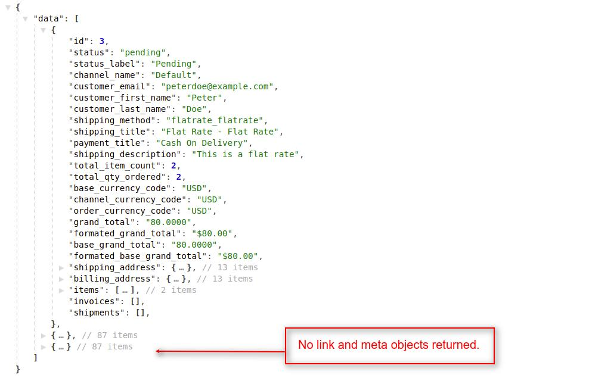

# Orders

In this section, we will see all the APIs which are related to order. As after order placement tracking of order is also important.

## Get all orders

You can get all the orders of the Bagisto store. To get the orders of the store, the customer must be logged in to the Bagisto Store. You can achieve this job by using `orders` API call resource.

- Request

  `GET <host>/api/orders(?limit,page,pagination)`

- Params

  | Name       | Info                                         | Type   |
  | ---------- | -------------------------------------------- | ------ |
  | limit      | Maximum number of records in each request    | Number |
  | page       | Records for specific page based on the limit | Number |
  | pagination | Will display all the records if set to `0`   | Number |

::: tip

If you are using pagination and want to know more info about responses then check the [explanation](./explanation) portion.

:::

### Examples

#### 1. Records for specific page,

- Request

  `GET http(s)://example.com/api/orders?page=1`

  ::: tip
  If you didn't use the page (?page=x) filter, then it returns the data of the first page by default.

  `GET http(s)://example.com/api/orders`
  :::

::: details Response

~~~json
{
    "data": [
        {...},
        {...},
         ...
        {...}
    ],
    "links": {
        "first": "https://example.com/api/orders?page=1",
        "last": "https://example.com/api/orders?page=2",
        "prev": null,
        "next": "https://example.com/api/orders?page=2"
    },
    "meta": {
        "current_page": 1,
        "from": 1,
        "last_page": 2,
        "path": "https://example.com/api/orders",
        "per_page": 10,
        "to": 10,
        "total": 11
    }
}
~~~

:::

#### 2. Records for specific page with limit,

- Request

  `GET http(s)://example.com/public/api/orders?limit=5&page=2`

::: details Response

~~~json
{
    "data": [
        {...},
        {...},
        {...},
        {...},
        {...}
    ]
    "links": {
        "first": "https://example.com/api/orders?limit=5&page=1",
        "last": "https://example.com/api/orders?limit=5&page=3",
        "prev": "https://example.com/api/orders?limit=5&page=1",
        "next": "https://example.com/api/orders?limit=5&page=3"
    },
    "meta": {
        "current_page": 2,
        "from": 6,
        "last_page": 3,
        "path": "https://example.com/api/orders",
        "per_page": "5",
        "to": 10,
        "total": 11
    }
}
~~~

:::

#### 3. Get all orders without pagination,

You can also get all the orders at once from the Bagisto store without pagination. To get the orders, the customer must be logged in to the Bagisto store. For this, you have to pass `pagination=0` in the query parameter with the `orders` resource in the API URL.

- Request

  `GET http(s)://example.com/public/api/orders?pagination=0`

::: details Response

~~~json
{
    "data": [
        {...},
        {...},
        {...},
         ...
        {...}
    ]
}
~~~

{:class="screenshot-dimension center"}

:::

## Get order by id

To get the specific order details, you have to pass an `order_id` as a request payload in the API URL.

- Request

  `GET <host>/api/orders/{order_id}`

- Params

  | Name     | Info       | Type   |
  | -------- | ---------- | ------ |
  | order_id | Order's ID | Number |

### Examples

Let's fetch specific order,

- Request

  `GET http(s)://example.com/api/order/3`

::: details Response

~~~json
{
    "data": {
        "id": 3,
        "status": "pending",
        "status_label": "Pending",
        "channel_name": "Default",
        "customer_email": "peterdoe@example.com",
        "customer_first_name": "Peter",
        "customer_last_name": "Doe",
        "shipping_method": "flatrate_flatrate",
        "shipping_title": "Flat Rate - Flat Rate",
        "payment_title": "Cash On Delivery",
        "total_qty_ordered": 2,
        "grand_total": "80.0000",
        "customer": {...},
        "shipping_address": {...},
        "billing_address": {...},
        "items": [
            {...},
            {...}
        ],
        "invoices": [],
        "shipments": [],
        }
    }
}
~~~

:::

## Get orders by customer's id

To get all the orders of a specific customer, you have to pass a `customer_id` as a query parameter like `orders?customer_id={id}` in API URL. To use this API call customer authentication is required means that customers must be logged-in to the store.

- Request

  `GET http(s)://example.com/public/api/orders(?customer_id,limit,page,pagination)`

- Params

  | Name        | Info                                         | Type   |
  | ----------- | -------------------------------------------- | ------ |
  | customer_id | Cutomer's ID                                 | Number |
  | limit       | Maximum number of records in each request    | Number |
  | page        | Records for specific page based on the limit | Number |
  | pagination  | Will display all the records if set to `0`   | Number |

### Examples

#### 1. To get all the results without pagination,

- Request

  `GET http(s)://example.com/public/api/orders?customer_id=2&pagination=0`

::: details Response

~~~json
{
    "data": [
        {
            "id": 3,
            "status": "pending",
            "customer_email": "peterdoe@webkul.com",
            "customer_first_name": "Peter",
            "customer_last_name": "Doe",
            "shipping_method": "flatrate_flatrate",
            "shipping_title": "Flat Rate - Flat Rate",
            "payment_title": "Cash On Delivery",
            "total_qty_ordered": 2,
            "grand_total": "80.0000",
            "customer": {...},
            "shipping_address": {...},
            "billing_address": {...},
            "items": [{...},{...},{...}],
        },
        {
            "id": 2,
            "status": "pending",
            "customer_email": "peterdoe@webkul.com",
            "customer_first_name": "Peter",
            "customer_last_name": "Doe",
            "shipping_method": "flatrate_flatrate",
            "shipping_title": "Flat Rate - Flat Rate",
            "payment_title": "Cash On Delivery",
            "total_qty_ordered": 5,
            "grand_total": "400.0000",
            "customer": {...},
            "shipping_address": {...},
            "billing_address": {...},
            "items": [{...},{...},{...}],
        }
    ]
}
~~~

:::

#### 2. Get all orders by customer's id with pagination,

- Request

  `GET http(s)://example.com/api/orders?customer_id=2&limit=5&page=1`

::: details Response

~~~json
{
    "data": [
        {...}
    ],
    "links": {
        "first": "https://example.com/api/orders?customer_id=2&limit=1&page=1",
        "last": "https://example.com/api/orders?customer_id=2&limit=1&page=1",
        "prev": "https://example.com/api/orders?customer_id=2&limit=1&page=1",
        "next": null
    },
    "meta": {
        "current_page": 2,
        "from": 2,
        "last_page": 2,
        "path": "https://example.com/api/orders",
        "per_page": "1",
        "to": 2,
        "total": 2
    }
}
~~~

:::

