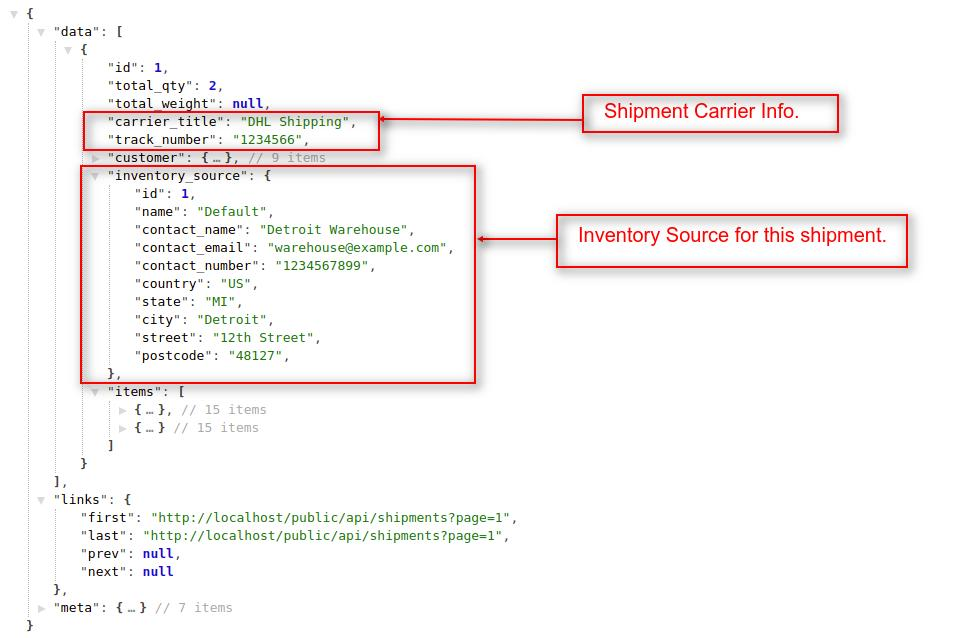
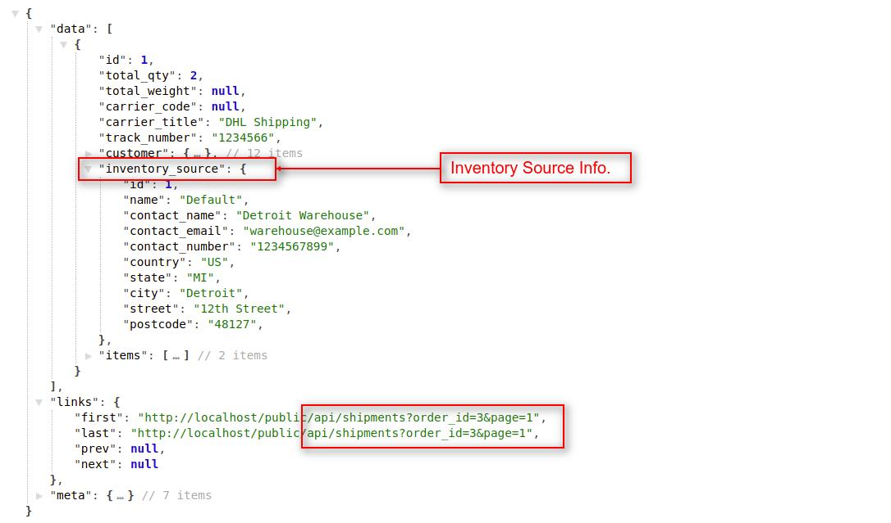

# Shipments

In this section, we will check all the shipments' API.

## Get shipments from all orders

You can get all the shipments of the Bagisto store. To get the shipments of the store, the customer must be logged in to the Bagisto store. You can achieve this job by using the `shipments` API call resource.

- Headers

  | Key           | Value                 | Info                                 |
  | ------------- | --------------------- | ------------------------------------ |
  | Accept        | application/json      |                                      |
  | Authorization | Bearer `token-string` | Use only when you pass `?token=true` |

- Request

  `GET <host>/api/shipments(?limit,page,pagination)`

- Params

  | Name          | Info                                         | Type   |
  | ------------- | -------------------------------------------- | ------ |
  | limit         | Maximum number of records in each request    | Number |
  | page          | Records for specific page based on the limit | Number |
  | pagination    | Will display all the records if set to `0`   | Number |

::: tip

  If you are using pagination and want to know more info about responses then check the [explanation](./explanation) portion.

:::

### Examples

#### 1. Get all shipments with pagination

- Headers

  | Key           | Value                 | Info                                 |
  | ------------- | --------------------- | ------------------------------------ |
  | Accept        | application/json      |                                      |
  | Authorization | Bearer `token-string` | Use only when you pass `?token=true` |

- Request

  `GET http(s)://example.com/api/shipments?page=1`

  ::: tip

    If you didn't use the page (?page=x) filter, then it returns the data of the first page by default.

    `GET http(s)://example.com/api/shipments`
  
  :::

::: details Response

  ~~~json
  {
      "data": [
          {
              "id": 1,
              "total_qty": 2,
              "total_weight": null,
              "carrier_title": "DHL Shipping",
              "track_number": "1234566",
              "customer": {...},
              "inventory_source": {
                  "id": 1,
                  "name": "Default",
                  "contact_name": "Detroit Warehouse",
                  "contact_email": "warehouse@example.com",
                  "contact_number": "1234567899",
                  "country": "US",
                  "state": "MI",
                  "city": "Detroit",
                  "street": "12th Street",
                  "postcode": "48127",
              },
              "items": [{...},{...}]
          }
      ],
      "links": {...},
      "meta": {...}
  }
  ~~~

  

:::

#### 2. Get all shipments without pagination

- Headers

  | Key           | Value                 | Info                                 |
  | ------------- | --------------------- | ------------------------------------ |
  | Accept        | application/json      |                                      |
  | Authorization | Bearer `token-string` | Use only when you pass `?token=true` |

- Request

  `GET http(s)://example.com/api/shipments?pagination=0`

::: details Response

  ~~~json
  {
      "data": [
          {
              "id": 1,
              "total_qty": 2,
              "total_weight": null,
              "carrier_title": "DHL Shipping",
              "track_number": "1234566",
              "customer": {...},
              "inventory_source": {
                  "id": 1,
                  "name": "Default",
                  "contact_name": "Detroit Warehouse",
                  "contact_email": "warehouse@example.com",
                  "contact_number": "1234567899",
                  "country": "US",
                  "state": "MI",
                  "city": "Detroit",
                  "street": "12th Street",
                  "postcode": "48127",
              },
              "items": [{...},{...}]
          },
          {...},
          {...},
          {...},
          ...
          {...}
      ]
  }
  ~~~

:::

## Get shipments by order's id

To get the details of a  specific order's shipment, you have to pass an `order_id` as a query parameter in API URL. By using this resource and query parameter, you will get only a single shipment detail in API response based on the provided `order_id`.

- Headers

  | Key           | Value                 | Info                                 |
  | ------------- | --------------------- | ------------------------------------ |
  | Accept        | application/json      |                                      |
  | Authorization | Bearer `token-string` | Use only when you pass `?token=true` |

- Request

  `GET <host>/api/shipments(?order_id,limit,page,pagination)`

- Params

  | Name          | Info                                         | Type   |
  | ------------- | -------------------------------------------- | ------ |
  | order_id      | Order's ID                                   | Number |
  | limit         | Maximum number of records in each request    | Number |
  | page          | Records for specific page based on the limit | Number |
  | pagination    | Will display all the records if set to `0`   | Number |

### Examples

#### 1. Get all shipments by order's id

- Headers

  | Key           | Value                 | Info                                 |
  | ------------- | --------------------- | ------------------------------------ |
  | Accept        | application/json      |                                      |
  | Authorization | Bearer `token-string` | Use only when you pass `?token=true` |

- Request

  `GET http(s)://example.com/api/shipments?order_id=3&pagination=0`

::: details Response

  ~~~json
  {
      "data": [
          {
              "id": 1,
              "total_qty": 2,
              "total_weight": null,
              "carrier_code": null,
              "carrier_title": "DHL Shipping",
              "track_number": "1234566",
              "customer": {...},
              "inventory_source": {...},
              "items": [
                  {...},
                  {...}
              ]
          }
      ],
  }
  ~~~

:::

#### 2. Get all shipments by order's id for specific page

- Headers

  | Key           | Value                 | Info                                 |
  | ------------- | --------------------- | ------------------------------------ |
  | Accept        | application/json      |                                      |
  | Authorization | Bearer `token-string` | Use only when you pass `?token=true` |

- Request

  `GET http(s)://example.com/api/shipments?order_id=3&page=1`

  ::: tip

    If you didn't use the page (?page=x) filter, then it returns the data of the first page by default.

    `GET http(s)://example.com/api/shipments?order_id=3`
  
  :::

::: details Response

  

:::

## Get shipment by id

To get the details of a specific shipment, you have to pass a `shipment_id` as a request payload in the API URL.

- Headers

  | Key           | Value                 | Info                                 |
  | ------------- | --------------------- | ------------------------------------ |
  | Accept        | application/json      |                                      |
  | Authorization | Bearer `token-string` | Use only when you pass `?token=true` |

- Request

  `GET http(s)://example.com/api/shipments/{id}`

### Examples

#### 1. Let's fetch specific shipment

- Headers

  | Key           | Value                 | Info                                 |
  | ------------- | --------------------- | ------------------------------------ |
  | Accept        | application/json      |                                      |
  | Authorization | Bearer `token-string` | Use only when you pass `?token=true` |

- Request

  `GET http(s)://example.com/api/shipments/1`

::: details Response

  ~~~json
  {
      "data": {
          "id": 1,
          "total_qty": 2,
          "total_weight": null,
          "carrier_code": null,
          "carrier_title": "DHL Shipping",
          "track_number": "1234566",
          "email_sent": 0,
          "customer": {...},
          "inventory_source": {...},
          "items": [
              {...},
              {...}
          ]
      }
  }
  ~~~

:::
