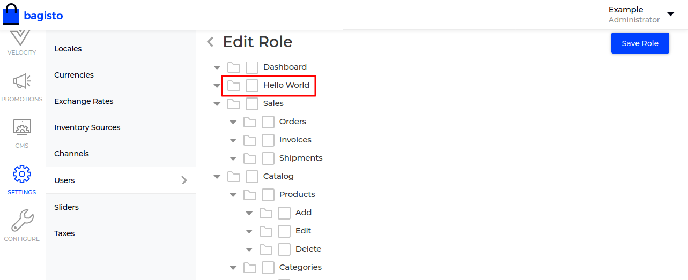

# Access control list

In addition to providing authentication services out of the box, Bagisto also provides a functionality **ACL** (Access Control List).

With this feature the administrator can allow/disallow other users to access parts of Bagisto.

## Create a new ACL file

Create a new file named `acl.php` in your package **Config** folder, for example, `packages/ACME/HelloWorld/src/Config` and add the following code.

~~~php
<?php

return [
    [
        'key' => 'helloworld',
        'name' => 'HelloWorld',
        'route' => 'helloworld.admin.index',
        'sort' => 2
    ]
];
~~~

If you check the above code we have created an array for an individual's menu with the parameters (key, name, route & sort).

Just like that, we need to define the menu here which we want to include in our ACL.

## Merge configuration

After that, we need to merge the ACL config also just like we have done with menu items,

  ~~~php
  <?php

  namespace ACME\HelloWorld\Providers;

  use Illuminate\Support\Facades\Event;
  use Illuminate\Support\ServiceProvider;

  /**
  * HelloWorldServiceProvider
  *
  * @copyright 2020 Webkul Software Pvt. Ltd. (http://www.webkul.com)
  */
  class HelloWorldServiceProvider extends ServiceProvider
  {
      /**
      * Register services.
      *
      * @return void
      */
      public function register()
      {
          $this->mergeConfigFrom(
              dirname(__DIR__) . '/Config/admin-menu.php', 'menu.admin'
          );

          $this->mergeConfigFrom(
              dirname(__DIR__) . '/Config/acl.php', 'acl'
          );
      }
  }
  ~~~

After setting up, just run this command `php artisan optimize` to cached the latest changes.

Now check the latest ACL.

## Checking roles and permissions

- If you check the `Admin` model in the namespace `Webkul\User\Models`, you will see the relationship binding with the `Role` model in the same namespace. From here you can grab all the permissions of the current user.

- We have provided the `bouncer()` helper, which helps you to check the permissions. Let's check the current user has permission or not,

  ~~~php
  bouncer()->hasPermission($permission)
  ~~~
