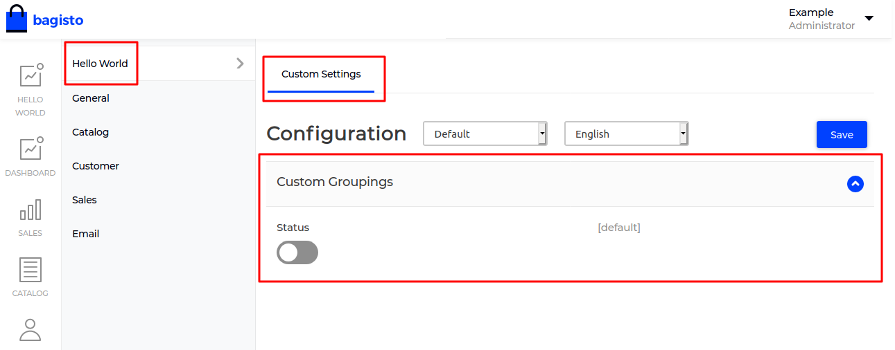

# Create Custom Configuration

Creating a custom configuration ease the task for a developer or any non-developer person. Generally, in Bagisto, you can find it in admin panel **Configuration Menu**.

## Steps to create custom configuration

- To create a custom configuration for your application, you just need to create a `system.php` file in the `Config` folder of your package.

- Inside the file, you can include the code below,

  ~~~php
  <?php

  return [
      [
          'key' => 'helloworld',
          'name' => 'Hello World',
          'sort' => 1
      ], [
          'key' => 'helloworld.settings',
          'name' => 'Custom Settings',
          'sort' => 1,
      ], [
          'key' => 'helloworld.settings.settings',
          'name' => 'Custom Groupings',
          'sort' => 1,
          'fields' => [
              [
                  'name' => 'status',
                  'title' => 'Status',
                  'type' => 'boolean',
                  'channel_based' => true,
                  'locale_based' => false
              ]
          ]
      ]
  ];
  ~~~

### Explanation for the keys

- **key**    : This key accept the unique value and nested with '.' (dot) operator.

- **name**   : This key accept the value as a placeholder for your configuration. Generally, in Bagisto, we consider writing it using translation.

- **sort**   : This key accept the sort position for the configuration menu.

- **fields** : This key accept the array for the value of the custom configuration.

- We need to merge the these custom config also,

  ~~~php
  <?php

  namespace ACME\HelloWorld\Providers;

  use Illuminate\Support\Facades\Event;
  use Illuminate\Support\ServiceProvider;

  /**
  * HelloWorldServiceProvider
  *
  * @copyright 2020 Webkul Software Pvt. Ltd. (http://www.webkul.com)
  */
  class HelloWorldServiceProvider extends ServiceProvider
  {
      /**
      * Register services.
      *
      * @return void
      */
      public function register()
      {
          $this->mergeConfigFrom(
              dirname(__DIR__) . '/Config/admin-menu.php', 'menu.admin'
          );

          $this->mergeConfigFrom(
              dirname(__DIR__) . '/Config/acl.php', 'acl'
          );

          $this->mergeConfigFrom(
              dirname(__DIR__) . '/Config/system.php', 'core'
          );
      }
  }
  ~~~

  ::: details Output

    

  :::
