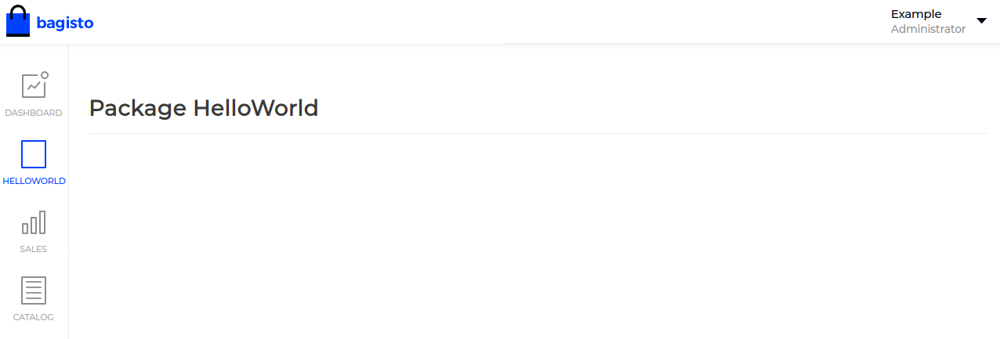
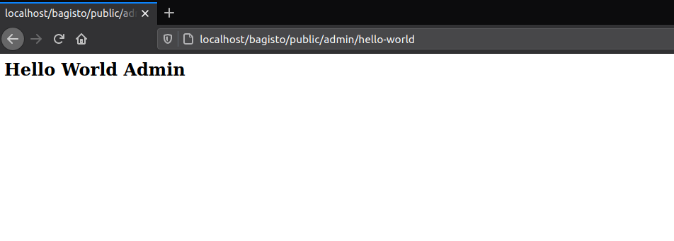

# Create a new package

There are two ways to create a package.

1. By using Bagisto Package Generator (**Recommended**)
2. By manually setting up all files (**Expert Level**)

## 1. By using Bagisto Package Generator

- You need to install [Bagisto Package Generator](https://github.com/bagisto/bagisto-package-generator).

- If you have not installed this package then you need to go to the root folder of **Bagisto** and run the following command

  ~~~php
  composer require bagisto/bagisto-package-generator
  ~~~

- Now, to generate your package you need to use the following command,

  - If the package directory does not exist,

    ~~~php
    php artisan package:make ACME/HelloWorld
    ~~~

  - If somehow the package directory is already present then you can use the force command as well. For that you just need to pass the '**--force**' command.

    ~~~php
    php artisan package:make ACME/HelloWorld --force
    ~~~

- Now check your `packages` directory, everything is setup for you.

- After that, you need to register your service provider in `config/app.php`.

  ~~~php
  <?php

  return [
      ...
      'providers' => [
          ...
          ACME\HelloWorld\Providers\HelloWorldServiceProvider::class,
          ...
      ]
      ...
  ];
  ~~~

- Add you package namespace in `psr-4` key in `composer.json` file for auto loading.

  ~~~json
  "autoload": {
      ...
      "psr-4": {
          ...
          "ACME\\HelloWorld\\": "packages/ACME/HelloWorld/src"
          ...
      }
      ...
  }
  ~~~

- Run `composer dump-autoload`.

::: details Check output in the browser

:::

- Now start creating something cool.

## 2. By manually setting up all files

By manually setting up package, we assume that you are familiar with packages directory structures and flow. If not then you can find a basic tree structure of package below,

  ::: details Basic tree structure of the package

  ~~~
  - ACME/HelloWorld/
    - publishable/assets
      - css/
      - images/
      - js/
    - src/
      - Config/
        - acl.php
        - admin-menu.php
      - Console/
        - Commands/
      - Contracts/
      - Database/
        - Migrations/
        - Seeders/
      - Events/
      - Http/
        - Controllers/
          - Admin/
            - HelloWorldController.php
          - Shop/
            - HelloWorldController.php
        - Middleware/
        - Requests/
        - admin-routes.php
        - shop-routes.php
      - Listeners/
      - Mail/
      - Models/
      - Providers/
        - HelloWorldServiceProvider.php
        - ModuleServiceProvider.php
      - Repositories/
      - Resources/
        - assets/
          - images/
          - js/
            - app.js
          - sass/
            - admin.scss
            - default.scss
            - velocity.scss
        - lang/
        - views/
          - admin/
            - layouts/
              - style.blade.php
            - index.blade.php
          - shop/
            - default/
              - index.blade.php
            - velocity/
              - index.blade.php
    - package.json
    - webpack.mix.js
  ~~~

  :::

Let's start with first step by creating the packages folder.

### Step-1

- In `packages` folder, create a folder with your company name and inside that create a folder with your package name. Let's say `ACME/HelloWorld`. So, your basic structure will look like this,

  ~~~
  - packages/
    - ACME/HelloWorld/
  ~~~

### Step-2

- In your package folder, create a folder named as `src`. This is the place where you need to put all your files related to your package. Now, your updated structure will look like this,

  ~~~
  - packages/
    - ACME/HelloWorld/
      - src/
  ~~~

### Step-3

- In `src` folder, create a folder named as `Providers` and inside that folder, create a file named as `PackagenameServiceProvider.php`. Let's say `HelloWorldServiceProvider.php`.

    ::: tip
    If you want to do this with the **Bagisto Package Generator** then you need to type the following command, it will generate the service provider for you.

    ~~~php
    php artisan package:make-provider HelloWorldServiceProvider ACME/HelloWorld
    ~~~

    If somehow the file already exists then you can use `--force` to overwrite the file.
    :::

- Copy the below code and paste it in `HelloWorldServiceProvider.php`,

  ~~~php
  <?php
  namespace ACME\HelloWorld\Providers;

  use Illuminate\Support\ServiceProvider;

  /**
  * HelloWorldServiceProvider
  *
  * @copyright 2020 Webkul Software Pvt. Ltd. (http://www.webkul.com)
  */
  class HelloWorldServiceProvider extends ServiceProvider
  {
      /**
      * Bootstrap services.
      *
      * @return void
      */
      public function boot()
      {

      }

      /**
      * Register services.
      *
      * @return void
      */
      public function register()
      {

      }
  }
  ~~~

### Step-4

- Now, register your service provider in `config/app.php`.

  ~~~php
  <?php

  return [
      ...
      'providers' => [
          ...
          ACME\HelloWorld\Providers\HelloWorldServiceProvider::class,
          ...
      ]
      ...
  ];
  ~~~

### Step-5

- Add you package namespace in `psr-4` key in `composer.json` file for auto loading.

  ~~~json
  "autoload": {
      ...
      "psr-4": {
          ...
          "ACME\\HelloWorld\\": "packages/ACME/HelloWorld/src"
          ...
      }
      ...
  }
  ~~~

- Run `composer dump-autoload`.

### Step-6

- Now, you need to add routing & views in your package.

  - **For routes**: Create a `Http` folder in `packages/ACME/HelloWorld/src` and create two files named as `admin-routes.php` and `shop-routes.php`. So the updated structure will look like below,

    ::: details Updated directory structure

    ~~~
    - packages/
      - ACME/HelloWorld/
        - src/
          ...
          - Http/
            - admin-routes.php
            - shop-routes.php
    ~~~

    :::
  
    - `admin-routes.php`: This file is for the admin routes. Add below codes to this file,

        ~~~php
        <?php

        Route::group(['middleware' => ['web', 'admin']], function () {

            // all admin routes will place here

        });
        ~~~

    - `shop-routes.php`: This file is for the shop routes. Add below codes to this file,

        ~~~php
        <?php

        Route::group(['middleware' => ['web', 'theme', 'locale', 'currency']], function () {

            // all shop routes will be place here

        });
        ~~~

    ::: tip

    - If you don't want to do it manually, then you can use our **Bagisto Package Generator**. For that you need to use this command,

      - For **admin-routes.php**,

        ~~~php
        php artisan package:make-admin-route ACME/HelloWorld
        ~~~

      - For **shop-routes.php**,

        ~~~php
        php artisan package:make-shop-route ACME/HelloWorld
        ~~~

    :::

  - **For views**: Create `Resources` folder in `packages/ACME/HelloWorld/src` path. In `Resources` folder, create another folder named as `views`. Now, in the `views` folder, we need to create a two more folder i.e. `admin` and `shop`. So updated structure will look like this,

    ::: details Updated directory structure

    ~~~
    - packages/
      - ACME/HelloWorld/
        - src/
          ...
          - Resources/
            ...
            - views/
              - admin/
              - shop/
    ~~~

    :::

    - Inside each folder i.e. `admin` and `shop` create a file named as `index.blade.php`. Add some data to `index.blade.php`,

      - `admin/index.blade.php`

        ~~~html
        <h2>Hello World Admin</h2>
        ~~~

      - `shop/index.blade.php`

        ~~~html
        <h2>Hello World Shop</h2>
        ~~~

- Now, we need to register our routes and views to service provider’s boot method i.e. `packages/ACME/HelloWorld/src/Providers/HelloWorldServiceProvider.php`

  ~~~php
  <?php

  namespace ACME\HelloWorld\Providers;

  use Illuminate\Support\ServiceProvider;

  /**
  * HelloWorldServiceProvider
  *
  * @copyright 2020 Webkul Software Pvt. Ltd. (http://www.webkul.com)
  */
  class HelloWorldServiceProvider extends ServiceProvider
  {
      /**
      * Bootstrap services.
      *
      * @return void
      */
      public function boot()
      {
          $this->loadRoutesFrom(__DIR__ . '/../Http/admin-routes.php');

          $this->loadRoutesFrom(__DIR__ . '/../Http/shop-routes.php');

          $this->loadViewsFrom(__DIR__ . '/../Resources/views', 'helloworld');
      }

      /**
      * Register services.
      *
      * @return void
      */
      public function register()
      {

      }
  }
  ~~~

### Step-7

- Now, we need to create a route and render a view on that route.

- Go to `packages/ACME/HelloWorld/src/Http/shop-routes.php` file and create a route to render view.

  ~~~php
  <?php

  Route::group(['middleware' => ['web', 'theme', 'locale', 'currency']], function () {

      // all shop routes will be place here
      Route::view('/hello-world', 'helloworld::shop.index');

  });
  ~~~

- Same for admin routes in file `packages/ACME/HelloWorld/src/Http/admin-routes.php`.

  ~~~php
  <?php

  Route::group(['middleware' => ['web', 'admin']], function () {

      // all admin routes will place here
      Route::view('/admin/hello-world', 'helloworld::admin.index');

  });
  ~~~

- Now, check your route in your browser,

  ::: details Admin Output

    
  
  :::

  ::: details Shop Output
  
    

  :::

### Step-8

- Now, we are going to create a language file for our package. For this create a `lang` folder in the `packages/ACME/HelloWorld/src/Resources` path.

- In `lang` folder, you can create a different folder for language translations like for English 'en', Hindi ‘hn’ etc. Moving forward, we will create a folder name `en` (say language code) and in that folder, create a file name as `app.php` to perform language translation.

  ::: details Updated directory structure

    ~~~
    - packages/
      - ACME/HelloWorld/
        - src/
          ...
          - Resources/
            ...
            - lang/
              - en/
                - app.php
    ~~~

  :::

- Now, we need to register the language file to the service provider.

  ~~~php
  <?php

  namespace ACME\HelloWorld\Providers;

  use Illuminate\Support\ServiceProvider;

  /**
  * HelloWorldServiceProvider
  *
  * @copyright 2020 Webkul Software Pvt. Ltd. (http://www.webkul.com)
  */
  class HelloWorldServiceProvider extends ServiceProvider
  {
      /**
      * Bootstrap services.
      *
      * @return void
      */
      public function boot()
      {
          $this->loadRoutesFrom(__DIR__ . '/../Http/admin-routes.php');

          $this->loadRoutesFrom(__DIR__ . '/../Http/shop-routes.php');

          $this->loadViewsFrom(__DIR__ . '/../Resources/views', 'helloworld');

          $this->loadTranslationsFrom(__DIR__ . '/../Resources/lang', 'helloworld');
      }

      /**
      * Register services.
      *
      * @return void
      */
      public function register()
      {

      }
  }
  ~~~

- Now we can write a translation in `app.php` like below,

  ~~~php
  <?php

  return [
      'hello-world' => [
          'name' => 'Prateek Srivastava'
      ]
  ];
  ~~~

- Add below code to your blade file.

  ~~~html
  {{ __('helloworld::app.hello-world.name') }}
  ~~~

  ::: details Admin Output

    

  :::

  ::: details Shop Output

    

  :::

### Step-9

- Now we will add CSS, JS and images to our package.

- In `Resources` folder creates a folder name `assets` & create `sass`, `js` and `images` folder.

  - In **sass** folder, add file **_app.scss_**
  
  - In **js** folder, add file **app.js**

::: details Updated directory structure

  ~~~php
  - packages/
      - ACME/HelloWorld/
        - src/
          ...
          - Resources/
            - assets/
              - sass/
                - app.scss
              - js/
                - app.js
              - images/
  ~~~

:::

- To add assets, create `package.json` and `webpack.mix.js` file inside the root of your package i.e. `packages/ACME/HelloWorld`.

- Copy below code to `package.json`,

  ~~~json
  {
      "scripts": {
          "dev": "npm run development",
          "development": "cross-env NODE_ENV=development node_modules/webpack/bin/webpack.js --progress --hide-modules --config=node_modules/laravel-mix/setup/webpack.config.js",
          "watch": "cross-env NODE_ENV=development node_modules/webpack/bin/webpack.js --watch --progress --hide-modules --config=node_modules/laravel-mix/setup/webpack.config.js",
          "watch-poll": "npm run watch -- --watch-poll",
          "hot": "cross-env NODE_ENV=development node_modules/webpack-dev-server/bin/webpack-dev-server.js --inline --hot --config=node_modules/laravel-mix/setup/webpack.config.js",
          "prod": "npm run production",
          "production": "cross-env NODE_ENV=production node_modules/webpack/bin/webpack.js --no-progress --hide-modules --config=node_modules/laravel-mix/setup/webpack.config.js"
      },

      "devDependencies": {
          "cross-env": "^7.0.2",
          "laravel-mix": "^5.0.1",
          "laravel-mix-merge-manifest": "^0.1.2"
      }
  }
  ~~~

- Copy below code to `webpack.mix.js`,

  ~~~javascript
  const mix = require("laravel-mix");

  if (mix == "undefined") {
      const { mix } = require("laravel-mix");
  }

  require("laravel-mix-merge-manifest");

  if (mix.inProduction()) {
      var publicPath = "publishable/assets";
  } else {
      var publicPath = "../../../public/vendor/webkul/helloworld/assets";
  }

  mix.setPublicPath(publicPath).mergeManifest();

  mix.disableNotifications();

  mix.js([__dirname + "/src/Resources/assets/js/app.js"], "js/helloworld.js")
      .copyDirectory(
          __dirname + "/src/Resources/assets/images",
          publicPath + "/images"
      )
      .sass(
          __dirname + "/src/Resources/assets/sass/app.scss",
          "css/helloworld.css"
      )
      .options({
          processCssUrls: false
      });

  if (mix.inProduction()) {
      mix.version();
  }
  ~~~

- After doing this go to the root of your package i.e. `packages/ACME/HelloWorld` and run `npm install` which will install all dependencies.

- Now, `app.js` and `app.scss` is ready. Write all your css and js here.

- When you done with your changes, then run `npm run prod` which will compiled all your css, js and images to the publishable folder. Then register your publishable in `HelloWorldServiceProvider`,

  ::: tip

  You can use `npm run watch` also, this will watch all your changes and put all your changes to the public path. When you done with all your changes then run `npm run prod` to compile all your changes and move to publishable folder.

  :::

  ~~~php
  <?php

  namespace ACME\HelloWorld\Providers;

  use Illuminate\Support\ServiceProvider;

  /**
  * HelloWorldServiceProvider
  *
  * @copyright 2020 Webkul Software Pvt. Ltd. (http://www.webkul.com)
  */
  class HelloWorldServiceProvider extends ServiceProvider
  {
      /**
      * Bootstrap services.
      *
      * @return void
      */
      public function boot()
      {
          $this->loadRoutesFrom(__DIR__ . '/../Http/admin-routes.php');

          $this->loadRoutesFrom(__DIR__ . '/../Http/shop-routes.php');

          $this->loadViewsFrom(__DIR__ . '/../Resources/views', 'helloworld');

          $this->loadTranslationsFrom(__DIR__ . '/../Resources/lang', 'helloworld');

          $this->publishes([
              __DIR__ . '/../../publishable/assets' => public_path('vendor/webkul/helloworld/assets'),
          ], 'public');
      }

      /**
      * Register services.
      *
      * @return void
      */
      public function register()
      {

      }
  }
  ~~~

- After doing this we need to add an event listener so that admin layouts include our CSS. For this we need to add an Event Listener in service provider. But before adding event, let's create a `layouts` folder in `packages/ACME/Test/src/Resources/views/admin` and inside that create a file called `style.blade.php` & mention compiled CSS path inside this file.

    ~~~html
    <link rel="stylesheet" href="{{ asset('vendor/webkul/helloworld/assets/css/helloworld.css') }}">
    ~~~

- **For Event Listener:** Add facade 'Event' into your `HelloWorldServiceProvider.php` file,

  ~~~php
  <?php

  namespace ACME\HelloWorld\Providers;

  use Illuminate\Support\Facades\Event;
  use Illuminate\Support\ServiceProvider;

  /**
  * HelloWorldServiceProvider
  *
  * @copyright 2020 Webkul Software Pvt. Ltd. (http://www.webkul.com)
  */
  class HelloWorldServiceProvider extends ServiceProvider
  {
      /**
      * Bootstrap services.
      *
      * @return void
      */
      public function boot()
      {
          $this->loadRoutesFrom(__DIR__ . '/../Http/admin-routes.php');

          $this->loadRoutesFrom(__DIR__ . '/../Http/shop-routes.php');

          $this->loadViewsFrom(__DIR__ . '/../Resources/views', 'helloworld');

          $this->loadTranslationsFrom(__DIR__ . '/../Resources/lang', 'helloworld');

          $this->publishes([
              __DIR__ . '/../../publishable/assets' => public_path('vendor/webkul/helloworld/assets'),
          ], 'public');

          Event::listen('bagisto.admin.layout.head', function($viewRenderEventManager) {
              $viewRenderEventManager->addTemplate('helloworld::admin.layouts.style');
          });
      }

      /**
      * Register services.
      *
      * @return void
      */
      public function register()
      {

      }
  }
  ~~~

- Till now, we configured our package HelloWorld and now we need to extend the default layout of our admin panel by using `@extends('admin::layouts.master')` in file `packages/ACME/HelloWorld/src/Resources/views/admin/index.blade.php`. Below is the simple template which you can copy to your `index.blade.php` file,

  ~~~html
  @extends('admin::layouts.master')

  @section('page_title')
      Package HelloWorld
  @stop

  @section('content-wrapper')

      

          

              

                  <h1>Package HelloWorld</h1>
              

              

              

          

          

          

      

  @stop
  ~~~

- If you don’t want to include this one then you can create your own master file which includes your packages CSS & JS.

- Run `php artisan vendor:publish --all --force`. This will move all your publishable assets to their respective directory which you mentioned in the service provider.

### Step-10

- Now we will add Database to our package. Create a `Database` folder in `packages/ACME/HelloWorld/src` path and inside `Database` folder create `Migrations` and `Seeders` folder.

- Now, we need to add migrations to our service provider to load them.

  ~~~php
  <?php

  namespace ACME\HelloWorld\Providers;

  use Illuminate\Support\Facades\Event;
  use Illuminate\Support\ServiceProvider;

  /**
  * HelloWorldServiceProvider
  *
  * @copyright 2020 Webkul Software Pvt. Ltd. (http://www.webkul.com)
  */
  class HelloWorldServiceProvider extends ServiceProvider
  {
      /**
      * Bootstrap services.
      *
      * @return void
      */
      public function boot()
      {
          $this->loadRoutesFrom(__DIR__ . '/../Http/admin-routes.php');

          $this->loadRoutesFrom(__DIR__ . '/../Http/shop-routes.php');

          $this->loadViewsFrom(__DIR__ . '/../Resources/views', 'helloworld');

          $this->loadTranslationsFrom(__DIR__ . '/../Resources/lang', 'helloworld');

          $this->publishes([
              __DIR__ . '/../../publishable/assets' => public_path('vendor/webkul/helloworld/assets'),
          ], 'public');

          Event::listen('bagisto.admin.layout.head', function($viewRenderEventManager) {
              $viewRenderEventManager->addTemplate('helloworld::helloworld.layouts.style');
          });

          $this->loadMigrationsFrom(__DIR__ .'/../Database/Migrations');
      }

      /**
      * Register services.
      *
      * @return void
      */
      public function register()
      {

      }
  }
  ~~~

- Now start adding your migration files.
