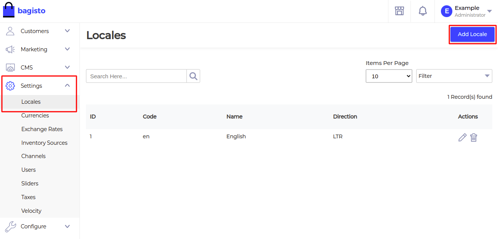
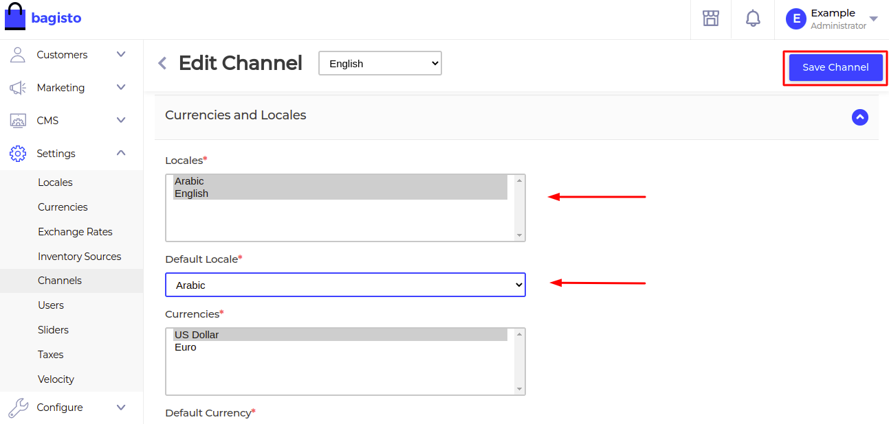
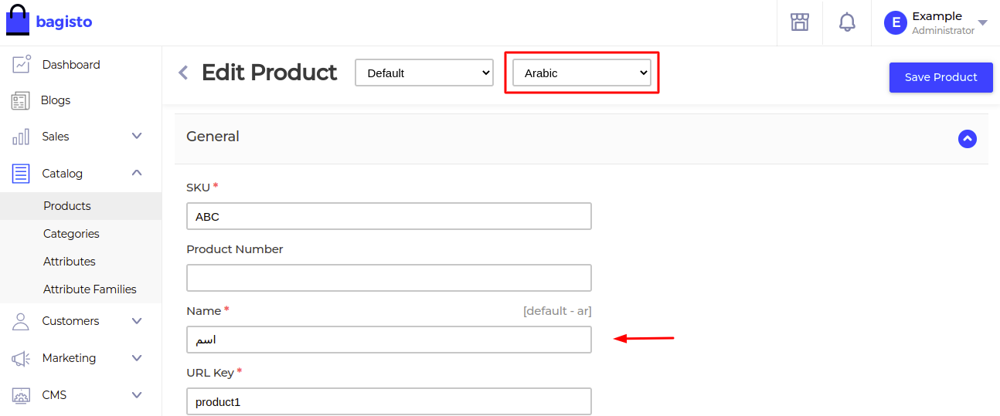
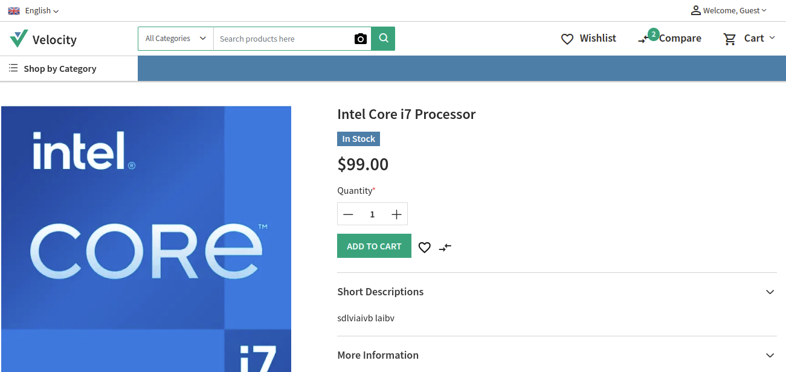
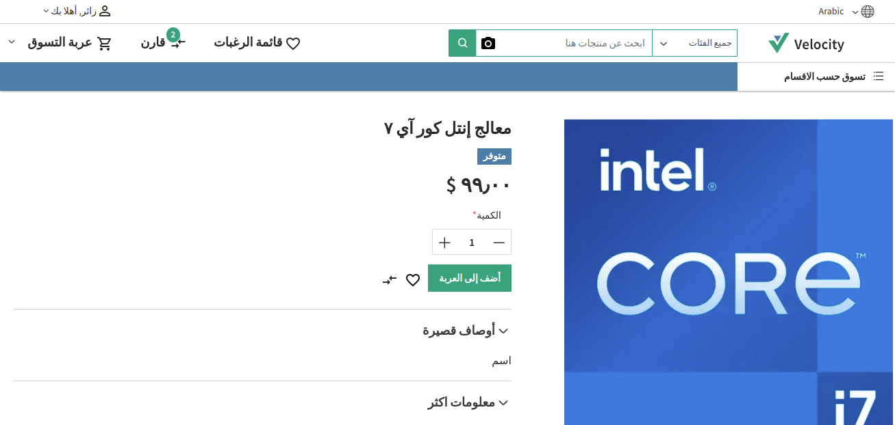

# Translation based on locale

If you want to make your website easily accessible to customers in multiple languages and expand your business to a global platform then language translation is crucial for your website. It will help you generate more traffic and increase sales.

By using language translation in Bagisto, you can easily localize your website for many global or regional languages. Your customer can easily translate your whole website just by a single click which also plays a major role in website SEO in the respective region and to show translation as per your locale, you need to follow these below steps:

You can easily perform language translation for both Admin dashboard and the front-end view

## Translation For Front End View

Kindly follow the steps as needed on the admin dashboard.

- On Admin Sidebar, click on Setting>>Locales>>Add Locale

    

- Enter the code and Name of locale (here I am taking an example of Arabic language or you can select as per your choice) and click on Save Locale.

    

- Next, you need to set the Channels.Click on Setting>> Channels. Open the selected Channel in Edit Mode. Under Currencies and Locales

- Locale:- You can select either one or multi-select locales as per your choice.

- Default Locale:- You have to set your default Locale so that if the Customer will not select any locale then it will be showing in the Default Locale set by you

- Once the settings have been done, click on Save Channels.

    

- Next, you need to change locale in the below main section: Products, Categories, and Attributes

    

- Under Attributes Section, click on Attributes which you want to change. Next, open selected attribute in Edit Mode. Enter the attribute name in Arabic after which click on Save Attribute. Here I am giving an example of Attribute “Pattern“.

    

- Under Categories Section, click on Categories. Enter the category name in Arabic and enter the description in Arabic after which click Save Category.

    

- Under Product Section, click on Product. Open the selected product in Edit Mode and enter the product name in Arabic and Short Description in Arabic

    


### Steps you can perform on Front End

- At the top left corner of the front end there is an option of Locale so you can select your Locale

    ::: details Change Language
    
    :::

- When you will select Locale in English then the front end will be visible like this:

    ::: details English
    
    :::

- When you will select the locale in Arabic from the front end then it will be visible like this:

    ::: details Arabic
    
    :::

## Translation For Admin View

You need to specify the locale in `.env` file, replace 'en' with your locale code.

```text
APP_LOCALE=en
```
If this doesn't work check `config/app.php` and set `locale` like below.

```php
    /*
    |--------------------------------------------------------------------------
    | Application Locale Configuration
    |--------------------------------------------------------------------------
    |
    | The application locale determines the default locale that will be used
    | by the translation service provider. You are free to set this value
    | to any of the locales which will be supported by the application.
    |
    */

    'locale' => env('APP_LOCALE', 'en'),
```
