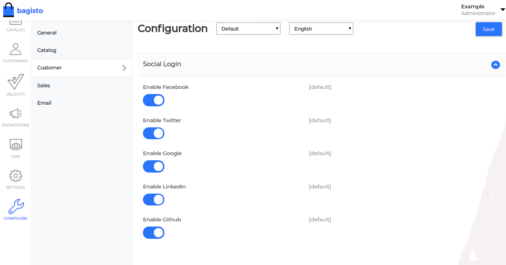
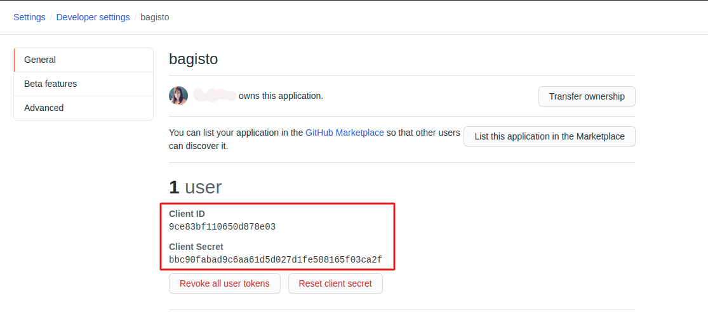
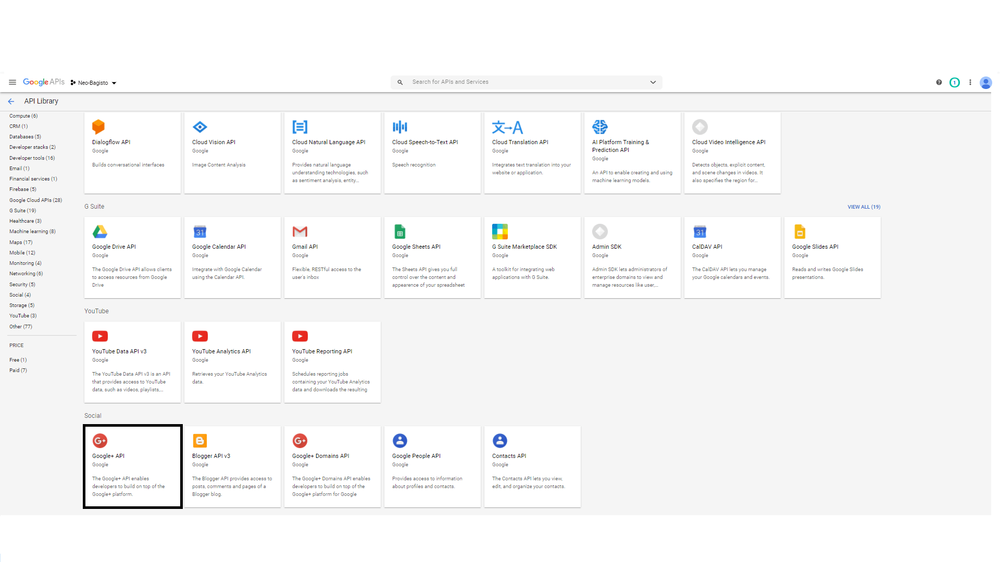
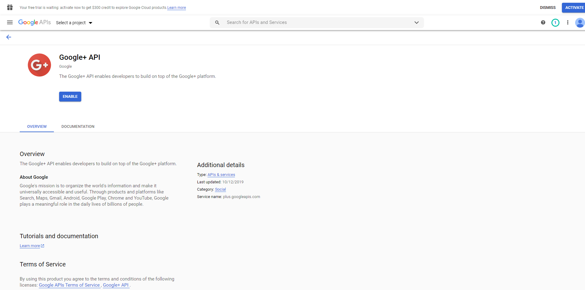
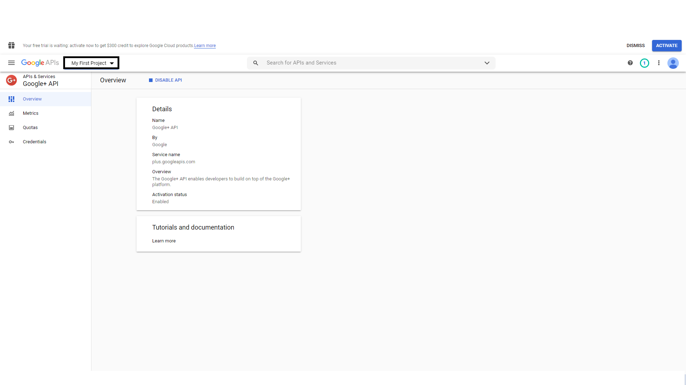
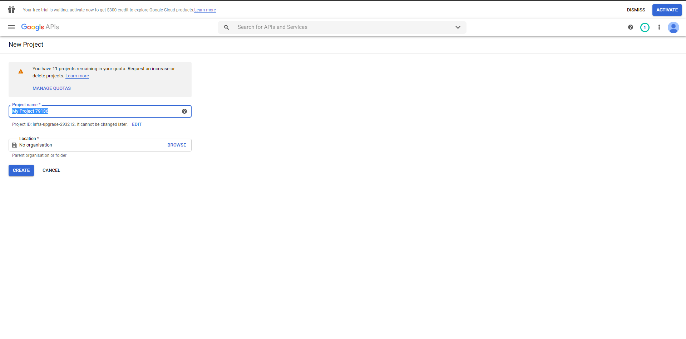
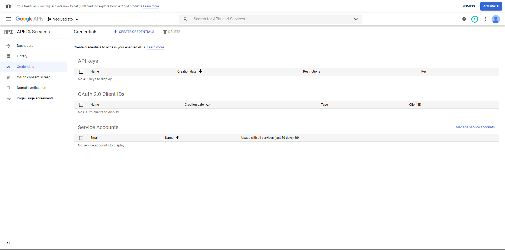
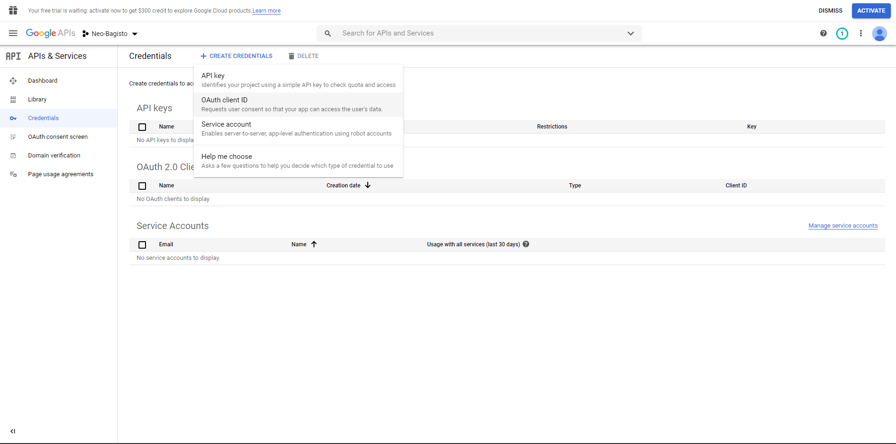
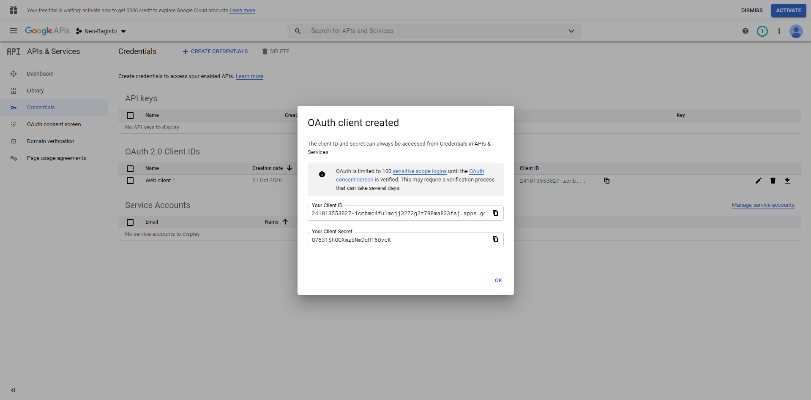

# Social Authentication

[[toc]]

## Introduction
In addition to the default authentication, Bagisto also provide a convenient way to authenticate with multiple OAuth providers.  
The following social networks are provided out of the box: [Facebook](https://facebook.com) [GitHub](https://github.com) [Google](https://google.com) [LinkedIn](https://linkedin.com) and [Twitter](https://twitter.com)

Once you configured one of the social networks, your customers can authenticate by one of these social networks by just a single buttons, there is no need to fill various fields.

## Configuration
To get started, you need to enable this feature first in the admin interface, navigate to configure>>Customer>>Social login.
Here you can enable / disable social authentication providers as shown in the below image.



## Configuring Github

### Register a new OAuth application
Before you can allow you customers to authenticate with Github, you first need to create a [GitHub application](https://github.com/settings/applications/new).  
::: tip Authorization callback URL
You can find the **Authorization callback URL** inside the .env file and change yourhost.com with your domain name.
:::

  

Once your new OAuth Application is registered, click on the name of your new application to get the **Client ID** and **Client Secret**.


### Configure credentials for the OAuth application
Now that you have the **Github Client ID**, **Client Secret** and **Authorization callback URL**, you just need to add these to your **.env** file.  
Remember to change the GITHUB_CALLBACK_URL yourhost.com with your domain name.

```
GITHUB_CLIENT_ID=
GITHUB_CLIENT_SECRET=
GITHUB_CALLBACK_URL=https://yourhost.com/customer/social-login/github/callback
```

## Configuring Google

### Register a new OAuth application
Before you can allow you customers to authenticate with Google, you first need to create a [Google application](https://console.developers.google.com/project).
1. Go to your API & Services ->Library

2. Now click on Google+API under the section Social.

3. Now, click the **Enable button** to enable the Google+ API.

4. Now, click My Project to create a new project.

5. On clicking My Project, a pop-up will appear. Click “New Project” link.

6. Enter the name for your store so that you can identify your project. Please note that you should not include any Google word for your project name.

7. Meanwhile, go to the Credentials menu option and then click on Create credentials.

8. After that, click on **OAuth client ID**.

9. Select the Application type and enter the Authorized JavaScript origins and the Authorized redirect URLs, once that is done click the **Create** button.
::: tip OAuth Redirect URL
Set the OAuth Redirect URL like this: www.example.com/socialsignup/google/callback/
::: 

10. After clicking the **Create** button in the above step you will get the Client Id and Client Secret.


### Configure credentials for the OAuth application
Now that you have the **Google Client ID**, **Client Secret** and **Authorization callback URL**, you just need to add these to your **.env** file.  
Remember to change the GOOGLE_CALLBACK_UR yourhost.com with your domain name.

```
GOOGLE_CLIENT_ID=
GOOGLE_CLIENT_SECRET=
GOOGLE_CALLBACK_URL=https://yourhost.com/customer/social-login/google/callback
```