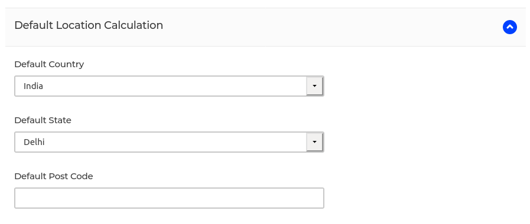

# Tax Rates

In e-commerce, there are various taxes involved while purchasing the product. These taxes and the rate of taxes differ from country to country.

In this section, we will focus only on the tax configuration. If you want to know more details about tax categories, tax rates, then feel free to check out out this [blog](https://bagisto.com/en/taxes-in-bagisto/).

## Pricing

If you check the configuration in the backend i.e. **Configuration > Taxes > Catalog**, you will see the '**Tax Inclusive**' button in the pricing section,

  

If this button is enabled then all the products in the shop will show tax-inclusive rates.

## Default Location Calculation

Now, in the same configuration, you will also see the '**Default Location Calculation**' with some fields, let us discuss all of them,

  

These are the default fields that can be handled by the admin. Let's say if the address of the customer or guest is not found, then in last, it will select the value from these configs.

Even if these configs are not set then in last it will check in the `config/app.php` file. If still it's not found then tax will not be applied.
