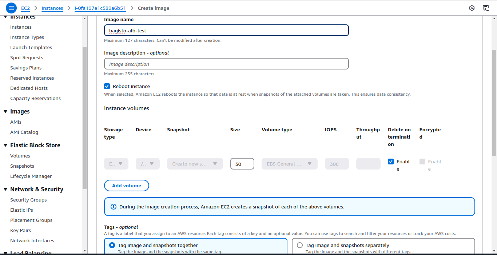
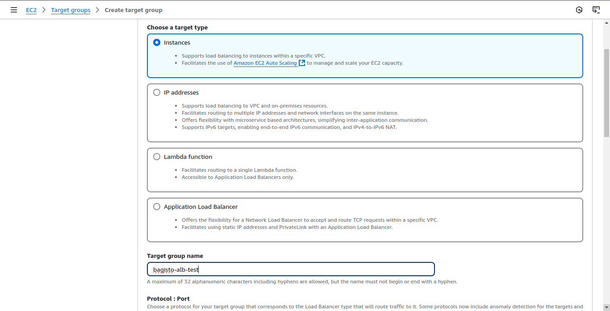
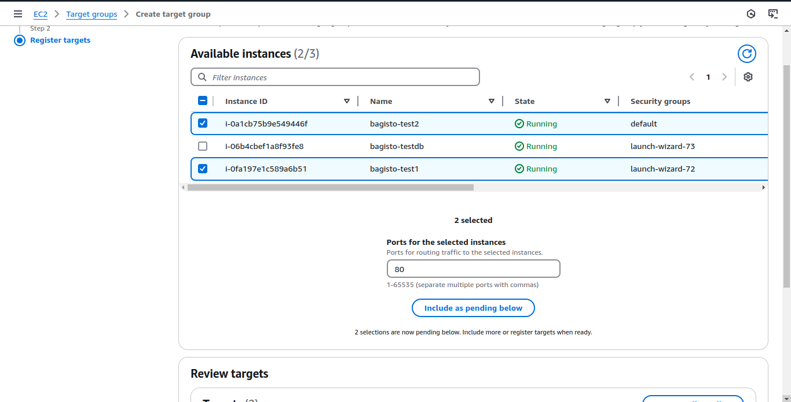
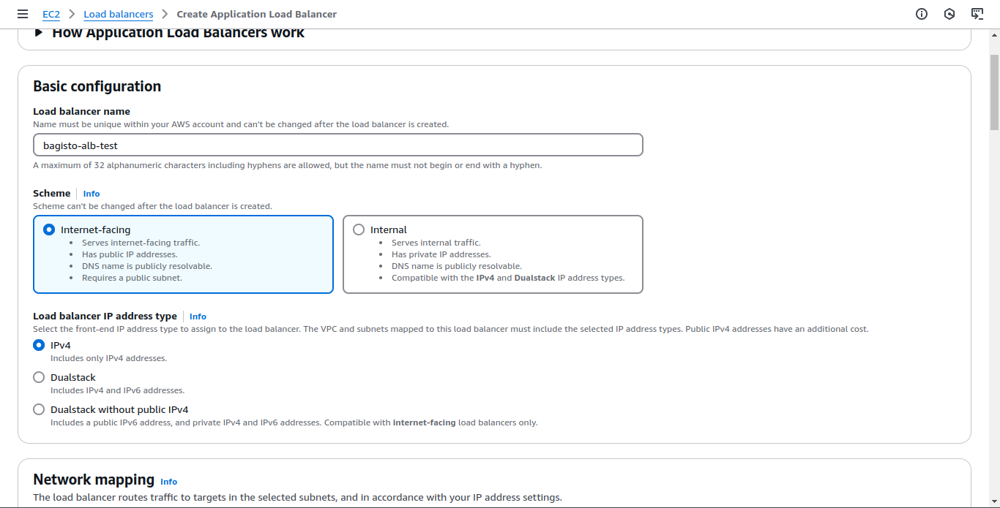
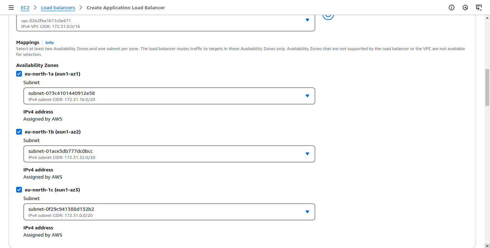
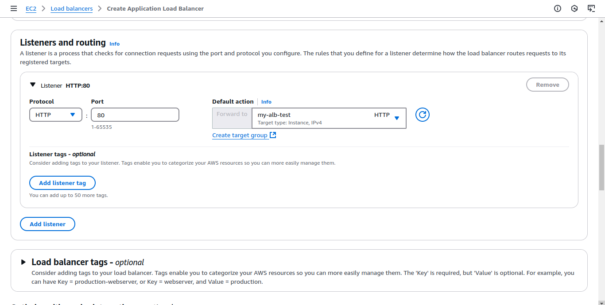

# Load Balancing

[[TOC]]

## Introduction

This guide provides a step-by-step approach to deploying Bagisto on AWS with an Application Load Balancer (ALB) for improved scalability and high availability. By setting up a dedicated database server, integrating Amazon S3 for media storage, and configuring an AMI-based auto-scaling setup, you can ensure that Bagisto can handle increased traffic efficiently.

The process includes:

- Setting up a dedicated MySQL server for better performance.
- Deploying Bagisto on multiple EC2 instances behind a Load Balancer.
- Using Amazon S3 for storage instead of local file storage.
- Creating an AMI to easily scale new instances.
- Configuring an Application Load Balancer (ALB) for traffic distribution.
- Setting up SSL and domain configuration for secure access.
- This setup ensures a scalable, fault-tolerant, and high-performance Bagisto application. 🚀

## Bagisto with ALB Setup on AWS

### Dedicated Database Server Setup

#### Launch EC2 Instance for MySQL Database

- Launch an EC2 instance for MySQL database.
- Assign an Elastic IP to the EC2 instance.

#### install and Configure MySQL Server

- SSH into the EC2 instance and run `apt-get update`.
- Install MySQL server:

```sh
sudo apt-get install mysql-server
```

- Secure the MySQL installation and create the database:

```sh
sudo mysql -u root -p
CREATE DATABASE bagistodb;
CREATE USER 'bagistouser'@'localhost' IDENTIFIED BY '<your-db-password>';
GRANT ALL ON bagistodb.* TO 'bagistouser'@'localhost' WITH GRANT OPTION;
SET GLOBAL log_bin_trust_function_creators = 1;
FLUSH PRIVILEGES;
EXIT;
```

#### Update MySQL Bind Address
- Modify the bind address from 127.0.0.1 to 0.0.0.0 in /etc/mysql/mysql.conf.d/mysqld.cnf.

#### Restart MySQL Server
- Restart the MySQL service:

```sh
sudo systemctl restart mysql
```

#### Open MySQL Port (3306) in Security Group
- Modify the security group for this EC2 instance to allow inbound traffic on port 3306.

#### Verify Database Connectivity

- Test connectivity using `telnet <EC2-ip> 3306` from your system

### S3 Bucket Configuration for Bagisto

#### Create S3 Bucket

- Follow the documentation [S3 Bucket and Policy Setup for Bagisto](https://bagisto.com/en/s3-bucket-and-policy-setup-for-bagisto-amazon-s3-extension) to create an S3 bucket.

#### Configure IAM Role for S3 Access

- Create an IAM role with the required permissions to allow Bagisto to interact with S3. Use the Access Key ID, Secret Key, Bucket Name, Region, and Bucket URL.

### Bagisto Server Setup

#### Launch EC2 Instance for Bagisto Application

- Launch a new EC2 instance for the Bagisto application.

#### Install MySQL Client

- SSH into the EC2 instance and install the MySQL client:

```sh 
sudo apt-get install mysql-client-8.0
```

#### Install Bagisto

- Follow the steps from the [Bagisto setup guide on AWS](https://cloudkul.com/blog/how-to-setup-bagisto-on-aws/) but skip step 7 (Install MySQL Server) as it is already done in the dedicated DB server.

- Use the latest [composer commands](https://getcomposer.org/download/)

#### Configure Bagisto Database Connection

- Use the following database details:
    - Host: `<public IP of dedicated DB server>`
    - User: `bagistouser`
    - Dbname: `bagistodb`
    - Password: `<your-db-password>`

#### Install S3 Integration Module

- Install and configure the S3 module for Bagisto using the IAM credentials.
    
#### Access Bagisto Admin Panel

- Visit the admin panel at: `http://<this-ec2-public-ip>/admin` to complete configurations.

### Create AMI for Bagisto Application

#### Create AMI from Bagisto EC2 Instance

- Go to **Instances > Actions > Image and templates > Create Image**.



- Enter the image name and click **Create Image**.

#### Wait for AMI to Be Available

- Monitor the status of the AMI in the AMI section.

#### Launch Instances from AMI

- Once the AMI is available, go to AMIs and launch as many instances as required in the target group.

### Configure Target Group

#### Create Target Group

- Go to Target Groups and click Create Target Group.
- Choose Instances as the target type and give it a name.




#### Register Instances in the Target Group

- Choose the instances to be added to the target group



####  Configure Load Balancing Algorithm

- After creating the target group, go to Attributes and choose the desired load-balancing algorithm (default: round-robin). Enable stickiness.

### Create and Configure Application Load Balancer (ALB)

#### Create ALB

- Go to **Load Balancers** and click **Create Load Balancer**.

- Choose **Application Load Balancer** and provide the following configurations:

    - **Internet-facing**.
    - Select all **Availability Zones**.
    - Choose the target group created earlier and configure the listener on **port 80 (HTTP)**.







#### Adjust Security Groups

- Modify the security groups to allow necessary traffic (e.g., HTTP/HTTPS).

#### Verify Load Balancer Configuration

- Copy the **DNS name** of the load balancer and verify it.
- Configure the **domain name** (CNAME) to point to this load balancer DNS for production use.

#### Set Up SSL on Load Balancer

- Configure the ALB listener to use HTTPS (port 443), ensuring that an SSL certificate is installed.


### Verify and Test the Entire Setup

#### Test Load Balancer
- Confirm that the load balancer is distributing traffic across the registered instances.

#### Verify Domain Configuration
- Ensure the domain is resolving correctly to the load balancer.

#### Test Bagisto Functionality
- Access the Bagisto application and verify that the S3 integration is working, the application can connect to the MySQL database, and all features are functional.

**Bagisto with ALB Setup on AWS is Successfully Configured!**

The Bagisto application is now running behind an Application Load Balancer (ALB) with a dedicated MySQL database and S3 integration for storage. The load balancer is efficiently distributing traffic across multiple instances, ensuring high availability and scalability.