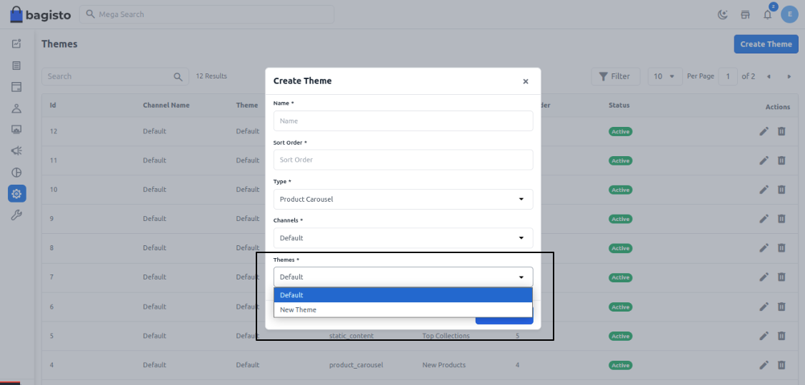

# Store Theme

[[TOC]]

## Introduction 

Configuring the store theme in Bagisto allows you to customize the visual appearance and functionality of your online store. Themes define the layout, styling, and user interface elements that create a unique brand experience for your customers.

## Configuration

- To configure the store theme in Bagisto, follow these steps:

- Locate the `themes.php` File.

- Navigate to the `config` folder located in the root directory of your Bagisto project.

- Look for the `themes.php` file within this directory.

```
- app
- bin
- bootstrap
- config
    ├── ...
    └── themes.php
- database
- packages
    └── Webkul
```

- Open the `themes.php` file to view and configure theme settings

- This file contains arrays that define different themes available in your application.

```php
<?php

return [
    'shop-default' => 'default',

    'shop' => [
        'default' => [
            'name'        => 'Default',
            'assets_path' => 'public/themes/shop/default',
            'views_path'  => 'resources/themes/default/views',

            'vite'        => [
                'hot_file'                 => 'shop-default-vite.hot',
                'build_directory'          => 'themes/shop/default/build',
                'package_assets_directory' => 'src/Resources/assets',
            ],
        ],
    ],
];
```

Let's go through the parameters defined in the `themes.php` file as understanding them will help you in creating a custom theme.

### Explanation of Parameters

- `shop-default` This parameter at the top of the file indicates the currently active or default theme for the shop in Bagisto. It is set to `'shop-default'`, representing the name of the currently active theme.

- `shop` This parameter allows you to define the configurations for your custom theme for the shop end. You can create and use multiple themes simultaneously in Bagisto.

- Inside the `'shop'` array, there is another array named `'default'`, which represents your currently active theme. It contains several key-value pairs that are explained below:

    - `views_path` This parameter specifies the path to the views or blade files for your custom theme.

    - `assets_path` It determines the path to the assets such as images, CSS files, and JavaScript files for your theme.

    - `name` This parameter defines a global name for your theme inside Bagisto.

    - `parent` This is an optional parameter that allows you to customize existing themes in Bagisto. By setting the `'parent'` parameter to the value of the `'name'` parameter listed above, you can inherit the configuration of the parent theme and make further customizations.

Once you have defined the paths and names for your custom theme in the `themes.php` file, you can start creating your view files. Make sure to cover all the GET routes of the shop package that include a parameter called `'view'`. You can find the route file of the shop package located at `packages/Webkul/Shop/src/Http/routes.php`.

Ensure that the name of your blade file matches the value passed in the GET route file. For example:

```php
use Webkul\Shop\Http\Controllers\CategoryController;

// Store front header nav-menu fetch
Route::get('/categories/{slug}', [CategoryController::class, 'index'])->name('shop.categories.index');
```

We are using Laravel 10 based routing system, which involves keeping view files inside the controller's section. This allows for the creation of custom view files, as well as redirection in controllers.

For all the views, check all the GET routes as they include a `'view'` parameter with the corresponding value to be used.

By following these steps, you can configure and create custom view files for your store theme in Bagisto. This allows you to personalize the appearance and layout of your storefront to align with your branding and provide an enhanced user experience.

## Creating a Theme

To create a new theme, follow these steps:

- Add a new theme entry to the `themes` array in the `themes.php` file:

```php
<?php
return [
    'shop-default' => 'default',

    'shop' => [
        'default' => [
            'name'        => 'Default',
            'assets_path' => 'public/themes/shop/default',
            'views_path'  => 'resources/themes/default/views',

            'vite'        => [
                'hot_file'                 => 'shop-default-vite.hot',
                'build_directory'          => 'themes/shop/default/build',
                'package_assets_directory' => 'src/Resources/assets',
            ],
        ],

        'new-theme' => [
            'name'        => 'New Theme',
            'assets_path' => 'public/themes/shop/new-theme',
            'views_path'  => 'resources/themes/new-theme/views',

            'vite'        => [
                'hot_file'                 => 'shop-new-theme-vite.hot',
                'build_directory'          => 'themes/shop/new-theme/build',
                'package_assets_directory' => 'src/Resources/assets',
            ],
        ],
    ],
];
```

- Create the necessary directories for your new theme

```
└── resources
    └── themes
        └── new-theme
            └── views
                └── layout.blade.php
                └── home.blade.php
```

- In the `views` directory, create the view files required for your theme, such as `layout.blade.php` and `home.blade.php`.

- Ensure that your theme's assets (CSS, JS, images, etc.) are placed in the specified `assets_path`:
```
└── public
    └── themes
        └── shop
            └── new-theme
                └── css
                └── js
                └── images
```

By following these steps, you can create and configure a new theme for your Bagisto store, enabling you to customize the appearance and layout to suit your branding and design preferences.

After adding your new theme, you will be able to select it when creating a new section for your storefront homepage from the admin panel.


