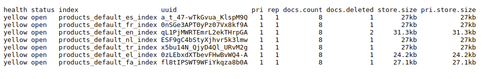

# Elasticsearch Configuration

[[TOC]]

In this section, we will explain how to configure Elasticsearch for indexing products from the database.

## Environment Setup

Before we proceed, make sure you have [Elasticsearch](https://www.elastic.co/guide/en/elasticsearch/reference/current/install-elasticsearch.html) installed on your system. By default, Elasticsearch uses port **`9200`**. We will be using the same port for our configuration.

To verify if Elasticsearch is installed successfully on your system, open your browser and navigate to **`http://localhost:9200`**. If you see the following output, it means Elasticsearch is installed:

```json
{
  "name" : "webkul-pc",
  "cluster_name" : "elasticsearch",
  "cluster_uuid" : "suPotT8zQjCOlq9dteWKyQ",
  "version" : {
    "number" : "8.6.2",
    "build_flavor" : "default",
    "build_type" : "deb",
    "build_hash" : "2d58d0f136141f03239816a4e360a8d17b6d8f29",
    "build_date" : "2023-02-13T09:35:20.314882762Z",
    "build_snapshot" : false,
    "lucene_version" : "9.4.2",
    "minimum_wire_compatibility_version" : "7.17.0",
    "minimum_index_compatibility_version" : "7.0.0"
  },
  "tagline" : "You Know, for Search"
}
```

Alternatively, you can use the curl command:

```sh
curl -X GET 'http://localhost:9200'
```

## Configuration Setup

  ::: tip Note
This configuration is for the latest version 2.1.0
  :::

To configure Elasticsearch, you can set the necessary value in the `config/elasticsearch.php` file of your project.


- **Default Connection**: The `connection` key specifies the default Elasticsearch connection to use when building a client.
    ```php
    /**
     * Here you can specify the connection to use when building a client.
     */
    'connection' => 'default',
    ```
- **Available Connections**: You can define multiple Elasticsearch connections with different configurations under the connections array.

    ```php
   /**
     * These are the available connections parameters that you can use to connect
     */
    'default' => [
        'hosts' => [
            env('ELASTICSEARCH_HOST', 'http://localhost:9200'),
        ],

        'user'   => env('ELASTICSEARCH_USER', null),
        'pass'   => env('ELASTICSEARCH_PASS', null),
    ],
    ```

- **API Key Authentication**: You can connect with API key authentication by setting the `api` key instead of the `user` and `pass` keys.

    ```php
    'api' => [
        'hosts' => [
            env('ELASTICSEARCH_HOST', null),
        ],

        'key'   => env('ELASTICSEARCH_API_KEY', null),
    ],
    ```

- **Elasticsearch Cloud**:  You can connect to Elastic Cloud with the Cloud ID using the `cloud` key

    ```php
    'cloud' => [
        'id'      => env('ELASTICSEARCH_CLOUD_ID', null),

        /**
         * If you are authenticating with API KEY then set user and pass as null
         */
        'api_key' => env('ELASTICSEARCH_API_KEY', null),

        /**
         * If you are authenticating with username and password then set api_key as null
         */
        'user'    => env('ELASTICSEARCH_USER', null),
        'pass'    => env('ELASTICSEARCH_PASS', null),
    ],
    ```
- **CA Bundle**:  The `caBundle` option allows you to specify the path to the CA Bundle certificate if required for SSL/TLS connections.

    ```php
    /**
     * If you have the http_ca.crt certificate copied during the start of Elasticsearch
     * then the path here
     *
     * @see https://www.elastic.co/guide/en/elasticsearch/client/php-api/current/connecting.html#auth-http
     */
    'caBundle' => null,
    ```

- **Retries**:  The `retries` option controls the number of times the client will retry requests. By default, it retries as many times as there are nodes in the Elasticsearch cluster.

    ```php
    /**
     * By default, the client will retry n times, where n = number of nodes in
     * your cluster. If you would like to disable retries, or change the number,
     * you can do so here.
     *
     * @see https://www.elastic.co/guide/en/elasticsearch/client/php-api/current/set-retries.html
     */
    'retries' => null,
    ```

::: tip Not
Below are the essential configuration details for setting up Elasticsearch in version 2.0.0
:::

To configure Elasticsearch, you can set the necessary key-value pairs in the **`.env`** file of your project.

Open the **`.env`** file and add the following lines:

```env
ELASTICSEARCH_PORT=9200
ELASTICSEARCH_HOST=localhost
```

Save the file and run the following command to cache the configuration:

```sh
php artisan config:cache
```

Now your environment is set up and ready to index products.

If you encounter any issues, you can directly set the configuration in the **`config/elasticsearch.php`** file:

```php
'hosts' => [
    [
        'host' => env('ELASTICSEARCH_HOST', 'localhost'),
        'port' => env('ELASTICSEARCH_PORT', 9200),
        // Additional configuration options can be added here
    ]
]
```

## Indexing

After setting up the environment and configuration, new products will be automatically indexed when created.

To index existing products, run the following command:

```sh
php artisan indexer:index
```

This command will index all the data from the **`product_flat`** table to the Elasticsearch index.

## Checking Indexes

To check if your products have been indexed successfully, open your browser and navigate to **`http://localhost:9200/_cat/indices?v`**. You should see information about the imported index.

Alternatively, you can use the curl command:

```sh
curl -X GET 'http://localhost:9200/_cat/indices?v'
```

The output will provide details about the product index:

:::details Output



:::

By following these steps, you have successfully configured Elasticsearch and indexed your products.