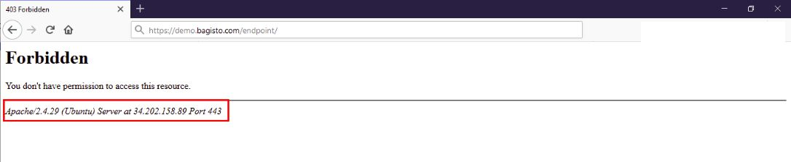

# Best Security Practices

[[TOC]]

## Software Updates

To ensure the security of your system, follow these best practices:

- Use HTTPS to encrypt communication. Google now considers HTTPS as a ranking factor.
- Keep all software on the server up-to-date, including Bagisto, the database, Adminer/phpMyAdmin, Apache, Redis, etc.
- Regularly update the server operating system to apply available security patches.
- Manage files only through secure communication protocols like SSH, SFTP, or HTTPS. Disable FTP.
- Use the **`.htaccess`** file to protect system files when using the Apache web server.
- Disable unused ports and stop unnecessary services running on the server.
- Restrict access to the admin panel by allowing only specific IP addresses and enforcing two-factor authorization for admin logins.
- Ensure the use of strong and unique passwords.
- Configure and update the firewall properly to secure the connection between payment card data and the public network.

## Limiting Error Messages

To limit the exposure of sensitive information in error messages, follow these steps:

- Edit your Apache configuration file to avoid displaying server and operating system details.
- Set **`ServerSignature`** to **`Off`** (by default, it is **`On`**).
- Add **`ServerTokens Prod`** to display Apache only as the product.

:::details Screenshot



:::

## Limiting Admin Access

To restrict access to the admin area, modify the **`.htaccess`** file with the following code:

```apacheconf
RewriteEngine On
RewriteCond %{REQUEST_URI} .*/admin
RewriteCond %{REMOTE_ADDR} !=<IP address>
RewriteCond %{REMOTE_ADDR} !=<IP address>
RewriteRule ^(.*)$ - [R=403,L]
```

Ensure that there are no accessible development leftovers on the server, such as "log files," ".git directories," "database dumps," or "zip files."

## Restricting Unnecessary Files

To restrict access to unnecessary files, add the following code to your **`.htaccess`** file:

```apacheconf
<FilesMatch "\.(git|zip|tar|sql)$">
    Require all denied
</FilesMatch>
```

Consider using a Web Application Firewall (WAF) to analyze traffic and detect suspicious patterns, such as credit card information being sent to attackers. Additionally, restrict public access to only ports 80 (HTTP) and 443 (HTTPS), while blocking other ports.

## Restricting PHP Execution Inside Storage

To restrict PHP execution inside the storage directory, modify your Apache configuration file:

```apacheconf
<Directory "~/www/bagisto/public/storage/">
    <FilesMatch "\.php$">
        Require all denied
    </FilesMatch>
    php_flag engine off
</Directory>
```

Don't forget to restart Apache after making these changes.

## Server Hardening

Take the following measures to harden your server:

- Use the **`mod_security`** module to detect and prevent intrusions.
- Implement the **`mod_passive`** module to prevent brute force attacks.
- Allow only specific users to log in.
- Disable login for users with empty passwords.
- Review and configure iptable rules to prevent unauthorized access and activity.
- Regularly back up important files and store them remotely in a secure environment.

## Strong Passwords

Ensure the use of strong and unique passwords and encourage periodic password changes. You can use a password generator tool ([Password Generator](https://passwords-generator.org/)) to create strong passwords. Limit access to the Bagisto admin

 panel by updating the whitelist with authorized IP addresses.

## Implementation of HTTP Security Headers

Implementing the following HTTP security headers enhances web security:

### HTTP Strict Transport Security (HSTS)

Set the **`Strict-Transport-Security`** response header to instruct the browser to only access the application using HTTPS:

```
Strict-Transport-Security: max-age=<expire-time>
```

### Cross-Site Scripting Protection (X-XSS Protection)

Set the **`X-XSS-Protection`** response header to enable browsers to detect and prevent cross-site scripting (XSS) attacks:

```
X-XSS-Protection: 1; mode=block
```

### X-Frame-Options​

The **`X-Frame-Options`** response header protects applications against clickjacking. It specifies whether the content can be displayed within frames:

```
X-Frame-Options: deny
```

### X-Content-Type-Options​

The **`X-Content-Type-Options`** response header forces the browser to disable MIME sniffing, preventing MIME sniffing vulnerabilities:

```
X-Content-Type-Options: nosniff
```

### Content Security Policy (CSP)

Implement a Content Security Policy (CSP) response header to control resources that can be loaded in users' browsers. CSP helps detect and mitigate attacks such as XSS and clickjacking.

### Continuous Logging And Monitoring

Maintain continuous logging and monitoring of all network access and cardholder data activities. Keep an eye out for large volume orders of a single item from new customers, a series of orders shipped to the same address but using different payment methods.

By implementing these best security practices, you can enhance the security of your system and protect it from potential threats.