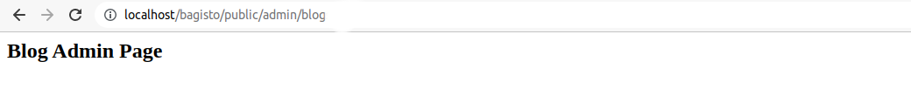

# Views

[[TOC]]

To learn in detail about Views, you can visit the Laravel documentation [here](https://laravel.com/docs/10.x/views).

## Directory Structure

- Create a **`Resources`** folder in the **`packages/Webkul/Blog/src`** path. Inside the **`Resources`** folder, create another folder named **`views`**. Now, inside the **`views`** folder, we need to create two folders, namely **`admin`** and **`shop`**. Finally, we need to create one more folders, name **`default`** under the **`shop`** folder. The updated directory structure will look like this:

  ```
  └── packages
      └── Webkul
          └── Blog
              └── src
                  ├── ...
                  └── Resources
                      └── views
                          ├── admin
                          └── shop
                              └── default
  ```

- Inside each folder, **`admin`** and **`default`**, create a file named **`index.blade.php`** and add some HTML to it.

  ```
  └── packages
      └── Webkul
          └── Blog
              └── src
                  ├── ...
                  └── Resources
                      └── views
                          ├── admin
                          │   └── index.blade.php
                          └── shop
                              └── default
                                  └── index.blade.php

  ```

  - **`admin/index.blade.php`**

    ```html
    <h2>Blog Admin Page</h2>
    ```

  - **`shop/default/index.blade.php`**

    ```html
    <h2>Blog Shop Page</h2>
    ```

## Load Views from Package

- Now, we need to register our views in the service provider's `boot` method. Open the file **`packages/Webkul/Blog/src/Providers/BlogServiceProvider.php`** and update it as follows:

  ```php
  <?php

  namespace Webkul\Blog\Providers;

  use Illuminate\Support\ServiceProvider;

  /**
  * BlogServiceProvider
  *
  * @copyright 2024 Webkul Software Pvt. Ltd. (http://www.webkul.com)
  */
  class BlogServiceProvider extends ServiceProvider
  {
     /**
      * Bootstrap services.
      *
      * @return void
      */
      public function boot()
      {
          //... 

          $this->loadViewsFrom(__DIR__ . '/../Resources/views', 'blog');
      }
  }
  ```

- Now, check the routes in your browser.

  ::: details Shop Output

  

  :::

  ::: details Admin Output

  

  :::
