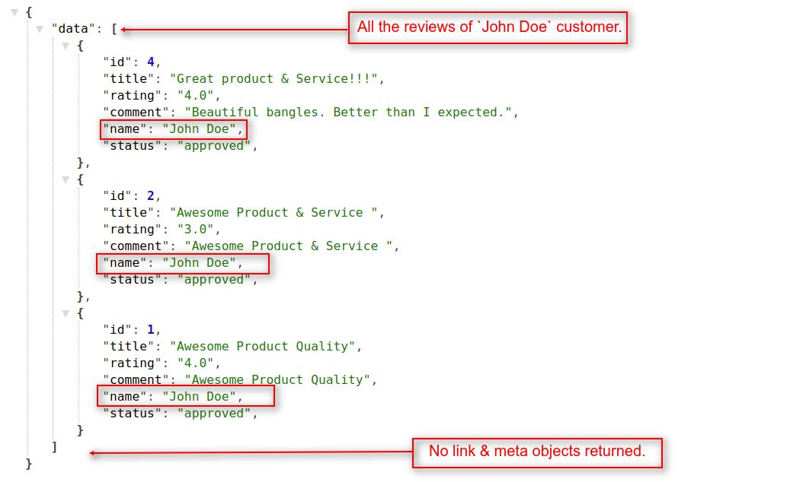

# Customer's Reviews

## 1. Get All Reviews Of Specific Customer: <a id="get-reviews-of-customer"></a>

To get all the reviews of a specific customer, you have to pass a **`customer_id`** as a query parameter like **`reviews?customer={id}`** in API url. To use this API call customer authentication is not required.

> _https://example.com/public/api/reviews?customer_id={id}_

**Note**: _In the `reviews?customer_id={id}` resource API call, we used `GET HTTP verb` to get all the reviews of a customer._

##### Request:

> _https://example.com/public/api/reviews?customer_id=6_

##### Response:

    {
        "data": [
            {
                "id": 4,
                "title": "Great product & Service!!!",
                "rating": "4.0",
                "comment": "Beautiful bangles. Better than I expected.",
                "name": "John Doe",
                "status": "approved",
            },
            {
                "id": 2,
                "title": "Awesome Product & Service ",
                "rating": "3.0",
                "comment": "Awesome Product & Service ",
                "name": "John Doe",
                "status": "approved",
            },
            {...}
        ],
        "links": {
            "first": "http://localhost/public/api/reviews?customer_id=1&page=1",
            "last": "http://localhost/public/api/reviews?customer_id=1&page=1",
        },
        "meta": {...}
    }

{:class="screenshot-dimension center"}

### 1.1 Get Customer's Reviews With Pagination: <a id="get-customer-reviews-pagination"></a>

You can get customer's reviews according to the pagination. You can define the limit as to  how many records of reviews you want in each page.

###### Request:

> _https://example.com/public/api/reviews?customer_id=1&page=1_

> _https://example.com/public/api/reviews?customer_id=1&limit=3&page=1_

**Note**: _If you didn't use the page(?page=x) filter, then it returns the data of the first page by default. You can also provide the limit request parameter in the API url._

###### Response:

    {
        "data": [
            {
                "id": 2,
                "title": "Awesome Product & Service ",
                "rating": "3.0",
                "comment": "Awesome Product & Service ",
                "name": "John Doe",
                "status": "approved",
            },
            {
                "id": 1,
                "title": "Awesome Product Quality",
                "rating": "4.0",
                "comment": "Awesome Product Quality",
                "name": "John Doe",
                "status": "approved",
            }
        ],
        "links": {
            "first": "http://localhost/public/api/reviews?customer_id=1&limit=2&page=1",
            "last": "http://localhost/public/api/reviews?customer_id=1&limit=2&page=2",
            "prev": "http://localhost/public/api/reviews?customer_id=1&limit=2&page=1",
            "next": null
        },
        "meta": {...}
    }


##### Explanation:

- In the response above, you will find the three Objects with the indexes mentioned below:
  1. data
  2. link
  3. meta

#### Data Object:

Under the data object, you will find a array of multiple objects which contain the details of the customer's reviews. You can use these objects to access the data of each individual customer's review.

**Note**: _Regarding both link and meta objects, we already explained these objects functionality in_ <a href="api_category.html#link-object" target="_blank" class="bagsito-link"> _Category API_ </a> _section._

### 1.2 Get Customer's Reviews Without Pagination:

You can also get all of the customer's reviews of Bagisto Store in a single API call without using pagination. For this you have to pass **`pagination=0`** in the query parameter with the **`reviews?customer_id={id}`** resource in API URL.

###### Request:

> _https://example.com/public/api/reviews?customer_id=1pagination=0_

##### Response:

    {
        "data": [
            {
                "id": 4,
                "title": "Great product & Service!!!",
                "rating": "4.0",
                "comment": "Beautiful bangles. Better than I expected.",
                "name": "John Doe",
                "status": "approved",
            },
            {...},
            {...},
            {...}
        ]
    }



# How To Post For Products's Reviews
To post a review of a specific product, you have to login as customer.{id} = Product_id in API url. To use this API call customer authentication is required.

> *https://example.com/public/api/reviews/{id}/create*

###### Post Data:
    {
        "rating" : "3",
        "title" : "This is dummy title",
        "comment" : "This is the comment for the dummy title"
    }

#### Response:
```json
{
    "message": "Your review submitted successfully.",
    "data": {
        "id": 1,
        "title": "This is dummy title",
        "rating": "3.0",
        "comment": "This is the comment for the dummy title",
        "name": "Mohammad Asif",
        "status": "pending",
        "product": {
            "id": 23,
            "type": "simple",
            "name": "white shirt",
            "url_key": "key",
            "price": 1000,
            "formated_price": "$1,000.00",
            "short_description": "<p>lorem</p>",
            "description": "<p>lorem ipsum</p>",
            "sku": "ssh",
            "images": [ {...}, { ...} ],
            "base_image": { ... },
            "variants": [],
            "in_stock": true,
            "reviews": { ... },
            "is_saved": false,
            "created_at": { ... },
            "updated_at": { ... }
        },
        "customer": { ... },
        "created_at": { ... },
        "updated_at": { ... }
    },
    "created_at": { ... },
    "updated_at": { ... }
}
```