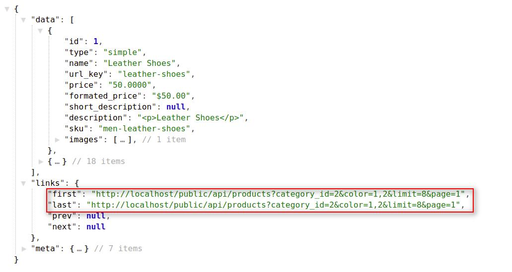
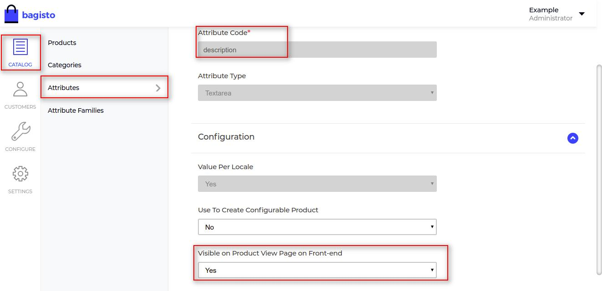

# Products

In this section, we will use the product's API. We will start with the fetching of all products. Then we will move forward to query params and filterable query params. In last, we will check the additional and variant information.

## Get all products

This request will fetch all the products based on `limit` and `page`.

- Request

  `<host>/api/products(?limit,page)`

  ::: tip

  If you didn't use the page(?page=x) filter, then it returns the data of the first page by default.

  :::

- Params

  | Name  | Info                                         | Type   |
  | ----- | -------------------------------------------- | ------ |
  | limit | Maximum number of records in each request    | Number |
  | page  | Records for specific page based on the limit | Number |

::: tip

If you are using pagination and want to know more info about responses then check the [explanation](./explanation) portion.

:::

### Examples

#### 1. Get products for specific page,

- Request

  `http(s)://example.com/api/products?page=1`

::: details Response

~~~json
{
    "data": [
      {
        "id": 3,
        "type": "simple",
        "name": "Lenovo IdeaPad Yoga 500 15 Hybrid (2-in-1) White",
        "url_key": "lenovo-ideapad-yoga-500-15-hybrid-2-in-1-white",
        "price": "600.0000",
        "formated_price": "$600.00",
        ...
        "sku": "5626",
        "images": [
          {...}
        ],
        "base_image": {...},
        "variants": [],
        "in_stock": true,
        "reviews": {...},
        "is_saved": false,
        "created_at": "2020-09-09 03:31:47",
        "updated_at": "2020-09-09 03:31:47"
      },
      {...},
      {...}
    ],
    "links": {...},
    "meta": {...}
}
~~~

:::

#### 2. Get products for specific page with limit,

- Request

  `http(s)://example.com/api/products?limit=2&page=1`

::: details Response

~~~json
{
    "data": [
      {...},
      {...}
    ],
    "links": {
          "first": "https://example.com/api/products?page=1&limit=2",
          "last": "https://example.com/api/products?page=4&limit=2",
          "prev": null,
          "next": "https://example.com/api/products?page=2&limit=2"
    },
    "meta": {
        "current_page": 1,
        "from": 1,
        "last_page": 4,
        "path": "https://example.com/api/products",
        "per_page": "2", // limit
        "to": 2,
        "total": 8
    }
}
~~~

:::

## Get products with query parameters

- Request

  `GET <host>/api/products(?category_id,new,featured,name,sku,url_key,limit,page)`

- Params

  | Name        | Info             | Type    |
  | ----------- | ---------------- | ------- |
  | category_id | Category's ID    | Number  |
  | new         | New Product      | Boolean |
  | featured    | Featured Product | Boolean |
  | name        | Name             | String  |
  | sku         | SKU              | String  |
  | url_key     | URL Key          | String  |
  | limit       | Limit            | Number  |
  | page        | Page             | Number  |

### Examples

#### 1. If you want to get the store's products those are having new condition then you can use `new=1` in the query parameter and if want to get the products without new condition then use `new=0`.

- Request

  `GET http(s)://example.com/api/products?new=1`

#### 2. You can also use the `limit` and `page` query parameters with the `new` query parameter

- Request

  `GET http(s)://example.com/api/products?new=1&limit=5&page=1`

  `GET http(s)://example.com/api/products?new=0&limit=5&page=1`

#### 3. If you want to get the store's products those are featured then you can use `featured=1` query parameter.

- Request

  `GET http(s)://example.com/api/products?featured=1`

#### 4. You can also use the `limit` and `page` in query parameters with `featured` query parameter.

- Request

  `GET http(s)://example.com/api/products?featured=1&limit=5&page=1`

  `GET http(s)://example.com/api/products?featured=0&limit=5&page=1`

#### 5. Suppose you want to find out the data of your product in the Bagisto store, here you can use the `name` query parameter. You have to provide the product name to the `name` query parameter in the API URL.

- Request

  `GET http(s)://example.com/api/products?name='Leather Shoes'`

#### 6. You can also get your product-related details with the help of the product's SKU. SKU will be unique for each product in the Bagisto store. For this, you have to use `sku` as a query parameter in the API URL.

- Request

  `GET http(s)://example.com/api/products?sku='1234'`

#### 7. `url_key` is a unique field for every product in Bagisto Store. You can also find out product details by using `url_key`. For this, you have to pass `url_key` as a query parameter in the API URL.

- Request

  `GET http(s)://example.com/api/products?url_key='leather-shoes'`

## Get products with filterable query parameters

You can also filter your store products by using filterable attributes query parameters. These filters will only work with the `category_id` input query parameter. There are two system-defined filterable attributes in the Bagisto E-commerce framework i.e. `size` and `color`. Admin user can also create their own custom attribute and can make these custom attributes as filterable. By using these filterable attributes, customers can filter the category's products to get the desired result.

- Request

  `GET http(s)://example.com/api/products(?category_id,size,color,price)`

- Params

  | Name        | Info          | Type   |
  | ----------- | ------------- | ------ |
  | category_id | Category's ID | Number |
  | size        | Size          | String |
  | color       | Color         | String |
  | price       | Price         | String |

### Examples

#### 1. You can filter Bagisto's product catalog with the help of `size` filter. `size` filter will work only on the category layout. You can pass the multiple attribute's values to the `size` filterable attributes as a query parameter in API url. Suppose you want to filter men's T-Shirt with medium and large size, then you can pass the id of both medium & large.

- Request

  `GET http(s)://example.com/api/products?category_id=2&size=6,7`

#### 2. You can also use the limit and page in query parameters with category & size filterable parameters.

- Request
  
  `GET http(s)://example.com/api/products?category_id=2&size=6,7&limit=10&page=1`

  

#### 3. You can also filter the Bagisto product catalog with the help of `color` filter. `color` filter will work only on the category layout. You can pass the multiple attribute's values to the color`s filterable attributes as a query parameter in API URL. Suppose you want to filter men's T-Shirt with white and red color, then you can pass the id of both white & red.

- Request

  `GET http(s)://example.com/api/products?category_id=2&color=1,2`

#### 4. You can also use the limit and page in query parameters with category & color filterable parameters.

- Request

  `GET http(s)://example.com/api/products?category_id=2&color=1,2&limit=10&page=1`

  

#### 5. In the case of a simple product, You can set a range of a minimum price and maximum price. Same as `size` and `color`, the `price` filter will also work on the category layout only. Suppose you want to filter products those are having price between price range from 50 to 100, then you have to pass value like `price=10,50` as the query parameter in API URL.

- Request

  `GET http(s)://example.com/api/products?category_id=2&price=50,100`

#### 6. You can also use the `limit` and `page` in query parameters with `category` & `price` filterable parameters.

- Request

  `GET http(s)://example.com/api/products?category_id=2&price=50,100&limit=10&page=1`

  

#### 7. In the case of a configurable product, the `price` filter will also work with the product's variants. Suppose you want to filter products with the 40$ min and 100$ max price range. And there is a configurable product named men's T-shirts having a price 30$ and there is any variant of the same product having 45$ price, then men's T-shirts product will show you in the filtered product's list.

- Request

  `GET http(s)://example.com/api/products?category_id=2&price=30,100`

  

::: tip

The above-explained filter query parameters (i.e. size, color, price) can be used together.

:::

## Get product by id

If you want the record of any specific product, then you have to provide the product id as an input parameter in the API URL.

- Request

  `GET <host>/api/products/{product_id}`

- Params

  | Name       | Info          | Type   |
  | ---------- | ------------- | ------ |
  | product_id | Product's ID | Number |

### Examples

- Request

  `GET http(s)://example.com/api/products/1`

::: details Response

~~~json
{
  "data": {
    "id": 1,
    "type": "simple",
    "name": "Adorable Cream Teddy Bear",
    "url_key": "adorable-cream-teddy-bear",
    "price": "10.0000",
    "formated_price": "$10.00",
    "short_description": "
Buy Adorable Cream Teddy Bear online at best price
",
    "description": "
Buy Adorable Cream Teddy Bear online at best price
",
    "sku": "80971254",
    "images": [
      {...}
    ],
    "base_image": {...},
    "variants": [],
    "in_stock": true,
    "reviews": {...},
    "is_saved": false,
    "created_at": "2020-09-08T23:52:02.000000Z",
    "updated_at": "2020-09-08T23:52:02.000000Z"
  }
}
~~~

:::

## Get product's additional information

Additional information relates to all the attributes and their values for which admin sets the `Yes` value for the `Visible on Product View Page on Front-end`. The product's additional information means those attributes which describe the product's specification.

- Request

  `GET http(s)://example.com/api/product-additional-information/1`

::: details Response

:::

## Get product's variants information

You can get all the configurable attributes of a product by using `product-configurable-config` resource in API calls. It will return all the variants of a product with their `label`, `options`, `regular_price` and `final_price` also.

Admin can set the `Yes` value for the `Use To Create Configurable Product` field under the attribute panel to make that attribute as variant.

- Request

  `GET http(s)://example.com/api/product-configurable-config/1`

::: details Response

~~~json
{
    "data": {
        "attributes": [
            {
                "id": 24,
                "code": "size",
                "label": "Size",
                "swatch_type": null,
                "options": [
                    {
                        "id": 7,
                        "label": "M",
                        "swatch_value": null,
                        "products": [
                            4
                        ]
                    }
                ]
            }
        ],
        "variant_prices": {
            "4": {
                "regular_price": {
                    "formated_price": "$45.00",
                    "price": 45
                },
                "final_price": {
                    "formated_price": "$45.00",
                    "price": 45
                }
            }
        }
    }
}
~~~

:::