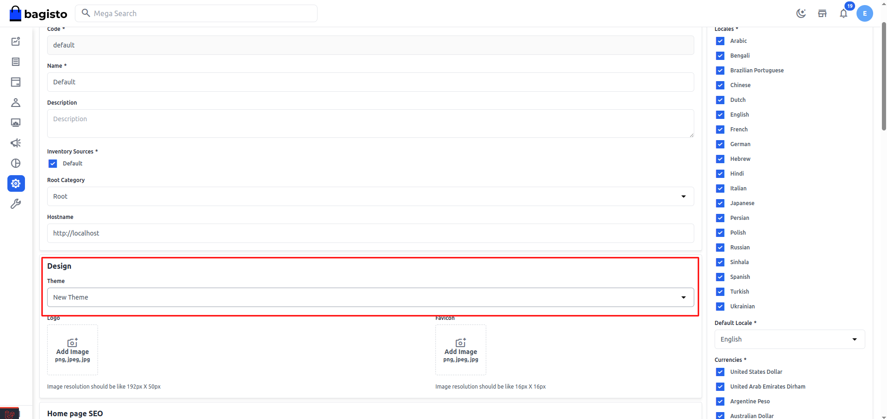
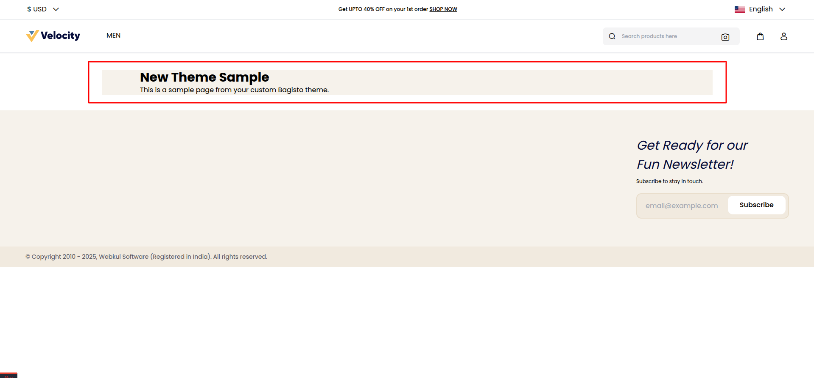

# Store Theme

[[TOC]]

## Introduction 

Themes in Bagisto define the visual identity and user experience of your e-commerce store. They control layouts, styling, and interactive elements that create a cohesive brand experience for your customers. This guide will help you understand, configure, and create custom themes for your Bagisto store.

## Theme Configuration

Bagisto's theme system is managed through a central configuration file: `themes.php`. This file contains all the theme definitions and settings that determine how your storefront appears.

### Key Configuration Parameters

| Parameter              | Description                                         |
| ---------------------- | ----------------------------------------------------|
| **`shop-default`**     | Designates the active theme for your store |
| **`name`**             | The display name of your theme. |
| **`views_path`**       | Location of the theme's blade template files. |
| **`assets_path`**      | Location of CSS, JavaScript, and image files.  |
| **`parent`**           | (Optional) Parent theme to inherit from. |
| **`vite`**             | Configuration for Vite assets bundling |

1. Locate the `themes.php` File. Navigate to the `config` folder located in the root directory of your Bagisto project.

```
- app
- bin
- bootstrap
- config
    ├── ...
    └── themes.php  👈 This is the file we need
- database
- packages
    └── Webkul
```

2. Open the `themes.php` File. Find the `themes.php` file within the config directory and open it for editing.

```php
<?php

return [
    'shop-default' => 'default',

    'shop' => [
        'default' => [
            'name'        => 'Default',
            'assets_path' => 'public/themes/shop/default',
            'views_path'  => 'resources/themes/default/views',

            'vite'        => [
                'hot_file'                 => 'shop-default-vite.hot',
                'build_directory'          => 'themes/shop/default/build',
                'package_assets_directory' => 'src/Resources/assets',
            ],
        ],
    ],
];
```

3. Understand the structure

- `shop-default` defines which theme is currently active
- The `shop` array contains all available themes
- Each theme (like `default`) has its own configuration settings

## Creating a Custom Theme
Follow these steps to create a new theme for your Bagisto store:

1. Add a new theme definition Edit `themes.php` to include your new theme:

```php
<?php
return [
    'shop-default' => 'default',

    'shop' => [
        'default' => [
            'name'        => 'Default',
            'assets_path' => 'public/themes/shop/default',
            'views_path'  => 'resources/themes/default/views',

            'vite'        => [
                'hot_file'                 => 'shop-default-vite.hot',
                'build_directory'          => 'themes/shop/default/build',
                'package_assets_directory' => 'src/Resources/assets',
            ],
        ],

        'new-theme' => [
            'name'        => 'New Theme',
            'assets_path' => 'public/themes/shop/new-theme',
            'views_path'  => 'resources/themes/new-theme/views',

            'vite'        => [
                'hot_file'                 => 'shop-default-vite.hot',
                'build_directory'          => 'themes/shop/default/build',
                'package_assets_directory' => 'src/Resources/assets',
            ],
        ],
    ],
];
```

:::tip Note
The vite configuration in this setup is currently a placeholder(as well as default theme). Since Vite has not been configured yet, we will cover its setup in detail in the upcoming Vite Configuration section.
:::

2. Create the necessary directories for your new theme

```
📁 resources
 └── 📁 themes
     └── 📁 new-theme
         └── 📁 views
             └── 📁 home.blade.php
                 └── 📄 index.blade.php
```

c
Example content for index.blade.php:

```html
<x-shop::layouts>
    <div class="container mt-10 py-16 bg-lightOrange"> 
        <h1 class="text-3xl font-bold">New Theme Sample</h1>
        <p>This is a sample page from your custom Bagisto theme.</p>
    </div>
</x-shop::layouts> 
```

:::tip Note
We are using the default `shop` layout here since a custom theme layout has not been implemented yet. We’ll cover how to create and use a custom layout in the upcoming section.
:::

5. Clear application cache:

```shell
php artisan cache:clear
```

6. Navigate to the Admin Panel, then go to Settings > Channels. Edit the desired channel and change the Theme option to your custom theme from the dropdown.



7. Your custom theme has now been successfully applied, and the changes are reflected on the homepage.



By following these steps, you can create and configure a new theme for your Bagisto store, enabling you to customize the appearance and layout to suit your branding and design preferences.

:::tip Note
This section covers the basic theme setup using resources. In the next topic, we'll explore an advanced setup with a separate package and Vite configuration.
:::