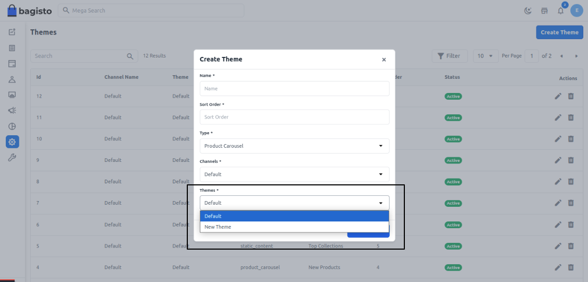

# Store Theme

[[TOC]]

## Introduction 

Themes in Bagisto define the visual identity and user experience of your e-commerce store. They control layouts, styling, and interactive elements that create a cohesive brand experience for your customers. This guide will help you understand, configure, and create custom themes for your Bagisto store.

## Understanding Theme Configuration

Bagisto's theme system is managed through a central configuration file: `themes.php`. This file contains all the theme definitions and settings that determine how your storefront appears.

### Key Configuration Parameters

| Parameter              | Description                                         |
| ---------------------- | ----------------------------------------------------|
| **`shop-default`**     | Designates the active theme for your store |
| **`name`**             | The display name of your theme. |
| **`views_path`**       | Location of the theme's blade template files. |
| **`assets_path`**      | Location of CSS, JavaScript, and image files.  |
| **`parent`**           | (Optional) Parent theme to inherit from. |
| **`vite`**             | Configuration for Vite assets bundling |

## Step-by-Step Theme Configuration

1. Locate the `themes.php` File. Navigate to the `config` folder located in the root directory of your Bagisto project.

```
- app
- bin
- bootstrap
- config
    ├── ...
    └── themes.php  👈 This is the file we need
- database
- packages
    └── Webkul
```

2. Open the `themes.php` File. Find the `themes.php` file within the config directory and open it for editing.

```php
<?php

return [
    'shop-default' => 'default',

    'shop' => [
        'default' => [
            'name'        => 'Default',
            'assets_path' => 'public/themes/shop/default',
            'views_path'  => 'resources/themes/default/views',

            'vite'        => [
                'hot_file'                 => 'shop-default-vite.hot',
                'build_directory'          => 'themes/shop/default/build',
                'package_assets_directory' => 'src/Resources/assets',
            ],
        ],
    ],
];
```

3. Understand the structure

- `shop-default` defines which theme is currently active
- The `shop` array contains all available themes
- Each theme (like `default`) has its own configuration settings

## Creating a Custom Theme
Follow these steps to create a new theme for your Bagisto store:

1. Add a new theme definition Edit `themes.php` to include your new theme:

```php
<?php
return [
    'shop-default' => 'default',

    'shop' => [
        'default' => [
            'name'        => 'Default',
            'assets_path' => 'public/themes/shop/default',
            'views_path'  => 'resources/themes/default/views',

            'vite'        => [
                'hot_file'                 => 'shop-default-vite.hot',
                'build_directory'          => 'themes/shop/default/build',
                'package_assets_directory' => 'src/Resources/assets',
            ],
        ],

        'new-theme' => [
            'name'        => 'New Theme',
            'assets_path' => 'public/themes/shop/new-theme',
            'views_path'  => 'resources/themes/new-theme/views',

            'vite'        => [
                'hot_file'                 => 'shop-new-theme-vite.hot',
                'build_directory'          => 'themes/shop/new-theme/build',
                'package_assets_directory' => 'src/Resources/assets',
            ],
        ],
    ],
];
```

2. Create the necessary directories for your new theme

```
📁 resources
 └── 📁 themes
     └── 📁 new-theme
         └── 📁 views
             ├── 📄 layout.blade.php
             └── 📄 home.blade.php
```

3. Create the necessary directories for theme assets

```
📁 public
 └── 📁 themes
     └── 📁 shop
         └── 📁 new-theme
             ├── 📁 css
             ├── 📁 js
             └── 📁 images
```

4. Create view files

Your theme needs to implement views for all routes in the shop package. Reference the route file at: `packages/Webkul/Shop/src/Http/routes.php` Ensure your blade filenames match the route definitions. For example:
```php
Route::controller(CategoryController::class)->group(function () {
    Route::get('/categories/{slug}', 'index')->name('shop.categories.index');
});
```

5. Clear application cache:

```
php artisan cache:clear
```

By following these steps, you can create and configure a new theme for your Bagisto store, enabling you to customize the appearance and layout to suit your branding and design preferences.

After adding your new theme, you will be able to select it when creating a new section for your storefront homepage from the admin panel.


