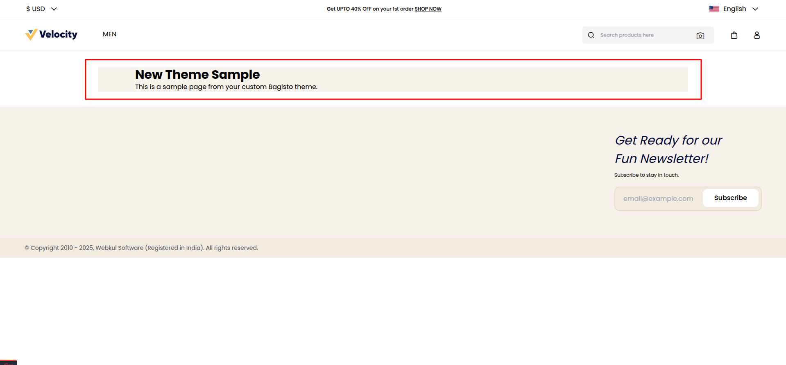

# Custom Theme Package

[[TOC]]

## Introduction 

Creating a custom theme package in Bagisto allows you to keep your theme separate from the core, making it easier to customize and maintain. By isolating the theme into its own package, you can integrate tools like Vite for efficient asset bundling, easily update or override existing sections, and fully tailor the UI to meet your requirements. This modular approach ensures better flexibility, reusability, and smoother theme management.

## Package Structure Setup

In the previous section, we created a basic custom theme. Here, we assume you already have a fundamental understanding of how custom themes work in Bagisto.

If you're not yet familiar with setting up a basic theme, we recommend checking out the [Basic Theme Setup](https://devdocs.bagisto.com/2.3/themes/create-store-theme.html) guide first to get up to speed.

In this section, we’ll walk you through the step-by-step process of creating a custom theme as a standalone package in Bagisto.

### Create the Directory Structure

First, create the following directory structure for your new theme package:

```
📁 packages
└── 📁 Webkul
    └── 📁 NewTheme
        └── 📁 src
            ├── 📁 Providers
                └── 📄 NewThemeServiceProvider.php
```

### Create the Service Provider

Add the following code to `NewThemeServiceProvider.php`:

```php
<?php

namespace Webkul\NewTheme\Providers;

use Illuminate\Support\ServiceProvider;

class NewThemeServiceProvider extends ServiceProvider
{
    /**
     * Bootstrap services.
     *
     * @return void
     */
    public function boot()
    {
        // Service provider code will be added here
    }

    /**
     * Register services.
     *
     * @return void
     */
    public function register()
    {
        //
    }
}
```

### Configure Autoloading

Update the root `composer.json` file to include your package's namespace:

```php
"autoload": {
    ...
    "psr-4": {
        // Other PSR-4 namespaces
        "Webkul\\NewTheme\\": "packages/Webkul/NewTheme/src"
    }
}
```

### Update Autoloader

Run the following command to register your package

```shell
composer dump-autoload
```

### Register the Service Provider

Add your service provider to `bootstrap/providers.php` 

```php
<?php

return [
    // Application service providers.
    App\Providers\AppServiceProvider::class,

    // Other service providers
    
    // NewTheme service providers.
    Webkul\NewTheme\Providers\NewThemeServiceProvider::class,
];
```

:::tip Note
Your new theme package has been set up successfully! In the next step, we will configure and apply the theme.
:::

## Theme Configuration

### Define the Theme

Edit `config/themes.php` to include your new theme:

In the previous section, we created a basic custom theme. Here, we assume you already have a fundamental understanding of how custom themes work in Bagisto.

If you're not yet familiar with setting up a basic theme, we recommend checking out the [Basic Theme Setup](https://devdocs.bagisto.com/2.3/themes/create-store-theme.html) guide first to get up to speed.

### Add Views

Create a new folder named `Resources` inside the src directory. This folder will serve as the central location for storing essential theme assets such as views, language files, and other resources required for the custom theme. Organizing files within Resources ensures better modularity and maintainability of your theme package.

After creating the `Resources` folder, your package directory structure will look like this

```
📁 packages
└── 📁 Webkul
    └── 📁 NewTheme
        └── 📁 src
            ├── 📁 Providers
            │   └── 📄 NewThemeServiceProvider.php
            │
            └── 📁 Resources  
```

Move the views folder from resources/themes/new-theme into the Resources directory of your package. This ensures that all theme-related assets are contained within the package itself, keeping the structure modular and organized.

After the move, your updated directory structure will look like this:

```
📁 packages
└── 📁 Webkul
    └── 📁 NewTheme
        └── 📁 src
            ├── 📁 Providers
            │   └── 📄 NewThemeServiceProvider.php
            │
            └── 📁 Resources
                └── 📁 views
                    └── 📁 home
                        └── 📄 index.blade.php  
```

### Update Service Provider

Configure the service provider to publish your theme's views. Update the `boot` method in `NewThemeServiceProvider.php`:

```php
public function boot()
{
    $this->publishes([
        __DIR__.'/../Resources/views'  => resource_path('themes/new-theme/views'),
    ]);
}
```

4. To publish the view files, navigate to the root directory of your project and run the following command:

```shell
php artisan vendor:publish --provider="Webkul\NewTheme\Providers\NewThemeServiceProvider"
```

:::tip Note
If the directory structure already exists in the resources folder and your changes are not reflected, use the `--force` flag to overwrite existing files.
:::

5. Your custom theme has now been successfully applied, and the changes are reflected on the homepage.



:::tip Note
Your new theme has been set up successfully using package! Next, we will configure Tailwind CSS and Vite to manage styles and assets efficiently.
:::

## Vite Integration

### Configure package.json

Create `packages/Webkul/NewTheme/package.json` with the following content.

```json
{
  "private": true,
  "type": "module",
  "scripts": {
    "dev": "vite",
    "build": "vite build"
  },
  "devDependencies": {
    "@playwright/test": "^1.48.1",
    "@types/node": "^22.7.8",
    "autoprefixer": "^10.4.16",
    "axios": "^1.7.9",
    "laravel-vite-plugin": "^1.0",
    "postcss": "^8.4.23",
    "tailwindcss": "^3.3.2",
    "vite": "^5.4.12",
    "vue": "^3.5.13"
  },
  "dependencies": {
    "@vee-validate/i18n": "^4.9.1",
    "@vee-validate/rules": "^4.9.1",
    "@vitejs/plugin-vue": "^4.2.3",
    "dotenv": "^16.4.7",
    "mitt": "^3.0.0",
    "playwright": "^1.48.1",
    "readline-sync": "^1.4.10",
    "vee-validate": "^4.9.1",
    "vue-flatpickr": "^2.3.0"
  }
}
```

:::tip Note  
You can also copy this code from the `Shop` package.  
:::

### Configure Tailwind CSS

Add the following to `packages/Webkul/NewTheme/tailwind.config.js`:

```js
/** @type {import('tailwindcss').Config} */
module.exports = {
    content: ["./src/Resources/**/*.blade.php", "./src/Resources/**/*.js"],

    theme: {
        container: {
            center: true,

            screens: {
                "2xl": "1440px",
            },

            padding: {
                DEFAULT: "90px",
            },
        },

        screens: {
            sm: "525px",
            md: "768px",
            lg: "1024px",
            xl: "1240px",
            "2xl": "1440px",
            1180: "1180px",
            1060: "1060px",
            991: "991px",
            868: "868px",
        },

        extend: {
            colors: {
                navyBlue: "#060C3B",
                lightOrange: "#F6F2EB",
                darkGreen: '#40994A',
                darkBlue: '#0044F2',
                darkPink: '#F85156',
            },

            fontFamily: {
                poppins: ["Poppins"],
                dmserif: ["DM Serif Display"],
            },
        }
    },

    plugins: [],

    safelist: [
        {
            pattern: /icon-/,
        }
    ]
};
```

:::tip Note  
You can also copy this file from the `Shop` package.  
:::

### Configure Vite

To configure your vite Add the following to `packages/Webkul/NewTheme/vite.config.js`:

```js
import { defineConfig, loadEnv } from "vite";
import vue from "@vitejs/plugin-vue";
import laravel from "laravel-vite-plugin";
import path from "path";

export default defineConfig(({ mode }) => {
    const envDir = "../../../";

    Object.assign(process.env, loadEnv(mode, envDir));

    return {
        build: {
            emptyOutDir: true,
        },

        envDir,

        server: {
            host: process.env.VITE_HOST || "localhost",
            port: process.env.VITE_PORT || 5173,
            cors: true,
        },

        plugins: [
            vue(),

            laravel({
                hotFile: "../../../public/shop-new-theme-vite.hot",
                publicDirectory: "../../../public",
                buildDirectory: "themes/shop/new-theme/build",
                input: [
                    "src/Resources/assets/css/app.css",
                    "src/Resources/assets/js/app.js",
                ],
                refresh: true,
            }),
        ],

        experimental: {
            renderBuiltUrl(filename, { hostId, hostType, type }) {
                if (hostType === "css") {
                    return path.basename(filename);
                }
            },
        },
    };
});
```

### Update Hot File Build Directory path

Edit `config/themes.php` to include your new theme:

```php
'new-theme' => [
    'name'        => 'New Theme',
    'assets_path' => 'public/themes/shop/new-theme',
    'views_path'  => 'resources/themes/new-theme/views',

    'vite'        => [
        'hot_file'                 => 'shop-new-theme-vite.hot', // Updated Path
        'build_directory'          => 'themes/shop/new-theme/build', //Updated Path
        'package_assets_directory' => 'src/Resources/assets',
    ],
],
```
### Create CSS and JS Entry Point

To include necessary assets in your custom theme, follow these steps:

Copy the `assets` folder from the `Shop` package:

```
packages/Webkul/Shop/src/Resources/assets
```

Paste the copied folder into the `Resources` directory of your custom theme package:

```
packages/Webkul/NewTheme/src/Resources/assets
```

:::warning
Make sure the `app.css` and `app.js` file added into your package under the assets folder.
:::

### Install Dependencies

Navigate to your theme package directory and install dependencies:

Navigate to the packages directory:

```shell
cd packages/Webkul/NewTheme

npm install
```

### Compile your assets

```shell
npm run build
```

The assets for your custom theme will be compiled and generated under the `public/themes/shop` directory. You can now verify that the build process has successfully created the required CSS, JavaScript, and other static files for your theme.

### Create layouts and view files.

Copy the `views` folder from the `Shop` package:

```
packages/Webkul/Shop/src/Resources/views
```

Replace with your `views` directory of your custom theme package: 

```
packages/Webkul/NewTheme/src/Resources/views
```

:::tip Note  
We copied the view files from the `Shop` package for better understanding. You can customize the theme according to your requirements.  
:::  

To publish the view files, navigate to the root directory of your project and run the following command:

```shell
php artisan vendor:publish --provider="Webkul\NewTheme\Providers\NewThemeServiceProvider"
```

:::tip Note
If the directory structure already exists in the resources folder and your changes are not reflected, use the `--force` flag to overwrite existing files.
:::

:::warning  
Ensure that your layout includes the following directive to properly load your theme’s assets:  

```blade
@bagistoVite(['src/Resources/assets/css/app.css', 'src/Resources/assets/js/app.js'])
```
:::

Your custom theme has now been successfully applied, and the changes are reflected on the homepage.

Navigate to the Admin Panel, then go to Settings > Themes. Create a Image slider for your custom the.


Your custom theme has been successfully applied! To demonstrate customization, we have modified the header background for better clarity and understanding.

:::details Output

:::

You've successfully created a custom theme package for Bagisto! This modular approach allows you to maintain your theme separately from the core and easily reuse it across multiple projects