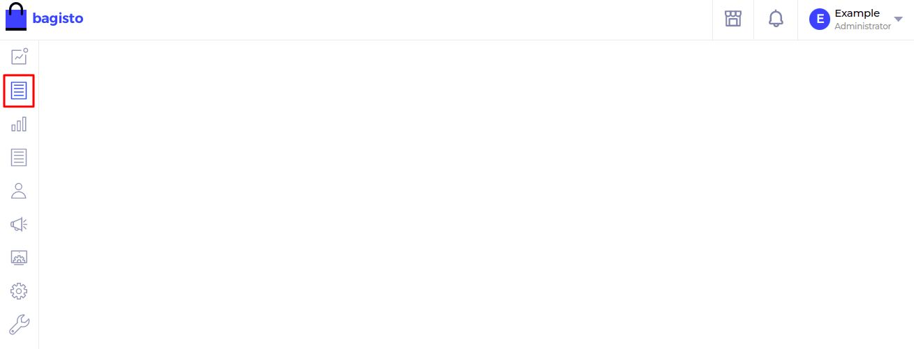

# Add menu in admin

- Within your package `packages/ACME/HelloWorld/src`, create **Config** folder and create a file named as `admin-menu.php`.

~~~php
<?php

return [
    [
      'key'        => 'helloworld',
      'name'       => 'Hello World',
      'route'      => 'helloworld.admin.index',
      'sort'       => 1,
      'icon-class' => 'dashboard-icon',
    ]
];
~~~

- In this file, we provide the name of the menu, route & its icon.

| Params     | Description                                         |
| ---------- | --------------------------------------------------- |
| key        | Unique key for menu icon.                           |
| name       | Name of menu icon.                                  |
| route      | Route name for your menu icon.                      |
| sort       | Sort number on which your menu icon should display. |
| icon-class | Class for menu icon.                                |

- For the route, just add the named route which specified above i.e. `helloworld.admin.index`,

  ~~~php
  Route::view('/admin/hello-world', 'helloworld::admin.index')->name('helloworld.admin.index');
  ~~~

- After that we need to merge this `menu.php` folder with a core menu file. For this, we use the method `mergeConfigFrom()` in the register method of the service provider.

  ~~~php
  <?php

  namespace ACME\HelloWorld\Providers;

  use Illuminate\Support\Facades\Event;
  use Illuminate\Support\ServiceProvider;

  /**
  * HelloWorldServiceProvider
  *
  * @copyright 2020 Webkul Software Pvt. Ltd. (http://www.webkul.com)
  */
  class HelloWorldServiceProvider extends ServiceProvider
  {
      /**
      * Register services.
      *
      * @return void
      */
      public function register()
      {
          $this->mergeConfigFrom(
              dirname(__DIR__) . '/Config/admin-menu.php', 'menu.admin'
          );
      }
  }
  ~~~

- Now, menu will display in the admin panel. You can change the icon according to your needs.

  ::: details Output

    

  :::