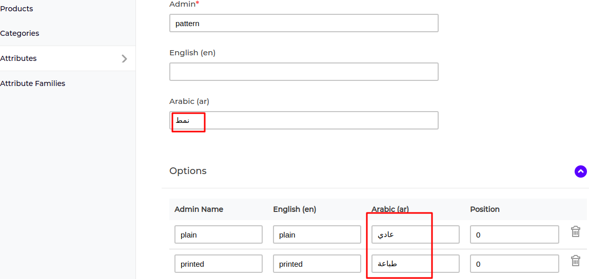
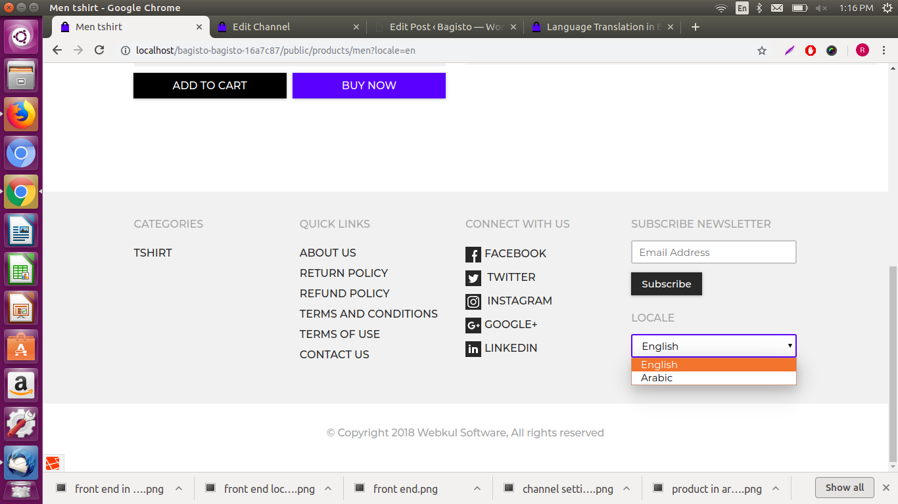
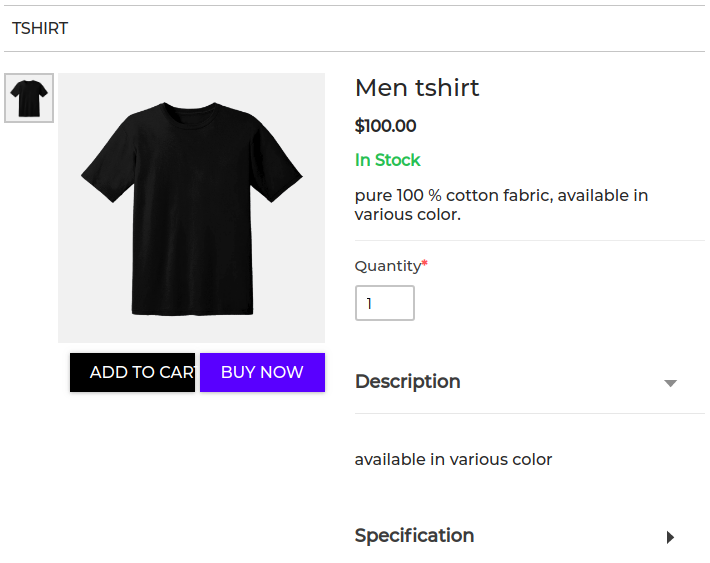

# Translation Based on Locale

{:.pencil-icon}
[edit on github](https://github.com/bagisto/bagisto-docs/blob/master/error_translation.md){:.edit-github target="\_blank"}

If you want to make your website easily accessible to customers in multiple languages and expand your business to a global platform then language translation is crucial for your website. It will help you generate more traffic and increase sales.

By using language translation in Bagisto, you can easily localize your website for many global or regional languages. Your customer can easily translate your whole website just by a single click which also plays a major role in website SEO in the respective region and to show translation as per your locale, you need to follow these below steps:

### Steps to apply Translation Based on Locale

You can easily perform language translation for both Admin dashboard and the front-end view

**Translation For Front-End View**

Kindly follow the steps as needed on the admin dashboard.

**Step 1:-** On Admin Sidebar, click on Setting>>Locales>>Add Locale

{: .screenshot-dimension .center}

**Step 2:-** Enter the code and Name of locale (here I am taking an example of Arabic language or you can select as per your choice) and click on Save Locale.

{: .screenshot-dimension .center}

Next, you need to change locale in the below main section: Products, Categories, and Attributes

{: .screenshot-dimension .center}

**Step 3:-** Under Attributes Section, click on Attributes which you want to change. Next, open selected attribute in Edit Mode. Enter the attribute name in Arabic after which click on Save Attribute. Here I am giving an example of Attribute “Pattern“.

{: .screenshot-dimension .center}

**Step 4:-** Under Categories Section, click on Categories. Enter the category name in Arabic and enter the description in Arabic after which click Save Category.

{: .screenshot-dimension .center}

**Step 5:-** Under Product Section, click on Product. Open the selected product in Edit Mode and enter the product name in Arabic and Short Description in Arabic

{: .screenshot-dimension .center}

**Step 6:-** Next, you need to set the Channels.Click on Setting>> Channels. Open the selected Channel in Edit Mode. Under Currencies and Locales

Locale:- You can select either one or multi-select locales as per your choice.

Default Locale:- You have to set your default Locale so that if the Customer will not select any locale then it will be showing in the Default Locale set by you

Once the settings have been done, click on Save Channels.

{: .screenshot-dimension .center}

**_Steps To Perform On The Front End_**

**Step 1:-** At the bottom of the front end there is an option of Locale so you can select your Locale

{: .screenshot-dimension .center}

When you will select Locale in English then the front end will be visible like this:

{: .screenshot-dimension .center}

When you will select the locale in Arabic from the front end then it will be visible like this:

{: .screenshot-dimension .center}

**Translation For Admin View**

You need to specify the locale in config/app.php file of the root as shown in the screenshot, replace 'en' with your locale code.

{: .screenshot-dimension .center}
